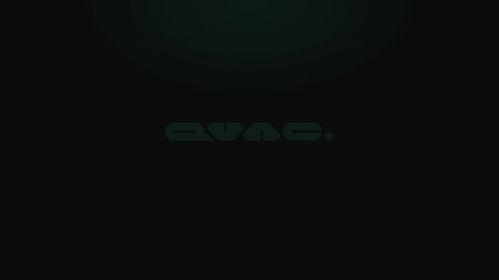

<div align="center">

<a href="https://docs.qvac.tether.io"></a>

<h2>Local AI – SDK &amp; Model Provider</h2>

<h3>Run LLMs, speech, vision, image/video generation, and more on any device.</h3>

<p><em>Build mobile and desktop apps, or serve local models to your favorite AI tools.</em></p>

</div>

<p align="center">
  <a href="https://qvac.tether.io">Website</a> &nbsp;•&nbsp;
  <a href="https://docs.qvac.tether.io">Docs</a>
</p>

<p align="center">
  
  &nbsp;
  <a href="https://www.npmjs.com/package/@qvac/sdk"></a>
  &nbsp;
  <a href="https://pypi.org/project/tetherto-qvac-sdk/"></a>
  &nbsp;
  <a href="https://www.npmjs.com/package/@qvac/cli"></a>
  &nbsp;
  <a href="https://x.com/qvac"></a>
  &nbsp;
  <a href="https://discord.com/invite/tetherdev"></a>
  &nbsp;
  <a href="https://docs.qvac.tether.io/keet/"></a>
</p>

<p align="center">
  
</p>

**QVAC** lets you run a comprehensive range of AI workloads locally using open models across Linux, macOS, Windows, Android, and iOS.

QVAC provides:
- **SDK** for building local-first AI applications and systems in JavaScript/TypeScript and Python.
- **HTTP server** for using QVAC as a local model provider. Its OpenAI-compatible API lets you connect AI tools such as OpenCode and OpenClaw, or any other compatible tool.

## Why QVAC

- **Local-first:** run AI offline with inference optimized for commodity hardware, from consumer apps and embedded systems to on-premises deployments.
- **Privacy and control:** keep data local, own the AI system. No cloud or third-party APIs required.
- **One SDK, all of AI:** a comprehensive range of AI capabilities through one interface.
- **Cross-platform:** one codebase for Linux, macOS, Windows, Android, and iOS, using JavaScript/TypeScript or Python.
- **Peer-to-peer:** fetch AI models directly between peers and build unstoppable internet systems, like BitTorrent or IPFS, but for AI.

## Quickstart

Load a model and run inference locally in a few steps. Pick your path.

<details>
<summary><b>JavaScript</b></summary>

<br>

Run your first example using the JS/TS SDK.

1. Create the examples workspace:

```bash
mkdir qvac-examples
cd qvac-examples
npm init -y && npm pkg set type=module
```

2. Install the SDK:

```bash
npm i @qvac/sdk
```

3. Create `qvac.config.json` to enable client and server logs during the run:

```json
{
  "loggerConsoleOutput": true,
  "loggerLevel": "info"
}
```

4. Create the `quickstart.js` script:

```js
import { loadModel, LLAMA_3_2_1B_INST_Q4_0, completion, unloadModel } from '@qvac/sdk';
try {
  const modelId = await loadModel({
    modelSrc: LLAMA_3_2_1B_INST_Q4_0,
    onProgress: (p) => {
      const mb = (n) => (n / 1e6).toFixed(1);
      const line = `▸ Downloading ${p.percentage.toFixed(0)}% (${mb(p.downloaded)}/${mb(p.total)} MB)`;
      process.stderr.write(process.stderr.isTTY ? `\r${line}` : `${line}\n`);
      if (p.percentage >= 100) process.stderr.write('\n');
    },
  });
  const history = [{ role: 'user', content: 'Explain quantum computing in one sentence' }];
  const result = completion({ modelId, history, stream: true });
  for await (const token of result.tokenStream) {
    process.stdout.write(token);
  }
  await unloadModel({ modelId });
} catch (error) {
  console.error('✖', error);
  process.exit(1);
}
```

5. Run the quickstart script:

```bash
QVAC_CONFIG_PATH=./qvac.config.json node quickstart.js
```

You'll see the model download first. Then QVAC will stream the response tokens and print them to the terminal.

</details>

<details>
<summary><b>Python</b></summary>

<br>

Run your first example using the Python SDK.

1. Create the examples workspace:

```bash
mkdir qvac-examples-py
cd qvac-examples-py
python -m venv .venv
source .venv/bin/activate
```

2. Install the package (self-contained — bundles the QVAC worker and Bare runtime, no Node.js required):

```bash
# Replace <version> with the release you want, e.g. sdk-v0.17.0:
pip install tetherto-qvac-sdk \
  -f https://github.com/tetherto/qvac/releases/expanded_assets/sdk-v<version>
```

3. Create the `quickstart.py` script:

```python
import asyncio
import sys

from tetherto.qvac_sdk import Client, completion, load_model, unload_model
from tetherto.qvac_sdk.models import LLAMA_3_2_1B_INST_Q4_0


def print_progress(p):
    line = f"▸ Downloading {p.percentage:.0f}% ({p.downloaded / 1e6:.1f}/{p.total / 1e6:.1f} MB)"
    print(line, end="\r" if sys.stderr.isatty() else "\n", file=sys.stderr)
    if p.percentage >= 100:
        print(file=sys.stderr)


async def main():
    async with Client() as client:
        t = client.transport
        try:
            model_id = await load_model(
                t, model_src=LLAMA_3_2_1B_INST_Q4_0, on_progress=print_progress
            )
            run = completion(
                t,
                model_id=model_id,
                history=[
                    {"role": "user", "content": "Explain quantum computing in one sentence"},
                ],
            )
            async for event in run.events:
                if event.type == "contentDelta":
                    sys.stdout.write(event.text)
                    sys.stdout.flush()
            print()
            await unload_model(t, model_id)
        except Exception as error:
            print(f"✖ {error}", file=sys.stderr)
            return 1
    return 0


if __name__ == "__main__":
    sys.exit(asyncio.run(main()))
```

4. Run the quickstart script:

```bash
python quickstart.py
```

You'll see the model download first. Then QVAC will stream the response tokens and print them to the terminal.

</details>

<details>
<summary><b>HTTP server</b></summary>

<br>

Launch the server with the CLI, then use QVAC as model provider for OpenAI-compatible tools like OpenCode and OpenClaw.

1. Install the CLI globally (this also installs `@qvac/sdk` as a transitive dependency):

```bash
npm install -g @qvac/cli
```

2. Create the examples workspace:
```bash
mkdir qvac-server
cd qvac-server
```

3. Create the `qvac.config.json` declaring one model to serve:

```json
{
  "serve": {
    "models": {
      "my-llm": {
        "model": "QWEN3_600M_INST_Q4",
        "default": true,
        "config": { "ctx_size": 8192 }
      }
    }
  }
}
```

4. Start the server (bound to `127.0.0.1:11434` by default):

```bash
qvac serve openai
```

The model downloads on first start and is preloaded into memory. You'll see progress in the server output.

5. From another terminal, hit it with any OpenAI-compatible client. A minimal `curl`:

```bash
curl http://localhost:11434/v1/chat/completions \
  -H 'Content-Type: application/json' \
  -d '{
    "model": "my-llm",
    "messages": [{"role": "user", "content": "Explain quantum computing in one sentence"}]
  }'
```

The response comes back as a single JSON payload with the model's answer. Add `"stream": true` to the body to get an SSE stream instead.

6. Point your AI tool at the server: open its model provider settings and add a new OpenAI-compatible provider with base URL `http://localhost:11434/v1`, any string as the API key, and `my-llm` as the model name.

> [!IMPORTANT]
> Setup varies by tool, and we ship dedicated plugins for some of them (like OpenCode and OpenClaw) that run the server for you. See [Connect AI tools to QVAC](https://docs.qvac.tether.io/cli/http-server/connection) for details.

</details>

<br>

> ⭐  If QVAC saves you from shipping yet another cloud dependency, give it a star, it helps other developers find the project!

## AI capabilities

| Task | Description |
| --- | --- |
| **Text generation** | LLM inference for text generation and chat via [Fabric LLM](https://github.com/tetherto/qvac-fabric-llm.cpp). |
| **Text embeddings** | Vector embedding generation for semantic search, clustering, and retrieval. |
| **RAG** | Out-of-the-box retrieval-augmented generation workflow. |
| **Fine-tuning** | Adapting LLMs to domain-specific tasks via LoRA. |
| **Multimodal** | LLM inference over text, images, and other media in one context. |
| **Image generation** | Text-to-image and image-to-image generation via a Diffusion backend. |
| **Video generation** | Text-to-video and image-to-video generation via a Diffusion backend. |
| **Music generation** | Generate music from text, lyrics, and musical controls via [ACE-Step](https://github.com/ace-step/ACE-Step-1.5) or [MiniMax-Music3](https://huggingface.co/MiniMaxAI/MiniMax-Music3) (desktop). |
| **Transcription** | Speech-to-text via a [Whisper backend](https://github.com/tetherto/qvac/tree/main/packages/asr-ggml) or [NVIDIA Parakeet](https://huggingface.co/nvidia/parakeet-tdt-0.6b-v3). |
| **Text-to-Speech** | Speech synthesis via a GGML backend. |
| **Translation** | Neural machine translation, via Fabric LLM and [Bergamot](https://browser.mt). |
| **BCI** | Brain–computer interface transcription via [a Whisper backend](https://github.com/tetherto/qvac/tree/main/packages/bci-whispercpp). |
| **VLA** | Vision-language-action for robot control via [a GGML backend](https://github.com/tetherto/qvac/tree/main/packages/vla-ggml). |
| **OCR** | Extract text from images via ONNX Runtime or GGML backends. |
| **Image classification** | Classify images into labels with confidence scores via [a GGML backend](https://github.com/tetherto/qvac/tree/main/packages/classification-ggml). |

## Peer-to-peer

QVAC's built-in P2P capabilities let you build unstoppable internet systems without depending on centralized infrastructure:

- **Fetch models:** download AI models directly from peers through a distributed model registry, removing the need for centralized model hosting and distribution.
- **Blind relays:** route traffic through relay peers when devices cannot connect directly across NATs and firewalls, keeping the network connected without centralized infrastructure.

## Resources

Explore and use QVAC:

| Resource | Description |
| --- | --- |
| [**Docs**](https://docs.qvac.tether.io) | Comprehensive QVAC documentation. |
| [**Examples**](https://github.com/tetherto/qvac-examples/) | Sample apps and PoCs built with QVAC SDK. |
| [**Local model provider**](https://docs.qvac.tether.io/cli/http-server/connection/) | Use QVAC as a local model provider connected to your favorite AI tools. |
| [**QV.AC**](https://qv.ac) | Get to know our local AI assistant. |
| **Support and community** | We gather on [Discord](https://discord.com/invite/tetherdev) and [Keet](https://docs.qvac.tether.io/keet/). Ask for help, give feedback, and discuss QVAC. |
| [**Blog**](https://qvac.tether.io/blog/) | Tutorials, deep dives, engineering notes, and announcements. |
| [**Ecosystem**](https://qvac.tether.io) | Discover the broader QVAC ecosystem. |
| [**Research**](https://huggingface.co/qvac) | Papers, datasets, and models optimized for edge devices. |
| [**Our vision**](https://docs.qvac.tether.io/about/vision/) | Learn why Tether built QVAC. |

## Contributing

We welcome contributions! Feel free to open a pull request, report bugs, or share ideas through issues.

See [CONTRIBUTING](./CONTRIBUTING.md) for details.

## Banners and badges

Built something with QVAC? Add a badge to your README to show it and help others discover QVAC:

[](https://github.com/tetherto/qvac) &nbsp; [](https://github.com/tetherto/qvac)

```
[](https://github.com/tetherto/qvac)
```

The full set of banners and light/dark and inline badge variants, with copy-paste snippets, lives in [BADGES.md](./docs/branding/BADGES.md).
