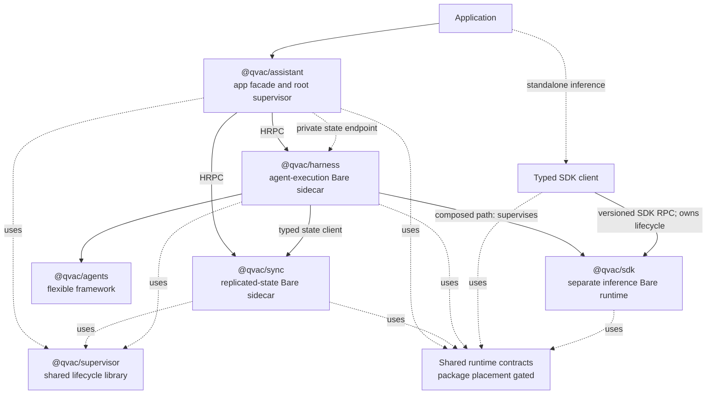

# QIP: Composable Agent Runtime - Decision Brief

This is the shorter approver-facing version of [Composable Agent Runtime](agentic-sdk-p2p-layering.md). It focuses on the product promise, package and runtime boundaries, and migration direction. Detailed evidence and implementation analysis stay in the full QIP.

## Approvers

| Role | Approver | Status |
| --- | --- | --- |
| Lead / Architect | @Dima / @Yury Samarin | |
| Head of QVAC | @Marco | |
| CTO | @Mathias Buus | |

## Why

QVAC should be plug-and-play at the top and composable underneath.

An application should install `@qvac/assistant`, call one lifecycle, and get local agent execution plus durable multi-device state. Developers can still use Harness, Agents, SDK, or Sync directly. Workers, Corestores, HRPC, schemas, storage paths, and runtime versions stay behind the normal API.

The PoC confirms the desktop package boundaries, generated contracts, replicated state, automatic child recovery, and real Qwen task execution between desktop and physical iOS and Android devices. It also shows why Sync, agent execution, and native inference must not share one Bare process. Android now contains SDK native abort in a private Service process and restarts the lightweight SDK probe while the host and sibling runtimes survive. Real model-loaded Android isolation and the iOS process boundary remain hard gates.

## What

The target has six components and three separately supervised Bare runtimes:



Harness owns the SDK runtime in the composed path; the SDK client owns it when an application uses SDK directly.

- **Assistant** owns the application API, defaults, pairing, compatibility, and root lifecycle.
- **Sync** owns identity, P2P networking, replicated state, invites, and durable routing data.
- **Harness** owns ready-to-run agent execution, persistence selection, and SDK supervision.
- **Agents** owns transport-free tools, guards, workflows, approvals, events, and checkpoints.
- **SDK** owns local inference, addons, models, downloads, and standalone worker behavior.
- **Supervisor** owns reusable dependency-aware lifecycle and restart mechanics.

Dependencies remain one-way: Sync has no agent or inference logic; SDK has no mesh or durable delegation logic; Agents owns no runtime or storage; Harness does not depend on Assistant; Supervisor has no product semantics. Shared runtime-contract placement and ownership are Phase 0 decisions.

## Developer experience

The confirmed normal shape is:

```ts
import { createAssistant } from "@qvac/assistant"

const assistant = createAssistant()
await assistant.ready()

const run = assistant.run({
  messages: [{ role: "user", content: "Implement the change" }]
})

for await (const event of run) {
  render(event)
}

await assistant.close()
```

Assistant defaults durable storage to `.assistant`, applies the default model, generates run and trace IDs, starts and reconnects its runtimes, negotiates contracts, and propagates logging and errors. Its stable state facade resolves the current Sync endpoint per operation; active watches surface runtime failure instead of reconnecting silently. Overrides remain available. Direct Harness use defaults to in-memory state. Once models are provisioned, local readiness does not wait for DHT connectivity or peers.

## Runtime behavior

- Assistant root-supervises Sync and Harness. Sync supervises its local
  metadata, identity Corestore, and replicated mesh/network, while Harness
  supervises its lazy SDK runtime.
- Desktop tests prove real child-death detection, dependent reconstruction, and current SDK worker recovery.
- The PoC uses the merged Workbench Supervisor implementation with bounded
  restart, backoff, reconciliation, reload, nesting, and terminal escalation.
- Components own process and HRPC adapters; Supervisor owns generic ordering, restart, suspension, and escalation.
- Replay, checkpoints, claims, fencing, and tool idempotency remain domain policy, not Supervisor behavior.
- Typed contracts fail closed on incompatible required capabilities.
- Logging, coded error envelopes, and one trace ID cross the demonstrated Assistant to Harness to SDK path.

Separate Sync, Harness, and SDK Bare runtimes remain required on supported
targets. Physical iOS and Android prove three concurrent Worklets and
suspend/resume. Android additionally proves real Sync writer admission, a
desktop-Qwen task round trip, background retention, force-stop reconnect, and
SDK abort containment in `:qvac_sdk`. The host and Harness survive, death is
reported, and a replacement SDK process handshakes successfully. This is a
lightweight probe, not real inference. The iOS isolation gate produced an iOS
26 Enhanced Security helper prototype, but Personal Team provisioning blocks
the physical run and multi-gigabyte Metal viability remains unknown.

## State and delegation

Agents ingests transportable state and emits events and checkpoints. Harness chooses in-memory state for direct local use or Sync-backed durable state when composed by Assistant.

Delegation becomes durable task routing through Sync, not an inference RPC proxy. A paired Harness claims replicated work, executes through its own SDK runtime, and commits progress, approvals, checkpoints, and results. Live streams are overlays, not the source of truth. SDK `delegate` and `provide` retire only after an approved migration.

Remote execution remains duplicate-possible until Phase 0 defines leases, fencing, stale reclaim, cancellation, and effect-level idempotency.

## What the proof of concept does and does not prove

**Demonstrated:** generated package contracts, independent desktop runtimes, Sync replication and writer admission, local Harness without Sync, automatic Sync/Harness reconstruction, SDK worker recovery, default storage/model/run IDs, logging/errors/tracing, physical iOS and Android task completion by desktop Qwen, Android background retention, durable Android relaunch, and Android SDK-process abort containment plus restart for the lightweight probe.

**Not demonstrated:** production package extraction, claim guarantees, safe interrupted-run replay, selective visibility and execution authorization, real model-loaded Android crash isolation, iOS crash isolation, accepted mobile resource budgets, complete host lifecycle policy, and production checkpoint compatibility.

## Phase 0 feasibility and decision gates

Phase 0 must turn the current assumptions into evidence and approved contracts before package extraction:

| Gate | Required evidence/decision |
| --- | --- |
| Mobile topology and P9 | Identify a mobile topology that contains native SDK crashes, validate lifecycle and restart behavior on iOS and Android, and approve measured startup, memory, and binary-size budgets. |
| Trust and claims | Approve selective visibility, capabilities, revocation/key epochs, lease/fencing semantics, duplicate handling, and tool idempotency. |
| SDK and host recovery | Prove standalone SDK recovery plus offline, disconnect, background, kill, and relaunch behavior for every supported host. |
| Shared contracts | Place, own, and version the lower-level HRPC/runtime-contract module before extraction. |
| Delegation migration | Inventory consumers and approve parity, deprecation duration, migration guidance, and the removal version. |

## Migration shape

After Phase 0 gates, extract Supervisor, then Sync and Agents, build Harness from Agents plus SDK, compose Assistant as the root facade, and finally migrate consumers before removing SDK delegation. Every step must leave Assistant and standalone SDK shippable.

## Consequences

The upside is one easy entry point plus independently reusable layers for agent frameworks, execution, inference, P2P state, and supervision. The cost is three runtime boundaries, a sixth package, stricter release discipline, and unresolved mobile and distributed-execution guarantees.

The approval ask is to adopt the package ownership, desktop topology, developer-experience promise, and gated migration direction. Mobile crash containment remains an explicit approval gate, not a proven property.

## Out of scope

- Hosted inference APIs, RAG/knowledge replication, attachment/retention/cache policy, vendor graph DSLs, shared Sync/SDK storage, and replacing direct standalone SDK inference.
