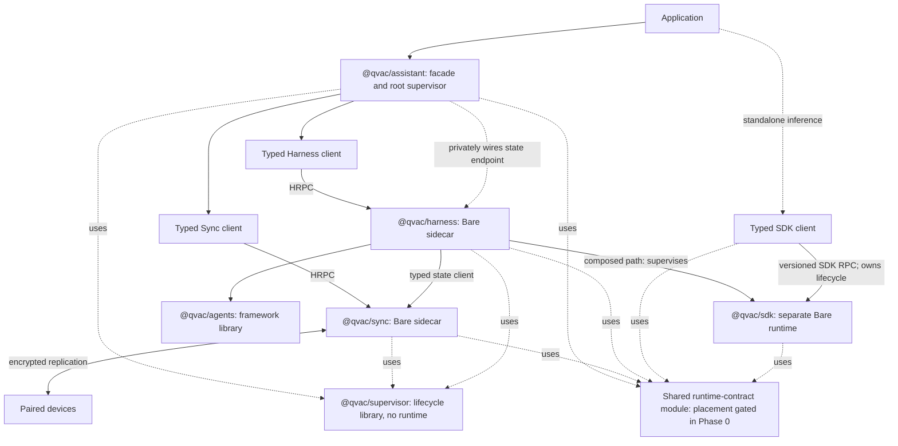

# QIP: Composable Agent Runtime

## Approvers

| Role | Approver | Status |
| --- | --- | --- |
| Lead / Architect | @Dima / @Yury Samarin | |
| Head of QVAC | @Marco | |
| CTO | @Mathias Buus | |

## Problem

QVAC should feel plug-and-play at the top while remaining capable underneath. Developers should be able to choose a high-level Assistant facade, a reusable execution Harness, flexible Agents primitives, direct inference through the SDK, or lower-level Sync infrastructure. They should not have to assemble workers, Corestores, HRPC streams, schemas, storage paths, or compatible package versions merely to make the normal path work.

The existing building blocks make this direction credible:

- The SDK provides local inference, model lifecycle, and model download.
- Assistant has a durable P2P state model for cross-device work, approvals, progress, and results.
- The coding-agent proof of concept composes the current Assistant and Harness packages into a working cross-device coding agent. Its assessment confirms remote execution, streaming, approvals, provider-local tools, and reusable Harness/P2P surfaces. The composable-runtime proof of concept additionally demonstrates generated HRPC clients, separately spawned Sync and Harness processes on desktop, three concurrent BareKit runtimes on physical iOS and Android, and an Android SDK Service process that contains native abort and restarts independently.

The proof of concept also changes the architecture decision in the earlier version of this QIP. A single Bare core is not the preferred target. Co-locating Sync, agent execution, and native inference gives one process too many responsibilities and lets an inference failure tear down P2P state. The target is a supervised set of separately restartable Bare runtimes behind one application-facing lifecycle.

This QIP defines that target, separates the framework from its ready-to-run implementation, keeps state transportable, and retains one durable delegation model. It also records what the proof of concept established and what remains design or implementation work.

## Decision summary

Adopt six components with strict dependency and runtime boundaries:

1. **`@qvac/assistant`** is the optional highest-level application facade.
2. **`@qvac/sync`** is the durable replicated-state engine in its own Bare runtime.
3. **`@qvac/harness`** is the ready-to-run agent execution runtime in its own Bare runtime.
4. **`@qvac/agents`** is the flexible agent framework used by Harness.
5. **`@qvac/sdk`** is the production inference runtime, supervised separately by Harness.
6. **`@qvac/supervisor`** is shared lifecycle infrastructure used by Assistant, Sync, and Harness.

Assistant is the normal plug-and-play entry point. It starts and connects the required clients and sidecars, applies safe defaults, propagates configuration, verifies runtime compatibility, and exposes one lifecycle. Applications may consume lower layers directly, but low-level handles are escape hatches rather than prerequisites.

Sync, Harness, and SDK run in separate Bare runtimes on every supported target. This remains a product requirement, including mobile, not an optional desktop optimization. A Phase 0 mobile spike is a hard feasibility gate: failure returns the topology to approvers with measured evidence rather than silently permitting co-location.

SDK-native stateless delegation is retired. Cross-device execution is durable task routing through Sync-backed state and is coordinated by Harness.

External hosted inference APIs, including OpenAI-compatible providers, are outside this QIP.

## Target architecture



The two SDK paths are alternatives. Harness owns the SDK runtime in the composed agent path; the SDK client owns it when an application consumes SDK directly.

Dependency direction:

```text
application
  -> @qvac/assistant
       -> typed @qvac/sync client
       -> typed @qvac/harness client
  -> direct @qvac/sdk client (standalone inference path)

@qvac/harness sidecar
  -> @qvac/agents
  -> typed @qvac/sync state client
  -> typed @qvac/sdk client

@qvac/sync  -> Holepunch storage and networking
@qvac/sdk   -> inference addons and model distribution

@qvac/assistant -> @qvac/supervisor
@qvac/sync      -> @qvac/supervisor
@qvac/harness   -> @qvac/supervisor

Assistant, Sync, Harness, and SDK clients/runtimes
  -> shared runtime-contract module (package placement decided in Phase 0)
```

There is no dependency from Sync to Harness, Agents, or SDK. There is no dependency from SDK to Sync, Harness, or Agents. Harness does not depend on Assistant. Supervisor has no dependency on any product package. Shared HRPC and contract primitives live in a lower-level runtime-contract module to avoid package cycles. Whether that module is a published package or an internal shared package is a Phase 0 decision; extraction cannot begin until its ownership and versioning are fixed.

## Component ownership

### `@qvac/assistant`: application facade

Assistant runs in the application/client process. It owns:

- the small application-facing API;
- root supervision of the Sync and Harness sidecars;
- default storage location and runtime configuration;
- typed client creation and private endpoint wiring;
- top-level `ready`, `suspend`, `resume`, and `close` ordering;
- log, error, trace, and compatibility configuration propagation;
- product-facing pairing and device-management flow.

Assistant does not own Corestore, mesh internals, the model/tool loop, agent framework semantics, or inference internals.

The normal API must not require a storage path, Corestore, HRPC stream, worker entry, schema router, plugin registry, or runtime version. An illustrative target shape is:

```ts
import { createAssistant } from "@qvac/assistant"

const assistant = createAssistant()

await assistant.ready()

const run = assistant.run({
  messages: [{ role: "user", content: "Implement the change" }]
})

for await (const event of run) {
  render(event)
}

await assistant.close()
```

Exact names are API design work. The architectural requirement is one obvious entry point with internally managed defaults and lifecycle.

The Assistant state namespace is a stable facade rather than a captured Sync
client. Each state operation waits for local readiness and resolves the current
Sync endpoint, so application-held references remain valid after component
replacement. An active watch is not silently replayed or reconnected across a
runtime failure; the iterator terminates and a higher-level caller may choose
an explicit resubscription policy.

`assistant.ready()` must not depend on DHT reachability or the presence of peers. Once models are provisioned, it resolves with local state and execution available while Sync reports network connectivity separately. No peers and no network are healthy offline states, not startup failures.

### `@qvac/sync`: replicated-state engine

Sync is a TypeScript, Bare-first package with a typed client usable from Node/Bun, Electron, Expo/React Native/Hermes, and Bare-compatible hosts. Its server always runs in a dedicated Bare runtime.

Sync owns:

- device identity, mesh creation, invites, joining, and writer admission;
- Corestore, Hyperswarm, Autobase/HyperDB, encrypted blobs, and replication;
- typed replicated operations, snapshots, watches, conflict rules, and migrations;
- durable work requests, claims, progress, cancellation, approvals, and outcomes as state;
- suspend/resume of its own networking and storage resources;
- capability and liveness data used for routing.

Sync does not execute tools, choose models, run agent loops, or expose inference APIs.

Sync ships the default state profile required by Assistant and Harness. Application developers do not provide HyperDB schemas or apply routers on the normal path. Generic schema/profile extension may exist as an advanced API, with explicit versioning and migration rules.

### `@qvac/agents`: flexible framework

Agents is a TypeScript, Bare-first framework library. It owns:

- agents, tools, guards, workflows, turn budgets, and orchestration primitives;
- approval and interruption semantics;
- versioned run state, events, checkpoints, and stable operation identifiers;
- interfaces for context management, compaction, and persistence;
- cancellation and lifecycle hooks that are independent of any process transport.

Agents ingests history/runtime state, emits events, and exports updated state. It owns no worker, network, Corestore, SDK runtime, or application lifecycle.

The package should adopt proven agent-framework shapes where they fit QVAC, without requiring a graph DSL, multi-agent handoff, or vendor-specific abstractions before there is a concrete use case.

### `@qvac/harness`: ready-to-run execution runtime

Harness is the implementation built with Agents and SDK. Its typed client is cross-platform; its server always runs in a dedicated Bare runtime.

Harness owns:

- the model/tool loop and execution scheduling;
- context budgeting and compaction coordination;
- tool approval pauses, cancellation, and stable invocation IDs;
- model selection and inference coordination;
- transportable state ingestion/export through Agents contracts;
- persistence backend selection;
- child supervision and lazy startup of its SDK runtime;
- execution policy for local and remotely submitted work.

Harness does not own P2P storage or mesh membership. Assistant privately gives Harness a typed Sync state endpoint for the default durable mode. Direct Harness use requires no storage configuration and defaults to in-memory state.

Product-specific coding tools, workspace policy, git behavior, terminal UX, OAuth integrations, and product skills remain in applications or product packages.

### `@qvac/sdk`: production inference runtime

SDK remains the direct entry point for applications that only need inference. It owns:

- local inference operations and native addons;
- model lifecycle, plugin selection, and runtime capabilities;
- model download and its own cache/storage;
- its worker protocol and standalone client behavior.

SDK-native `delegate` and `provide` are removed. The SDK has no peer identity, pairing, mesh, agent, or durable-work concept.

Harness communicates with SDK through a typed runtime contract. In the composed path, Harness owns the SDK runtime child through its Supervisor subtree. In the standalone path, the SDK client itself owns worker startup, death detection, restart, model reload, and structured failure reporting under P8. Applications must not supply their own supervisor merely to use SDK.

The standalone Node/Bun path already has a client/worker boundary. On physical
iOS, equivalent Worklet startup, signaling, and suspend/resume pass, but forced
native SDK failure terminates the host application. On Android, a private
`:qvac_sdk` Service using core BareKit and a reliable socket data plane now
contains native abort: the host and sibling runtimes survive, death is
reported, and a new SDK process completes a fresh handshake. This is verified
with the lightweight SDK probe, not yet a model-loaded worker. On iOS 26,
Enhanced Security helper extensions
provide a supported process-boundary candidate with XPC communication and
interruption reporting. The PoC implementation compiles, but Personal Team
provisioning blocks physical execution, and Apple does not qualify the helper
for multi-gigabyte Metal inference. Mobile approval therefore still requires
physical crash, memory, and App Review evidence or delegated inference.

SDK runs in a separate Bare runtime in either path. On desktop, that process
boundary prevents a native inference crash from terminating Harness, Sync, or
the application. Separate mobile Worklets do not provide the same guarantee.
SDK model-download Corestores and swarms are not injected into Sync. Runtime
isolation and clear ownership take priority over sharing those resources.

### `@qvac/supervisor`: shared lifecycle infrastructure

Supervisor is a standalone, reusable library used by Assistant, Sync, and Harness. It has no process of its own and no knowledge of HRPC methods, storage, agents, tools, models, or product policy. The same lifecycle contract must run in client hosts and inside Bare sidecars.

Supervisor owns:

- declarative child specifications and dependency ordering;
- startup in dependency order and shutdown in reverse order;
- explicit child-death reporting;
- bounded restart intensity, backoff, and crash-loop exhaustion;
- restart of affected dependents against fresh child handles;
- suspend/resume, inspection, lifecycle events, and deliberate reload;
- nested supervision trees whose internal failures remain internal until restart exhaustion.

Each component owns the subtree for its runtime concerns:

- Assistant composes the root Sync and Harness children.
- Sync owns the lifecycle of its storage/network workers and internal services.
- Harness owns its run-loop services and SDK runtime child.

Only a subtree's terminal `gave-up` condition escalates to its parent. Supervisor restarts and reconstructs runtime components, but it does not decide whether an interrupted run is safe to replay. Checkpoint recovery, claims, tool idempotency, and business failure policy stay in Harness, Agents, and Sync.

The merged [`qvac-supervisor` PR](https://github.com/tetherto/qvac-app/pull/1103),
with tree-immutability guards from
[PR #1161](https://github.com/tetherto/qvac-app/pull/1161), is implementation
evidence for this boundary, including nested trees and Bare sidecar adapters.
This QIP specifies the component contract, not that implementation's exact API.

## Runtime lifecycle and supervision

`@qvac/supervisor` provides the common lifecycle mechanism. Applications using Assistant do not configure it directly.

The component must support:

- declarative child specs with explicit death reporting;
- dependency-ordered startup and reverse-order shutdown;
- eager or lazy child startup through component-owned specs;
- bounded restart with backoff and crash-loop detection;
- suspend/resume, inspection, lifecycle events, and deliberate reload;
- reconstruction of affected dependents against fresh child handles;
- nested-tree escalation after restart exhaustion.

Assistant, Sync, and Harness own the adapters that spawn processes, create HRPC clients, report child death, propagate observability metadata, and reconnect component-specific handles. Those are not Supervisor responsibilities.

The supervision tree is hierarchical:

- Assistant uses Supervisor to root-supervise Sync and Harness.
- Sync uses its own nested Supervisor tree for storage/network workers and internal services.
- Harness uses its own nested Supervisor tree for run-loop services and its SDK runtime.
- Sync never supervises or launches execution.

`assistant.ready()` resolves after required local sidecars have started, HRPC contracts have been negotiated, observability configuration has been applied, and Harness has received its private Sync state endpoint. It does not wait for DHT discovery or peers. Sync starts eagerly for Assistant's default durable mode and opens local state before networking. Harness may start lazily for state-only use. SDK starts lazily when inference is first needed.

Failure behavior:

| Failure | Required behavior |
| --- | --- |
| SDK runtime crashes | Harness reports a serializable inference failure, restarts SDK under policy, and preserves its own process and Sync state. |
| Harness crashes | Assistant keeps Sync alive, restarts Harness, reconnects its client, and recovers only from committed checkpoints. |
| Sync crashes | Assistant restarts Sync; Harness pauses durable commits and must not silently downgrade a durable run to memory. |
| Competing or stale claims | No production guarantee is approved yet. The Phase 0 claim contract must define leases, fencing, stale reclaim, and duplicate handling. |
| Application/client disconnects | Ownership, linger, and termination policy must be explicit per host; durable state remains recoverable. |
| Mobile app backgrounds | Supervisor suspension and OS behavior must be validated; no new remote claim may start while execution is suspended. |
| Host application is killed | Process-local sidecars terminate; the next launch must reconstruct from durable state without assuming in-memory completion. |
| Repeated crash loop | Supervisor stops retrying, marks the component failed, and returns a human-readable error with diagnostic context. |

Automatic replay of side-effecting tools is unsafe without stable operation IDs and idempotency rules. Initial recovery may mark a run interrupted/recoverable rather than retrying it transparently.

## State, persistence, and delegation

Agent state is transportable across process and persistence boundaries:

```text
Agents:  state in -> events/checkpoints out
Harness: chooses and drives a persistence backend
Sync:    provides the default durable backend for Assistant
```

Harness supports at least:

1. **In-memory state** for local-only use. No storage configuration is required.
2. **Sync-backed state** for durable, multi-device use. Assistant wires this privately as its default.

RAG/vector replication, local-first knowledge, attachment limits, retention, and cache policy are separate decisions. The state contract must not assume they are already replicated.

Delegation is stateful task routing, not an inference RPC proxy:

1. Harness writes a run request plus the required transportable context to Sync.
2. Sync replicates it to paired devices.
3. A target Harness claims the run according to identity, capability, and liveness policy.
4. The target executes through its own SDK runtime.
5. Progress, approvals, checkpoints, and results are committed back through Sync.
6. Live streams may overlay durable state, but they are never the source of truth.

This model is async, disconnect-tolerant, and context-carrying. It replaces the SDK's connection-bound delegate completely.

No execution guarantee is approved yet. The current proof of concept must be treated as **duplicate-possible** under partitions, stale claims, and crash recovery. Exactly-once tool effects cannot be promised by a replicated claim alone. Before production delegation, Phase 0 must define a normative claim state machine covering acquire, lease/renewal, fencing token, expiry, stale reclaim, cancellation, and terminal state, then choose between at-most-once execution or at-least-once delivery with effect-level idempotency. Side-effecting tools require stable invocation IDs and explicit replay policy under either choice.

## Communication, observability, and compatibility

### Typed HRPC contracts

Every sidecar exposes a generated typed client and a versioned HRPC contract. Client-compatible exports must run in Node/Bun, Electron, Expo/React Native/Hermes, and Bare-compatible hosts. Server entries remain Bare-only.

Each connection starts with a handshake containing at least:

- contract name and protocol version;
- supported feature/capability set;
- package/runtime build version;
- required peer features.

Assistant performs the root compatibility check during `ready()`. Harness performs the SDK check before inference. Incompatible required contracts fail closed with a human-readable error. Optional capabilities may degrade explicitly. Users do not maintain a compatibility matrix by hand.

### Logging, errors, and tracing

All six target components use the existing `@qvac/logging` and `@qvac/error` infrastructure.

- A logging configuration supplied to Assistant propagates explicitly through both HRPC clients, sidecars, Agents, and SDK.
- Each process retains its boundary label so records can be attributed to Assistant, Sync, Harness, Agents, or SDK.
- Errors crossing HRPC use standardized, sanitized, serializable envelopes. Public and CLI surfaces render human-readable messages.
- A stable operation/trace identifier follows an operation across Assistant -> Sync/Harness -> SDK and returns on events and errors.
- Profiling is added only after logging, error propagation, and tracing are reliable.

The proof of concept validates generated HRPC clients. Existing HRPC tests also cover stream-close and error propagation. Top-down logging, cross-process tracing, and runtime negotiation remain to be implemented.

## Cross-platform runtime requirements

- Source packages are TypeScript and Bare-first, using syntax supported by the chosen Bare build pipeline.
- `@qvac/assistant` and all typed clients support Node/Bun, Electron, Expo/React Native/Hermes, and Bare-compatible hosts.
- Sync, Harness, and SDK servers run only in Bare runtimes.
- Sync, Harness, and SDK run in separate Bare runtimes on desktop, mobile, Pear, and other supported targets.
- A target is not considered supported until independent startup, restart, suspend/resume, and shutdown have been validated for all required runtimes.

The current desktop proof-of-concept path uses separate Sync and Harness
processes plus the SDK worker. On physical iOS and Android, the lifecycle probe
starts Sync, Harness, and SDK as three named Bare runtimes, while the
interactive task slice runs real Sync on the phone and keeps Harness and
inference on desktop. Android additionally passes background retention,
force-stop reconnect, durable recovery, and SDK abort containment through a
private Service process. The Android host and Harness survive, SDK death is
reported, and a replacement SDK runtime handshakes successfully. iOS Worklets
still share the application process. The iOS process-isolation gate produced
an iOS 26 Enhanced Security helper prototype, but Personal Team capability
restrictions block its physical-device run and its inference resource limits
remain unknown. Production mobile approval still requires real model-loaded
Android evidence and physical iOS evidence.

### P9 resource gates

Three runtimes are not P9-compliant merely because they start. Phase 0 must establish a named constrained mobile reference device and measure:

- cold `assistant.ready()` time offline;
- incremental and total resident memory for Sync, Harness, and SDK before model load;
- peak memory and recovery behavior during model load/inference;
- application, JavaScript bundle, and native binary size attributable to the topology;
- suspend/resume latency and retained memory while backgrounded.

The spike produces the baseline and proposed numeric budgets. Approvers must accept those budgets before the architecture is considered feasible on mobile; subsequent regressions become blocking CI gates. This QIP does not invent limits without measurements.

## Trust boundaries and security (P5)

P5 (Verifiable Trust Boundaries) applies to both network and local process boundaries.

| Boundary | Enforcement and required work |
| --- | --- |
| Peer connection | Hyperswarm device identity + Noise encryption; preserve through Sync extraction. |
| Mesh join/writer admission | Cryptographic admission exists, but Phase 0 must define invite scope, revocation authority, key epochs, and future-access behavior. Revocation cannot erase plaintext already replicated to a peer. |
| Assistant -> Sync/Harness HRPC | Local transport plus contract negotiation; do not treat local reachability as authorization on multi-user hosts. |
| Harness -> SDK HRPC | Expose only inference capabilities; reject incompatible contracts and sanitize addon failures. |
| Remote task execution | Default-deny executor policy keyed to admitted identity, with explicit operation/model/tool capabilities and expiry. |
| Replicated tool data | Phase 0 must define mesh-wide, role-restricted, peer-targeted, and local-only visibility before the Sync schema is extracted. |
| Resource abuse | Bound concurrent runs, context size, model loads, tool duration, blob size, and disk/cache growth. |
| Local secrets | Protect mesh root material and credentials at rest; never pass them into Harness or SDK. |
| Trace/log data | Redact prompts, tool arguments, credentials, and private state before cross-process or remote emission. |

Deleting SDK `provide` removes its default-allow firewall and full-handler exposure. The replacement is not "paired means trusted to execute anything." Sync proves identity and admission; Harness applies execution authorization.

Security is a Phase 0 extraction gate, not deferred hardening. Sync schema extraction cannot begin until a security reviewer approves:

1. selective-visibility classes and which fields use each class;
2. execution capabilities, scope, expiry, and verification;
3. invite revocation, key rotation/epoch behavior, and the limits of revocation for already-replicated data;
4. at-rest protection and process exposure rules for mesh roots, credentials, and other secrets.

## Relationship to `bare-stow` and the Tether bundler

Holepunch `bare-stow` is the packaging/launch backend. The unified Tether bundler is a separate Tether-level initiative built on it, adding defaults and pre-installed targets. QVAC intends to integrate with that work; the SDK-specific port remains tracked in [Porting SDK to Bare Stow](PortingSDKToBareStow.md).

This QIP requires independently packaged entries for Sync, Harness, and SDK, plus host-side supervision. The bundler must preserve:

- separate process/worklet boundaries;
- generated HRPC clients and contract metadata;
- addon manifests and ABI validation;
- platform-specific shutdown behavior;
- crash/death detection and reconnectable endpoints;
- explicit package import composition.

The bundler must not collapse the runtimes into one core as an optimization.

## What the proof of concept establishes

The coding-agent assessment confirms:

- cross-device agent runs over replicated state;
- streaming content, thinking, tool calls, results, and status;
- remote approvals and provider-local tools;
- model lifecycle and pooling in Harness.

Current implementation tests additionally demonstrate:

- generated typed HRPC clients;
- a Core/Sync-style sidecar;
- a separately spawned Harness process on desktop;
- in-process and remote Harness contracts;
- one-time writer pairing with explicit fingerprint approval and apply-path
  Autobee admission;
- a physical-iPhone Sync writer creating a task that a long-running desktop
  Harness and SDK worker process with Qwen, with the terminal result replicated
  back to the phone.

It does not yet confirm:

- the final six-package split;
- adoption of the standalone Supervisor component by Assistant, Sync, and Harness;
- separate Sync, Harness, and SDK Bare runtimes on mobile;
- standalone SDK worker-life signaling/recovery on mobile;
- claim leases, fencing, stale reclaim, or a duplicate-execution guarantee;
- fully offline Assistant readiness and per-host background/kill behavior;
- acceptable mobile startup, memory, and binary-size budgets;
- a transportable checkpoint/resume format;
- stable tool IDs across every boundary;
- full remote Harness parity for attachments and context policy;
- generic schema/profile extension;
- selective visibility and capability authorization;
- top-down logging, tracing, or contract negotiation;
- `@qvac/agents` as a standalone framework.

The Supervisor implementation separately demonstrates declarative dependency
trees, nested failure containment, bounded restart, suspend/resume, reload, a
Bare sidecar adapter, an Assistant-owned tree, and a Harness child adapter. The
composable-runtime PoC now adopts that implementation for its Assistant root
tree, Sync-owned storage/network subtree, and Harness-owned SDK subtree. The
in-process mobile topology is validated on iOS and Android. Android now also
validates SDK crash containment and restart through a private Service process;
real inference in that process and the final iOS topology remain planned.

These gaps become explicit migration deliverables rather than assumptions hidden in the target diagram.

## Feasibility PoC/MVP, decision gates, and unresolved questions

The current PoC validates the product direction, not the full production architecture. Phase 0 is therefore a combined contract-design and feasibility phase. No package extraction or public API removal starts until its gates pass.

### Useful Phase 0 spikes

| Spike | Minimum setup | Measurable exit criteria |
| --- | --- | --- |
| **S1 - Mobile three-runtime topology** | Minimal mobile app with Sync, Harness, and SDK in three Bare runtimes on each supported mobile OS (iOS and Android) | All start independently; HRPC requests cross each boundary; force Sync, Harness, and SDK to die one at a time; the app and unaffected siblings survive; each child restarts, reconnects, and renegotiates; suspend/resume works; addons load after SDK restart. |
| **S2 - P9 footprint baseline** | S1 on a named constrained mobile reference device | Record cold offline `ready()` time, incremental/total RSS, peak model-load memory, application/bundle/native binary size, background retained memory, and resume latency. Produce proposed numeric budgets for approval and CI. |
| **S3 - Claim/lease chaos test** | Two eligible providers and one run; inject partition, provider crash, suspend, lease expiry, and reconnect | An explicit claim state machine is observable; stale claims are fenced/reclaimed according to contract; terminal state is deterministic; a test side effect is not silently repeated. |
| **S4 - Visibility and execution authorization** | Two mesh roles plus a run containing sensitive tool arguments | Unauthorized peers cannot read restricted fields or claim work; execution without the required capability is rejected; capability expiry is enforced. |
| **S5 - Revocation and secret containment** | Revoke an admitted identity mid-run; inspect component logs/configuration | Revoked identity cannot claim new work or read future key epochs; retained access to already-replicated data is documented; mesh roots/credentials do not enter Harness or SDK logs/configuration. |
| **S6 - Standalone SDK recovery** | Application uses SDK directly without Harness; force addon/worker failure on desktop and mobile | Client survives, returns a structured recoverable error, recreates its worker, reloads a model, and completes a later inference request. |
| **S7 - Fully offline local path** | Provisioned model, no DHT/peers/network | `assistant.ready()` resolves; local Sync operations work; a local Harness run completes; networking reports offline/degraded separately. |
| **S8 - Host lifecycle matrix** | Electron, Node/Bun, Expo/React Native/Hermes, and Pear hosts | For disconnect, background, resume, host kill, and relaunch, record which runtimes remain, stop, or restart; durable work recovers according to the documented host policy. |

The spikes prove feasibility only. Their resulting contracts and budgets require approver review before they become architectural guarantees.

### Phase 0 decision gates

| Gate | Blocks | Required output |
| --- | --- | --- |
| **G0 - P5 security contract** | Sync schema extraction | Approved selective-visibility classes, execution-capability format, invite revocation/key-epoch semantics, and secret-storage/process-exposure rules. |
| **G1 - Claim guarantee** | Production durable delegation | Chosen delivery/execution guarantee plus normative acquire, lease, renew, fence, expire, reclaim, cancel, terminal, retry, and idempotency semantics. |
| **G2 - Mobile topology and P9** | Implementation beyond the architecture spike | S1/S2 report and accepted numeric resource budgets. Failure returns the locked three-runtime decision to approvers. |
| **G3 - Standalone SDK recovery** | Claiming P8 coverage for direct SDK consumers | Desktop and mobile owner/recovery contract plus passing S6 evidence. |
| **G4 - Shared runtime contracts** | Package extraction that would create type/protocol cycles | Named module/package placement, owner, protocol versioning policy, and dependency rule. |
| **G5 - Delegation migration** | Removing SDK `delegate`/`provide` | Consumer inventory, compatibility/parity checklist, deprecation release and duration, migration guide, and approved removal version. |
| **G6 - Offline and host lifecycle** | Declaring Assistant's normal API ready | Passing S7 plus a per-host lifecycle policy backed by S8. |

### What is not clear yet

1. Which BareKit mechanism provides three independent mobile runtimes with reliable death signals and acceptable overhead.
2. Whether durable execution targets at-most-once execution or at-least-once delivery with idempotent effects. Exactly-once effects are not assumed.
3. Lease duration, renewal ownership, fencing representation, and stale-claim resolution during long tool calls or partitions.
4. Whether sidecars outlive a client disconnect on each host, and what mobile background/OS-kill behavior is achievable.
5. Whether shared HRPC/contract primitives become a published package or an internal shared package.
6. Numeric startup, memory, and binary-size budgets for the constrained-device profile.
7. Exact SDK delegation deprecation and removal releases, pending consumer inventory.
8. Whether post-revocation confidentiality requires key rotation only, data re-encryption, tombstones, or a new mesh. Data already copied to a peer cannot be recalled.

## Alternatives considered

- **Keep one Bare core for Sync, Harness, and SDK.** Rejected. It is simpler to package but lets native inference failures terminate P2P state and agent execution, conflicts with independent restart, and places mesh secrets in the inference addon's address space.
- **Let applications compose clients, sidecars, storage, and schemas themselves.** Rejected for the normal path. It creates a compatibility and lifecycle integration task for every application. Lower-level clients remain available as escape hatches.
- **Make Sync dispatch work directly to Harness.** Rejected. It couples the state engine to execution and makes Sync responsible for agent runtime policy.
- **Let Harness spawn and own Sync.** Rejected. Local-only Harness must work without P2P, and Sync must remain independently usable and restartable.
- **Keep supervision inside Assistant.** Rejected. Sync and Harness need to own and test their internal lifecycle trees independently, while lower-level consumers may use either package without Assistant.
- **Duplicate restart logic in each package.** Rejected. Death disambiguation, dependency-aware restart, backoff, suspension, and escalation are cross-cutting runtime concerns and must have one reusable implementation.
- **Put the framework and implementation in one package.** Rejected. `@qvac/agents` must be usable as flexible primitives, while `@qvac/harness` is the opinionated ready-to-run implementation.
- **Keep SDK live delegation as a fast path.** Rejected. Durable delegation already supports live streaming as an overlay and adds async recovery and context transport. A second path would require a second authorization and failure model.
- **Share Sync's Corestore/swarm with SDK downloads.** Rejected as the target. Separate runtime ownership provides better isolation and simpler lifecycle rules. Each runtime owns its resources.

## Migration path

Each phase must leave Assistant and SDK shippable and keep existing proof-of-concept tests green.

| Phase | Deliverable | Primary owner |
| --- | --- | --- |
| 0 | Complete S1-S8 and approve G0-G6: mobile topology/footprint, P5 trust contracts, claim semantics, standalone SDK recovery, shared runtime-contract placement, delegation migration policy, offline readiness, and per-host lifecycle behavior. Also lock package dependencies, HRPC handshake, log/error/trace envelope, transportable state/checkpoints, and the default Assistant state profile. | Joint |
| 1 | Extract and stabilize `@qvac/supervisor` from the existing draft, including generic lifecycle semantics and component-adapter conventions. Keep package-specific HRPC/process logic outside it. | Runtime + Joint |
| 2 | After G0/G1/G4 pass, extract the current replicated `Core`, generated client, mesh, watches, blobs, and durable operation model into `@qvac/sync`. Hide storage/schema defaults behind its normal client and adopt a Sync-owned Supervisor subtree. | Assistant |
| 3 | Extract portable framework contracts and loop primitives into `@qvac/agents`: tools, guards, approval semantics, events, checkpoint interfaces, and stable IDs. | Assistant |
| 4 | Build `@qvac/harness` from Agents plus the existing Harness proof of concept. Move execution-host responsibilities into it, add in-memory and Sync-backed persistence adapters, complete the remote wire, and adopt a Harness-owned Supervisor subtree for a separate lazy SDK runtime. | Assistant + SDK |
| 5 | After G2/G6 pass, build `@qvac/assistant` as the root facade. Compose Sync and Harness through its root Supervisor tree and replace manual construction with one offline-capable lifecycle. | Assistant + Runtime |
| 6 | After G3/G5 pass, execute the approved migration and remove SDK `delegate`/`provide` plus delegated model-registry branches. Preserve standalone inference and validate both standalone and Harness-to-SDK recovery contracts. | SDK |
| 7 | Migrate Assistant, the coding agent, and other consumers; align all sidecar entries with `bare-stow`/Tether bundler; remove obsolete monolithic paths after parity. | Joint |

Phase 0 is the feasibility and contract gate. The architecture remains strict, but implementation cannot proceed on assumptions about mobile, security, claims, standalone SDK recovery, or migration. Package extraction without those contracts would reproduce the current ambiguity under new names.

## Suggested ownership split

- **Assistant team** owns `@qvac/assistant`, `@qvac/sync`, `@qvac/harness`, and the initial `@qvac/agents` extraction.
- **SDK team** owns `@qvac/sdk`, its standalone API, runtime contract, inference supervision hooks, model lifecycle, and download/cache ownership.
- **Runtime/bundler owners** own or co-own `@qvac/supervisor` and target packaging.
- **Joint ownership** applies to HRPC contract conventions, logging/error/trace propagation, version negotiation, and cross-platform lifecycle tests.
- **Security review** gates invite/capability design, selective visibility, execution policy, and local-secret handling.

## Consequences

**Principle trace.** This advances P10 (Inference Platform, Not Application Framework) by keeping agent orchestration out of SDK; P4 (P2P as Infrastructure) by isolating Sync; P3 (Modular at the Interface) through typed package contracts; and P8 (Resilient at the SDK Boundary) through separate restart domains. P1 requires the offline behavior in S7. P5 compliance is conditional on G0. P9 compliance is not claimed until S1/S2 establish accepted mobile resource budgets.

### Positive impact

- A developer can install Assistant, call one lifecycle, and run without assembling infrastructure.
- Developers can drop down to Harness, Agents, SDK, or Sync without inheriting unrelated concerns.
- Inference crashes no longer terminate mesh state, and Harness crashes no longer terminate Sync.
- Local-only Harness use requires no persistence setup.
- Assistant gets durable multi-device behavior by default.
- Runtime contract negotiation replaces user-maintained 0.x compatibility matrices.
- Assistant, Sync, and Harness share one lifecycle model while retaining ownership of their own subtrees.
- One durable delegation model replaces the SDK's stateless delegate.
- The framework/implementation split lets agent builders reuse Agents without adopting the whole Assistant product.

### Trade-offs and risks

- Three Bare runtime boundaries increase startup, memory, packaging, and test complexity.
- Strict mobile isolation is not yet proven and may require BareKit/runtime work.
- Supervision and reconnect semantics become shared infrastructure that must be maintained carefully.
- A sixth package adds another compatibility contract, although it removes duplicated lifecycle code.
- Portable checkpoints, stable IDs, and idempotency rules are prerequisites for safe automatic recovery.
- Remote work is duplicate-possible until G1 defines and validates claim, lease, fencing, and idempotency semantics.
- Mobile backgrounding or OS termination may interrupt all process-local runtimes; recovery is limited to committed durable state.
- Revocation prevents future authorized access but cannot erase sensitive data already replicated and decrypted by a peer.
- Separate SDK storage gives up shared-Corestore/cache optimizations.
- HRPC contracts, capability negotiation, and schema migrations add release discipline.
- Moving the current execution host into Harness is a real refactor, not a package rename.
- Existing SDK delegation consumers must migrate to durable task execution or lose the feature.

## Open decisions for implementation planning

1. Exact public method names and configuration shape for Assistant, Harness, and Agents.
2. The initial `@qvac/supervisor` public API and compatibility policy.
3. Initial restart/retry policy for interrupted runs and side-effecting tools.
4. The serialized checkpoint/event format and compatibility policy.
5. The default Assistant state profile and extension mechanism.
6. Migration compatibility between existing Assistant meshes and the extracted Sync schema.
7. Mobile mechanism for three independent Bare runtimes and accepted P9 budgets.
8. Exact delegation compatibility release, deprecation duration, and removal version under G5.
9. Shared runtime-contract module package placement and release ownership.
10. Per-host disconnect/background/kill behavior and sidecar ownership.

## Out of scope

- External hosted inference providers, including OpenAI-compatible APIs.
- RAG/vector replication and local-first knowledge design.
- Attachment limits, retention, and cache policy.
- Vendor-specific graph DSLs or multi-agent handoff before a concrete use case.
- WDK/wallet composition.
- Sharing Sync storage/network identity with SDK downloads.
- Implementing the packages in this QIP.

---

## Appendix A - Current-to-target package map

| Current proof-of-concept component | Target |
| --- | --- |
| `qvac-assistant` `Core`, generated engine client, mesh/storage code | `@qvac/sync` |
| `qvac-assistant` `AssistantClient` plus new root orchestration | `@qvac/assistant` |
| `qvac-assistant` `QvacAssistant` execution host | move into `@qvac/harness` |
| `qvac-assistant-harness` model/tool loop and wire contract | `@qvac/harness` |
| Reusable loop/state/tool abstractions currently embedded in Harness/Assistant | `@qvac/agents` |
| `@qvac/sdk` | remains `@qvac/sdk`, with delegation removed |
| Draft `qvac-supervisor` package | `@qvac/supervisor` |
| Coding-agent tools and workspace policy | application package, outside the six target components |

The current Harness dependency on Assistant for shared RPC types must be removed. Shared protocol utilities belong in a lower-level runtime contract module.

## Appendix B - SDK delegation removal

The SDK code to retire includes:

- delegate swarm/connect code (`hyperswarm.ts`, `delegate-rpc-client.ts`, delegate diagnostics);
- delegate transport and profiler;
- `provide`/`stopProvide` handlers and public APIs;
- delegated load/completion/heartbeat/unload/cancel handlers;
- the model-registry `isDelegated` variant and delegated handler branches;
- `delegate`/`provide` schema fields and related errors.

Model-download networking remains in SDK. Removing delegation trims delegate transport code but does not remove the Holepunch dependencies needed for `registry://` and `pear://` model distribution.

Removal is not approved until G5 produces a versioned migration policy. At minimum it must:

1. inventory active `delegate`/`provide` consumers and required parity;
2. freeze the old path and mark it deprecated in a compatibility release;
3. publish consumer guidance for durable Harness/Sync task execution;
4. keep the compatibility path for an explicitly approved period;
5. name the removal version and verify migrated consumers before deletion.

## Appendix C - Review plan

Consult before posting:

- Assistant lead: package extraction, state model, public facade, and migration.
- SDK lead: runtime contract, delegation removal, model lifecycle, and inference crash behavior.
- Runtime/BareKit expert: strict multi-runtime topology on desktop and mobile.
- Supervisor owner: generic lifecycle contract, nesting, restart intensity, suspend/resume, and escalation semantics.
- Holepunch expert: Sync ownership, mesh lifecycle, schema migration, and capability routing.
- Security reviewer: P5 table, selective visibility, execution authorization, and secret handling.
- Bundler owner: independent sidecar packaging, supervision hooks, and generated targets.
