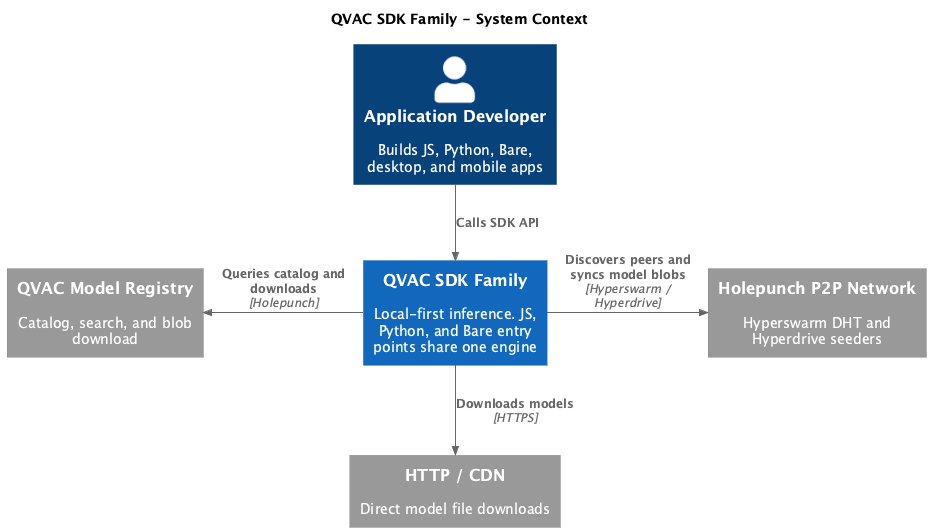
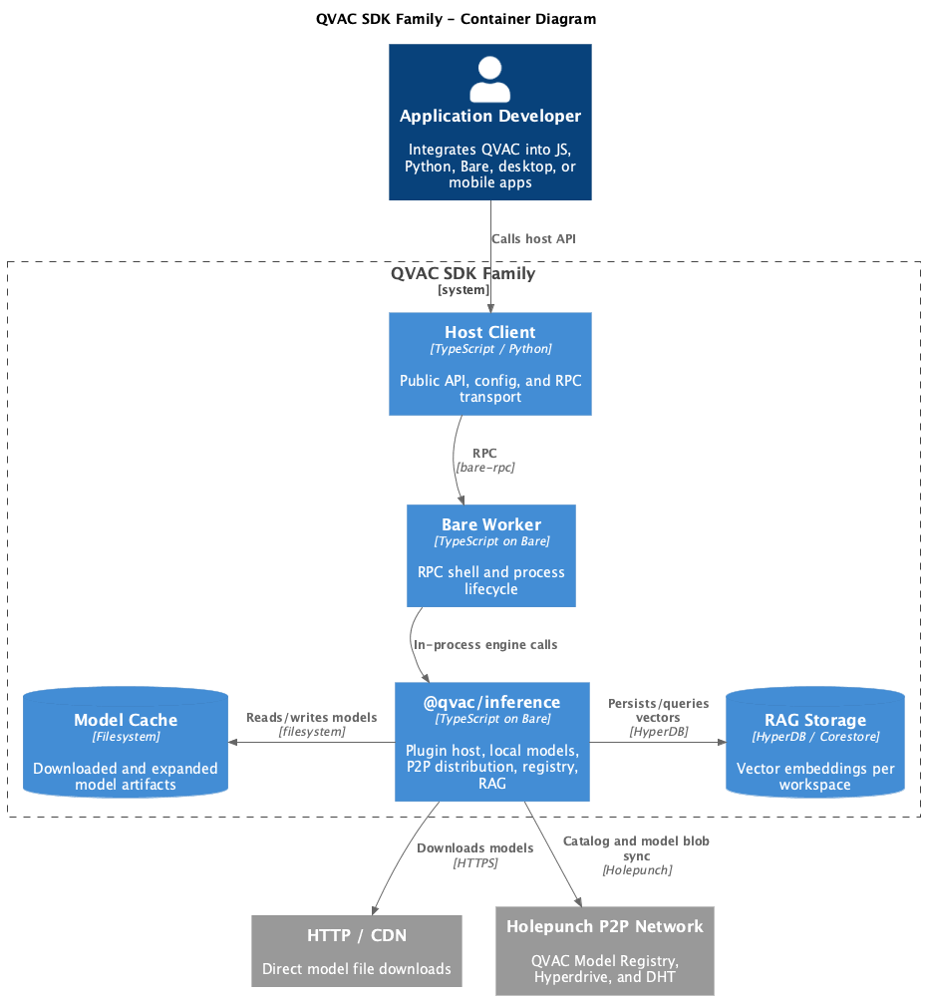
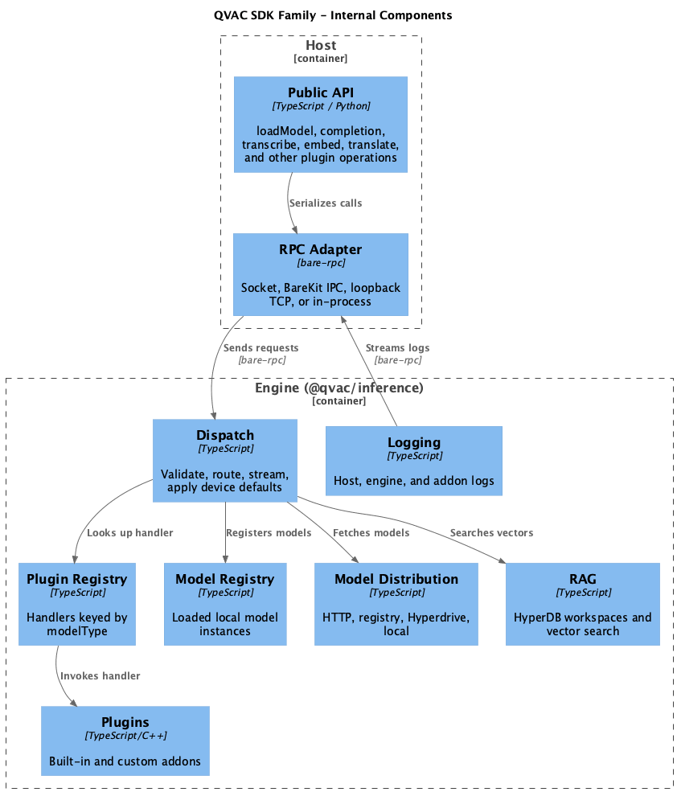
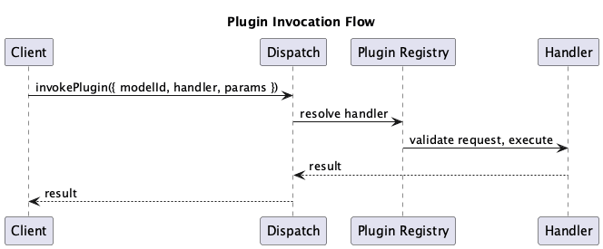
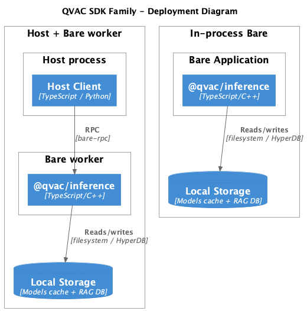
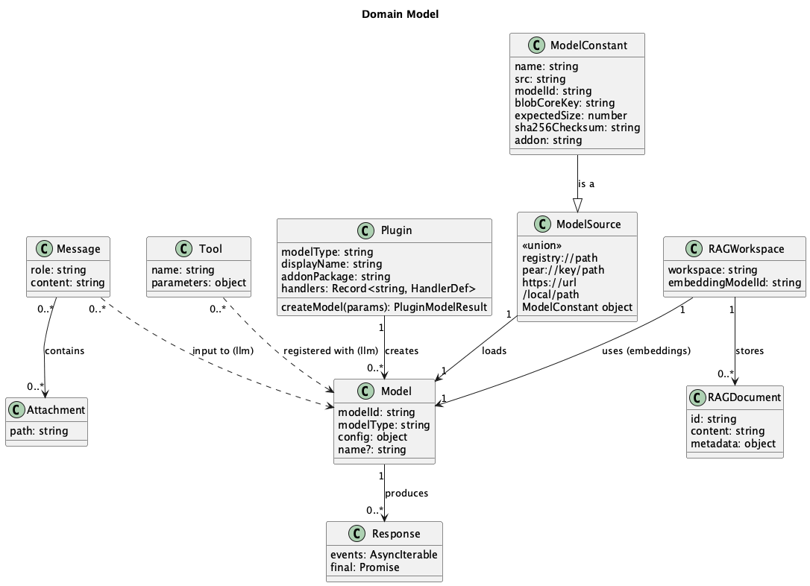
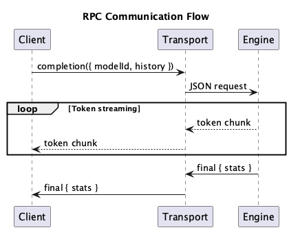
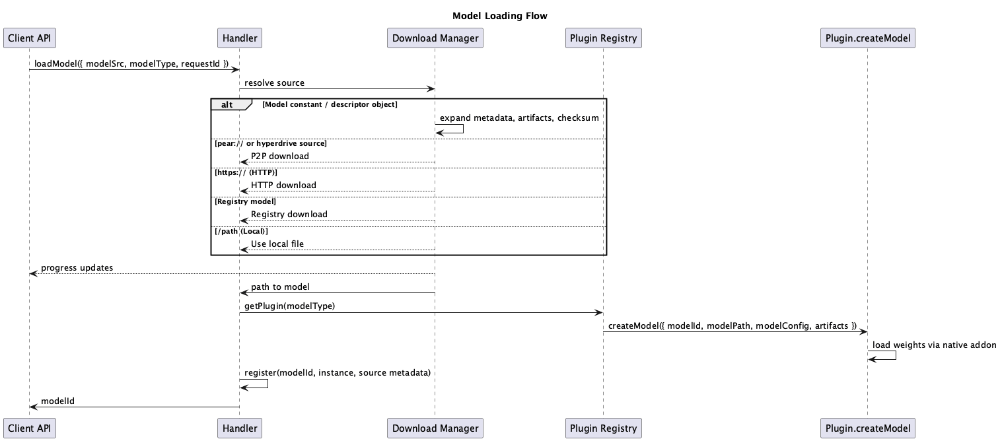
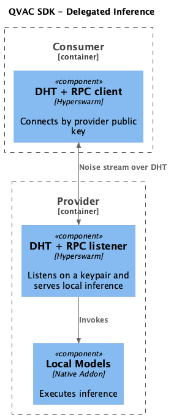
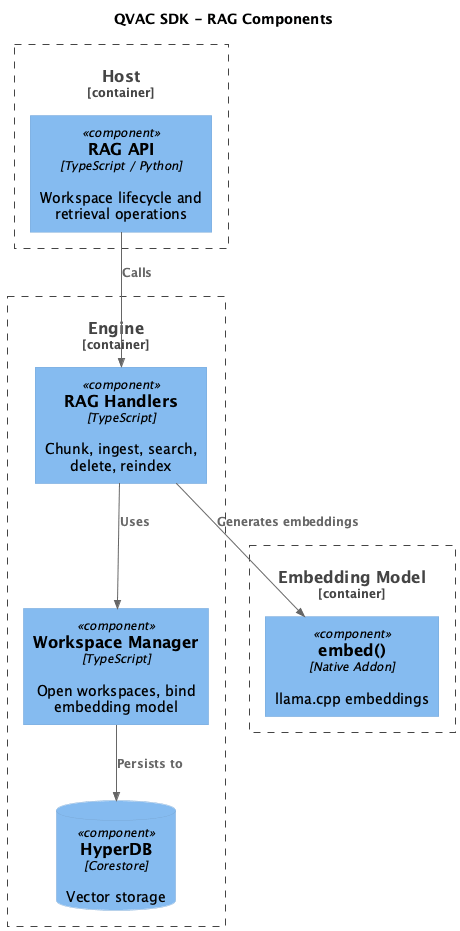

# QVAC SDK Architecture

Author(s): [Yuri Samarin](https://github.com/yuranich) - QVAC Team

Last Update: Aug 24, 2026

Related Documents & Links

- [C4 Model Reference](https://c4model.com/)
- [Agent Integrations](./AGENT-INTEGRATIONS.md) - AI SDK provider, OpenCode plugin, CLI serve, models.dev, layer ownership, and release workflow

---

# Product Executive Summary

QVAC SDK is a local-first, peer-to-peer AI platform for JavaScript, Bare, and Python applications. The architecture is split by responsibility:

- **`@qvac/inference`** is the SDK core: a Bare-only in-process engine with plugin assembly, model loading, request lifecycle, P2P/delegation, registry access, RAG, logging, and profiling.
- **`@qvac/sdk`** is the TypeScript convenience layer for Node.js, Bun, Electron, Expo/React Native, and Pear. It owns runtime integration, worker RPC, bundling, platform packaging, and the default all-plugin distribution.
- **`@qvac/bare-sdk`** is deprecated (last release 0.18.1). In-process Bare consumers should use `@qvac/inference`.
- **`tetherto-qvac-sdk`** is the generated Python client. It is built from the SDK wire contract and runs against the same Bare worker as TypeScript hosts.

The core execution model is the same across packages:

- Plugins implement `QvacPlugin`, provide Zod schemas, create model instances, and expose unary, server-streaming, or duplex handlers.
- Host clients either call the engine in process or send the same request envelope to a Bare worker over the platform transport.
- Model distribution uses the Holepunch stack (Hyperdrive, Hyperswarm), HTTP, the QVAC Model Registry, or local filesystem paths.

---

# System Context Diagram

[PlantUML source](puml/01-system-context.puml)

*Key - Blue: system in scope; grey: external systems; arrows: dependency direction*

---

# Container Diagram

[PlantUML source](puml/02-container.puml)

*Key - Blue: internal containers; grey: external systems; cylinder: data store*

---

# Component Overview

[PlantUML source](puml/03-component-overview.puml)

*Key - Left boundary: host clients; right boundary: shared engine/runtime components; arrows: runtime dependencies*

The component model separates host-facing APIs from engine-owned state. Physical process placement is covered in the [Deployment Diagram](#deployment-diagram).

---

# Plugin Architecture

Each AI capability is an independent plugin. A `QvacPlugin` defines its canonical `modelType`, addon metadata, load-config schema, model factory, optional artifact resolution, and handler set. Handlers declare Zod request/response schemas and whether they are unary, server-streaming, or duplex.

The plugin registry provides uniform dispatch for built-in and custom plugins. Distribution-specific registration rules live in [Worker Generation & Bundle System](#worker-generation--bundle-system).

**Built-in plugins:**

| Plugin | Model Type | Wraps |
|--------|------------|-------|
| LLM Completion | `llamacpp-completion` | `@qvac/llm-llamacpp` |
| Embeddings | `llamacpp-embedding` | `@qvac/embed-llamacpp` |
| Whisper | `whispercpp-transcription` | `@qvac/asr-ggml` |
| BCI Whisper | `bci-whispercpp-transcription` | `@qvac/bci-whispercpp` |
| Parakeet | `parakeet-transcription` | `@qvac/asr-ggml` |
| NMT | `nmtcpp-translation` | `@qvac/translation-nmtcpp` |
| TTS | `tts-ggml` | `@qvac/tts-ggml` |
| OCR | `ggml-ocr` | `@qvac/ocr-ggml` |
| Diffusion / Video / Upscale | `sdcpp-generation` | `@qvac/diffusion-cpp` |
| Audio Generation | `audiogen-ggml` | `@qvac/audiogen-ggml` |
| Vision-Language-Action | `ggml-vla` | `@qvac/vla-ggml` |
| Classification | `ggml-classification` | `@qvac/classification-ggml` |

Model types follow an `engine-usecase` naming convention. Backward-compatible aliases (`llm`, `whisper`, `bci`, `embeddings`, `nmt`, `parakeet`, `tts`, `ocr`, `diffusion`, `audiogen`, `vla`, `classification`) are supported and normalized to canonical types.

**Custom plugins** ship as npm packages whose plugin manifest is imported through a `/plugin` subpath.

**Plugin Invocation Flow:**

[PlantUML source](puml/04-plugin-invocation-flow.puml)

---

# Worker Generation & Bundle System

Plugin registration is determined by the package and runtime path:

- `@qvac/inference` registers no plugins by default. Consumers assemble the engine explicitly with `plugins([...])` or `registerPlugin(...)`.
- `@qvac/sdk` ships a default worker (`dist/server/worker.js`) that registers every built-in plugin.
- `qvac bundle sdk` generates an optimized worker entry for the plugin list in `qvac.config.{json,js,ts}`.

The bundle command emits:

- `qvac/worker.entry.mjs` - standalone worker entry with RPC and lifecycle, used by desktop/Electron/Pear packaging.
- `qvac/worker.bundle.js` - mobile bundle for Expo/React Native BareKit.
- `qvac/addons.manifest.json` - native addon manifest derived from the bundle.

**TypeScript desktop worker resolution:**

| Priority | Source | Description |
|----------|--------|-------------|
| 1 | `QVAC_WORKER_PATH` env var | Explicit path override |
| 2 | Packaged Electron worker | `resources/.../qvac/worker.entry.mjs` |
| 3 | `qvac/worker.entry.mjs` in project root | Output of `npx qvac bundle sdk` |
| 4 | Default SDK worker (`dist/server/worker.js`) | Fallback with all built-in plugins |

---

# Deployment Diagram

[PlantUML source](puml/05-deployment.puml)

*Key - Nested boxes: deployment environment; blue: container instances; cylinder: persistent storage*

Deployment paths:

- Node.js, Bun, and Electron run `@qvac/sdk` in the host process and spawn a Bare subprocess.
- Expo/React Native starts the worker bundle inside a BareKit `Worklet`.
- Pear uses a generated `qvac/worker.pear.entry.mjs` staged into the app.
- Direct Bare runs in one process through `@qvac/inference`.
- Python runs `tetherto-qvac-sdk` in the Python process and starts a Bare worker subprocess.

Native addon packaging follows the deployment target: Node/Bun use installed prebuilds, Electron and Expo/RN package native addons with the app, and Bare/Pear builds include the addons selected by the authored or generated worker entry.

---

# Domain Model Diagram

[PlantUML source](puml/06-domain-model.puml)

---

# RPC Communication Flow

[PlantUML source](puml/07-rpc-communication-flow.puml)

Worker-backed clients use the same JSON request/response envelopes over different transports:

- TypeScript Node/Bun/Electron clients use `bare-rpc` over a Unix socket or Windows named pipe.
- Expo clients use `bare-rpc` over the BareKit worklet IPC bridge.
- Python clients use `bare-rpc-python` over loopback TCP (`127.0.0.1:0`) because asyncio has no cross-platform Unix-socket/named-pipe server.

In-process `@qvac/inference` bypasses sockets and calls the dispatch layer directly.

---

# Model Loading Flow

[PlantUML source](puml/08-model-loading-flow.puml)

**Model Constants:** Model constants are rich objects (not plain strings) containing metadata such as `name`, `src`, `modelId`, `hyperdriveKey`, `expectedSize`, `sha256Checksum`, and `addon`. APIs accept string URIs, local paths, descriptor objects, and model constants via the `ModelSrcInput` union type. Python receives the same constants from `packages/sdk/contract/models.json`.

---

# Delegated Inference Component Diagram

[PlantUML source](puml/09-delegated-inference.puml)

*Key - Left boundary: provider-side; right boundary: consumer-side; bidirectional arrows: P2P connections*

**Delegation Workflow:**

1. **Provider** loads model locally, calls `startQVACProvider({ firewall? })`
2. Provider waits for DHT bootstrap, binds its swarm keypair with `swarm.listen()`, and returns its `publicKey`
3. **Consumer** calls `loadModel({ modelSrc, delegate: { providerPublicKey, timeout?, healthCheckTimeout?, fallbackToLocal?, forceNewConnection? } })`
4. Consumer dials the provider directly with `dht.connect(providerPublicKey)`
5. All inference calls proxy through encrypted P2P stream
6. Provider executes inference locally, streams results back

**Firewall Configuration:** `mode: "allow"|"deny"` with `publicKeys` array

---

# RAG Component Diagram

[PlantUML source](puml/10-rag-components.puml)

**Workspace Isolation:** Each workspace is bound to a specific embedding model at creation. Documents from different workspaces cannot be mixed.

---

# Model Registry (Online Catalog)

The SDK includes a client for the QVAC Model Registry (`@qvac/registry-client`), providing catalog-based model discovery. Client APIs: `modelRegistryList`, `modelRegistrySearch`, `modelRegistryGetModel`. Models discovered through the registry can be loaded via `loadModel()` or pre-downloaded via `downloadAsset()`.

---

# Language Contract & Python Client

The language-neutral SDK contract lives under `packages/sdk/contract/**`:

- `schema.json` contains JSON Schema for every request/response wire type and registered public constants.
- `manifest.json` lists every RPC method and call shape (`request-reply`, `server-stream`, `duplex`).
- `models.json` contains the generated model constants catalog.

`packages/sdk` owns contract generation via `bun run contract:export` and drift detection via `bun run contract:check`. `packages/sdk-python` consumes the contract to generate Pydantic models, typed method stubs, model type maps, error-code registries, model constants, and the pinned SDK version.

The Python package provides:

- A flat public API under `tetherto.qvac_sdk`, plus `tetherto.qvac_sdk.models` for model constants.
- Ergonomic wrappers for common calls, generated stubs for the full RPC surface, typed errors, logging/profiling helpers, VLA helpers, and a notebook `SyncClient` facade.
- Thin PyPI installs that resolve a worker from explicit paths, `QVAC_*` env vars, a local `@qvac/sdk`, a managed `install-worker` cache, or global npm.
- Self-contained release wheels that bundle the worker and Bare runtime for supported platforms.

---

# Security Model

| Boundary | Mechanism |
|----------|-----------|
| P2P Transport | Noise protocol encryption (Hyperswarm default) |
| Delegated Inference | Firewall allow/deny lists by public key |
| Model Integrity | SHA256 checksum verification (model constants include checksums; optional for custom URLs) |
| Path Security | Path traversal protection for model file resolution |
| Local Worker RPC | Local IPC/loopback only; trusted local process model |
| Local Storage | No encryption at rest; relies on OS-level file permissions |

**Not in scope:** Authentication/authorization for local API calls (SDK runs as trusted local process).

---

# Failure Modes

| Failure | Behavior |
|---------|----------|
| P2P peer disconnects mid-inference | Consumer receives error; `fallbackToLocal` option triggers local model load if configured |
| Download interrupted | Partial file cached; resume on retry (HTTP range requests, Hyperdrive sparse sync) |
| Model load fails (corrupt/incompatible) | Error with cause chain; model not registered |
| Native addon crash | Server process may terminate; client receives RPC error |
| Server process OOM | OS kills subprocess; client receives RPC connection error and must restart SDK |
| Worker crash during an in-flight request | Client life-signal race rejects pending calls instead of hanging |
| Plugin not enabled | Fast-fail with a plugin registration / no-handler error and guidance to configure or register the plugin |
| `@qvac/inference` call before plugin assembly | Fast-fail with guidance to call `plugins([...])` or `registerPlugin(...)` |

**Cancellation:** `cancel({ requestId })` is the preferred targeted path for migrated long-running operations, including completion/batch completion, embeddings, transcription, translation, fine-tuning, model loading, asset downloads, RAG, and audio generation. Broad cancellation by `modelId` remains available for shutdown, unload, and admin sweeps.

---

# Native Addons Architecture

- [Addon C++ Framework](../../packages/inference-addon-cpp/docs/architecture.md)
- [LLM Completion - llama.cpp](../../packages/llm-llamacpp/docs/architecture.md)
- [Embeddings - llama.cpp](../../packages/embed-llamacpp/docs/architecture.md)
- [Speech-to-text - ASR GGML](../../packages/asr-ggml/docs/architecture.md)
- [Translation - nmt.cpp](../../packages/translation-nmtcpp/docs/architecture.md)
- [Diffusion - stable-diffusion.cpp](../../packages/diffusion-cpp/docs/architecture.md)
- [Classification - GGML](../../packages/classification-ggml/docs/architecture.md)

---

# Cross-Cutting Concerns

**Logging:** Logs span host client, worker core, and native addons. Addon logs are forwarded to JS via registered callbacks (plugins can configure this via `logging.module` and `logging.namespace`). A streaming mechanism (`loggingStream` / `subscribeServerLogs`) allows real-time log forwarding from subprocess to client for debugging UIs. Log level and console output are configurable via `qvac.config` and Python `Client(config=...)`.

**Error Handling:** All SDK errors expose a numeric `code` property for programmatic handling, with original errors preserved via `cause` chain. Errors are structured classes extending `QvacErrorBase`. Client (50,001-52,000) and server (52,001-54,000) error codes are strictly separated.

**Worker Lifecycle:** Startup has two phases: `initializeWorker()` initializes the engine and worker (environment, log buffering, locks) and registers SIGTERM/SIGINT handlers; then plugins are registered; finally `ensureRPCSetup()` creates the IPC client (desktop) or BareKit RPC server (mobile) and begins accepting requests. On termination signal, the registered shutdown handler runs graceful cleanup: clear registries, unload models, destroy swarm, close RAG instances, cancel downloads, close registry client.

**Request Lifecycle:** Long-running operations run through request lifecycle primitives (`RequestRegistry`, `RequestContext`, `DisposableScope`) that provide request IDs, cancellation, structured cleanup, concurrency policy, and per-request logging. Client-side `completion`, `loadModel`, and `downloadAsset` expose request IDs synchronously so callers can cancel in-flight work.

---

# Repositories

Most packages live in this monorepo under `packages/`. Integration plugins live under `plugins/`, and the documentation site lives under `docs/website`.

**SDK & CLI**

| Directory | Package | Purpose |
|-----------|---------|---------|
| `sdk` | `@qvac/sdk` | TypeScript SDK: public API, worker core, RPC transports, plugins, model registry client, bundling commands |
| `bare-sdk` | `@qvac/bare-sdk` | Deprecated (last release 0.18.1). Use `@qvac/inference` for in-process Bare |
| `inference` | `@qvac/inference` | Implemented SDK core: Bare-only in-process engine, explicit plugin assembly, no worker/RPC/subprocess layer |
| `sdk-python` | `tetherto-qvac-sdk` | Generated Python client for the SDK worker contract |
| `cli` | `@qvac/cli` | CLI tooling (`qvac bundle sdk`, verification, release helpers) |
| `ai-sdk-provider` | `@qvac/ai-sdk-provider` | Vercel AI SDK provider integration |
| `plugins/opencode` | `@qvac/opencode-plugin` | OpenCode integration |
| `plugins/openclaw` | `@qvac/openclaw-plugin` | OpenClaw integration |
| `docs/website` | - | Documentation site (Next.js / Fumadocs) |

**Inference Addons**

| Directory | Package | Purpose |
|-----------|---------|---------|
| `llm-llamacpp` | `@qvac/llm-llamacpp` | LLM completion (llama.cpp) |
| `embed-llamacpp` | `@qvac/embed-llamacpp` | Text embeddings (llama.cpp) |
| `asr-ggml` | `@qvac/asr-ggml` | Whisper and Parakeet speech-to-text (GGML) |
| `bci-whispercpp` | `@qvac/bci-whispercpp` | BCI neural-signal transcription |
| `translation-nmtcpp` | `@qvac/translation-nmtcpp` | Translation (nmt.cpp) |
| `tts-ggml` | `@qvac/tts-ggml` | Text-to-speech (GGML) |
| `ocr-ggml` | `@qvac/ocr-ggml` | OCR (GGML) |
| `diffusion-cpp` | `@qvac/diffusion-cpp` | Image/video generation and upscaling |
| `audiogen-ggml` | `@qvac/audiogen-ggml` | Text-conditioned audio generation |
| `vla-ggml` | `@qvac/vla-ggml` | Vision-language-action inference |
| `classification-ggml` | `@qvac/classification-ggml` | Image classification |

**Support Libraries**

| Directory | Package | Purpose |
|-----------|---------|---------|
| `rag` | `@qvac/rag` | RAG with HyperDB |
| `decoder-audio` | `@qvac/decoder-audio` | Audio decoding |
| `logging` | `@qvac/logging` | Logging utilities |
| `error` | `@qvac/error` | Base error types |
| `langdetect-text` | `@qvac/langdetect-text` | Language detection |
| `registry-server` | process package plus `@qvac/registry-client` / shared packages | Distributed model registry service and client/shared contracts |

