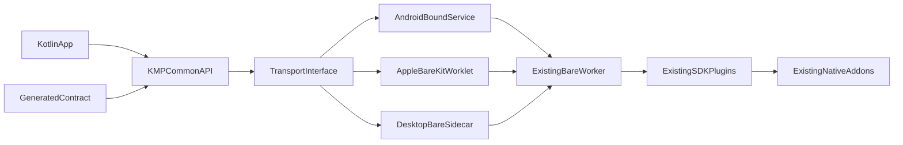

# QIP: First-class Kotlin Multiplatform client for QVAC

## Implementation status and phase-one scope

Phase one covers Android arm64 and desktop JVM: the generated 40-method
contract, idiomatic feature APIs, isolated Android host, desktop JVM sidecar,
all current SDK addon profiles, Maven publications, consumer checks, and Pixel
8a device suite. Kotlin/Native targets are out of scope for phase one because
they have no implemented worker host; this QIP keeps the broader host design as
a future proposal.

The current automated registry target is GitHub Packages. Each `sdk-v*` GitHub
Release also receives token-free, profile-specific Maven repository ZIPs and a
SHA-256 manifest. The Gradle publication supports an arbitrary authenticated
Maven repository and optional in-memory PGP signing
(`MAVEN_SIGNING_KEY`/`MAVEN_SIGNING_PASSWORD`), so Maven Central can be enabled
once namespace/portal credentials and the approvals below are available.
Repository code cannot substitute for those external decisions.

## Approvers

The following approvers are required in priority order:

| Role | Approver | Status |
| --- | --- | --- |
| Lead / Architect | @Dima / @Yury Samarin | Pending |
| Head of QVAC | @Marco | Pending |
| CTO | @Mathias Buus | Pending |

## People to consult before posting

- SDK owner: validate public API, wire-contract generation, lifecycle, and lockstep release semantics.
- Bare/BareKit owner: validate Android service hosting, Apple worklet embedding, teardown, and addon linking.
- Native inference owner: validate reuse of `.bare` prebuilds and GPU/backend packaging.
- Mobile/release owner: validate phase-one Android/JVM variants, Maven publication, signing, and device-test coverage.
- Security reviewer: validate authenticated desktop IPC; review the documented iOS crash-isolation exception before any later Apple phase.
- Preserve the required Lead/Architect, Head of QVAC, and CTO approver sequence above.

## Problem

`@qvac/sdk` is a TypeScript client over a Bare worker, not a portable native library. Android/Kotlin and Kotlin/Native applications currently need React Native/Expo or bespoke worker integration even though QVAC already builds native addons for Android, iOS, macOS, Linux, and Windows.

The blocker is the runtime boundary, not inference-engine availability:

- Product behavior lives in the Bare worker: plugins, model loading, P2P/HTTP distribution, RAG, request admission, cancellation, errors, logging, and lifecycle ([QVAC SDK architecture](../ARCHITECTURE.md)).
- Native addons expose Bare JS modules, while `inference-addon-cpp` is an internal C++20 framework using `std::any`, JS references, and libuv callbacks—not a stable C ABI.
- A language-neutral generated contract already describes unary, streaming, duplex, progress, model, and constant surfaces ([SDK wire contract](../../../packages/sdk/contract/README.md)); the Python SDK proves the thin-client/one-worker model and lockstep generation strategy.

The primary driver is enabling native Android and Kotlin Multiplatform applications without requiring React Native or Expo, while avoiding a second implementation of SDK behavior.

## Proposed solution

Approve a new `packages/sdk-kotlin` SDK that generates its common API from `packages/sdk/contract/` and runs the existing, version-matched Bare worker through platform-specific hosts. Do not port worker handlers or bind inference engines directly in the first release.

### Kotlin API and parity

- Generate request/response models, enums, model constants, method stubs, error-code registries, method call shapes, and the pinned SDK version from `schema.json`, `manifest.json`, and `models.json`.
- Hand-write only irreducibly client-side ergonomics: `suspend` unary calls, `Flow` for server streams/progress, duplex stream adapters, typed errors, completion aggregation, and worker ownership.
- Preserve caller-minted `requestId`, targeted and broad cancellation, normal stream termination with cancelled aggregates rejecting with partial state, immutable initialization config, structured causes/codes, backpressure, and idempotent close.
- Keep behavior in the worker, including tool orchestration, source-language detection, P2P, RAG, queue policy, and lifecycle. Extend the shared conformance corpus instead of reproducing these behaviors in Kotlin.

### Platform hosting

- Android/JVM: publish an AAR containing the Kotlin client, a minimal BareKit JNI adapter, worker bundle, and target native libraries. Host BareKit in a private bound service running in a dedicated app process by default so addon crashes do not kill the UI process. Prove Binder/file-descriptor model access and lifecycle before committing to this topology.
- iOS Kotlin/Native: use a small Objective-C/C adapter to host a BareKit worklet in-process and expose byte IPC to cinterop. General child processes are unavailable on iOS; document that native-addon crashes can still terminate the app, matching the current Expo limitation but not fully satisfying the resilience principle.
- macOS, Linux, and Windows Kotlin/Native, plus desktop JVM: spawn a version-matched Bare sidecar and use the existing cross-platform loopback transport. Add a random per-launch capability token to the initialization handshake, bind only to loopback, and terminate the worker with the owning client.
- Supported first-release matrix follows real current prebuilds: Android arm64; iOS arm64 device plus arm64/x64 simulator; macOS arm64/x64; Linux arm64/x64; Windows x64 (`mingwX64` client talking to the independent MSVC-built worker). Android x86/x64 and Windows arm64 are not claimed until genuinely built and tested.

### Packaging and modularity

- Publish KMP metadata and target variants to Maven Central; publish development variants to GitHub Packages Maven.
- Repack existing CI-built worker/addon outputs into Maven runtime artifacts; do not fork native builds or compile native code in consumer projects.
- Ship a small set of CI-generated runtime profiles (`llm`, `speech`, `vision`, `full`) to preserve practical binary-size excludability without requiring npm/Node in consumer builds. Exact profile membership is versioned and documented; arbitrary profile composition and third-party plugins remain out of scope for v1.
- Add a Gradle plugin that selects a profile, copies/link-target assets, configures Android packaging or Apple linker inputs, and rejects SDK/worker version mismatch before build.
- Carry Apache license and generated NOTICE data into every Maven artifact.

### Delivery gates

1. Architecture spikes: one-token LLM completion and clean teardown on Android service, iOS Kotlin/Native worklet, and desktop Kotlin/Native sidecar; verify stream cancellation and worker restart.
2. Contract generator: deterministic generation/check mode, Kotlin serialization models, method-shape dispatch, model constants, error mapping, and golden conformance vectors.
3. Runtime packaging: AAR, Apple/static-link inputs, desktop sidecars, profile manifests, Gradle integration, checksum/signature verification, and licenses.
4. API parity: unary, server-stream, duplex, progress, cancellation, immutable config, logging, lifecycle, RAG/P2P, and structured error conformance.
5. Release pipeline: KMP target compile/link checks on every PR; expensive real-model/device tests behind `verify`; Maven staging smoke and provenance/signing before promotion.

### Acceptance criteria and ownership

- SDK owner signs off that every contract entry has a generated Kotlin representation and that request IDs, cancellation, streaming, progress, duplex, errors, logging, and lifecycle match the shared conformance corpus.
- Bare/BareKit owner signs off that Android service, iOS worklet, and desktop sidecar start, reconnect, terminate, and release resources repeatedly. Android service death must produce a structured terminal error for in-flight calls and allow a fresh client session; it must not silently replay non-idempotent calls.
- Native inference owner signs off that each runtime profile uses existing version-matched `.bare` prebuilds, validates model checksums, and does not compile native code in consumer projects.
- Mobile/release owner signs off on the artifact matrix, Maven staging smoke, signed checksums, NOTICE/license contents, and rollback of a mismatched runtime artifact.
- Security reviewer signs off on desktop capability-token handshakes and Android Binder authorization. The bound service is non-exported, accepts only callers with the app's signature permission or an app-generated per-session secret, rejects unauthenticated frames before dispatch, and clears the secret on service teardown.
- Lead / Architect, Head of QVAC, and CTO decide whether the documented iOS in-process crash-isolation gap is acceptable for v1. If rejected, the iOS host gate fails and the target is removed from the v1 support matrix; it is not silently shipped with reduced guarantees.

### Runtime capability and support matrix

The common API is generated for the full contract, while runtime support is claimed only where the host and worker profile pass conformance:

| Capability | Android arm64 service | iOS arm64 worklet | Desktop JVM/Kotlin/Native sidecar |
| --- | --- | --- | --- |
| Unary requests and typed errors | Required | Required | Required |
| Server streams and cancellation | Required | Required | Required |
| Duplex requests | Required | Required | Required |
| Progress streams | Required | Required | Required |
| Local model download/load/inference | Required | Required | Required |
| RAG and embeddings | Required in matching profile | Required in matching profile | Required in matching profile |
| P2P/delegated inference | Required where the worker profile supports it | Required where the worker profile supports it | Required where the worker profile supports it |
| Worker restart and client recovery | Service restart with terminal in-flight errors | Worklet teardown/recreate; process crash remains an accepted v1 gap | Sidecar restart with terminal in-flight errors |

The first-release floor is Android API 29 on a representative three-year-old arm64 device with 8 GB RAM, iOS arm64 device plus arm64/x64 simulator, macOS arm64/x64, Linux arm64/x64, and Windows x64. Release evidence must record startup time, peak RSS, APK/AAR or native artifact size, model load time, and streamed completion correctness; the exact budgets are set by the mobile/release owner before the prototype gate is approved.

### Version and release lockstep

The Kotlin package, generated contract, worker bundle, native addon profile, and Maven runtime artifact share one SDK release identity. The build plugin rejects artifacts whose embedded contract version, worker version, or profile manifest digest differs from the Kotlin client. CI generates a provenance manifest containing source commit, npm package versions, target architectures, SHA-256 digests, and licenses; Maven promotion is blocked unless the manifest and staging smoke test agree. A failed promotion leaves the previous Maven version intact and does not update the npm lockstep pointer.

## Alternatives considered

- Public QVAC C ABI plus direct JNI/cinterop: best eventual footprint, but it requires designing an ABI, binding every engine, and reimplementing worker orchestration, P2P, RAG, cancellation, and lifecycle. Defer to a separate QIP after the Kotlin client proves demand and profiling identifies justified native seams.
- Bind llama.cpp/ONNX directly: technically possible but exposes engine APIs rather than `qvac/sdk` and loses QVAC plugin and worker semantics.
- Sidecar on every target: reuses the Python architecture but is not viable as a uniform iOS topology and is awkward for Android app packaging.
- Keep React Native/Expo as the Kotlin bridge: preserves today’s implementation but does not meet the native-app requirement.
- OpenAI-compatible local HTTP only: useful for completion interoperability, but cannot represent the complete model, RAG, media, duplex, plugin, and lifecycle APIs.

## Consequences

Positive:

- One worker remains the behavioral source of truth across TypeScript, Python, and Kotlin.
- Existing native engines, mobile prebuilds, P2P, RAG, registry, plugins, and conformance assets are reused.
- Kotlin consumers receive idiomatic coroutines/Flow APIs without npm, Node, React Native, or Expo in their app project.
- The change is additive to `@qvac/sdk`; no existing TypeScript API migration is required.

Trade-offs reviewers must accept:

- Apps still ship Bare and a JavaScript worker, increasing binary size, startup work, and memory versus a direct C ABI.
- Maven packaging and profile artifacts create a second distribution pipeline that must stay lockstep with npm worker/addon versions.
- iOS cannot provide the desktop/Android process-isolation guarantee; this is a documented principle gap, not hidden parity.
- V1 profile selection is less flexible than npm custom-plugin bundling.
- Android service isolation, Apple static addon linking, and clean repeated worklet teardown are feasibility gates; failure of a gate returns the proposal for redesign rather than silently falling back to a lower-integrity topology.
- Android Binder isolation adds lifecycle and authorization complexity, while iOS retains a process-boundary gap. Both are explicit acceptance decisions with named owners rather than hidden implementation details.

## Security and trust boundaries

- Preserve SHA-256 model verification, Noise-encrypted P2P, firewall keys, local-only diagnostics, and app-sandbox cache storage.
- Authenticate desktop loopback IPC with an inherited per-launch capability token and reject requests before normal dispatch when it is absent or invalid.
- Never download executable worker/addon code at runtime on mobile; all code is linked or packaged at build time.
- Treat Kotlin error causes and logs as local data; add no telemetry.

## Principle alignment and explicit gaps

- Principle 1, Device-First Design: the proposed client keeps inference local after provisioning. P2P and HTTP are provisioning or enhancement paths, never runtime prerequisites.
- Principle 2, Cross-Platform Parity: the generated API and conformance corpus are shared across targets. A target is not advertised until its worker host and required native artifacts pass the delivery gates.
- Principle 5, Verifiable Trust Boundaries: mobile code is packaged at build time; desktop loopback IPC uses a per-launch capability token. The iOS in-process worklet cannot isolate native-addon crashes, so that limitation is explicit and tracked rather than hidden.
- Principle 8, Resilient at the SDK Boundary: Android service and desktop sidecar topologies provide the intended crash boundary. iOS remains a documented exception until a viable out-of-process host exists.
- Principle 9, Reach Every Device That Matters: runtime profiles and tree-shaken bundles constrain binary size. The support floor, model-fit requirements, startup time, and memory budget must be measured on a representative mid-range Android device before release.
- Principle 6, Developer Experience is Architecture: generated contract APIs, idiomatic coroutines/Flow wrappers, structured errors, and a raw escape hatch provide both a common path and an advanced path without exposing runtime branches to application code.

If a selected runtime profile omits a generated capability, the Kotlin API remains present but fails before dispatch with a typed `UnsupportedCapability` error containing the capability name, required profile, and remediation. It must not silently fall back to a different worker or network service.

## Compatibility and release impact

- Add `packages/sdk-kotlin` to the SDK pod and lock its version to `@qvac/sdk`, following the Python/bare SDK precedent.
- Add contract drift checks, package-path/release wiring, signed Maven
  publication, target-specific smoke tests, and Android instrumentation/device
  tests. Add Apple publication and simulator/device tests only when the Apple
  host enters a later supported phase.
- Keep npm native packages as the native-build source of truth; Maven artifacts are deterministic repackaging plus Kotlin host code.
- Start at the current SDK major/minor version; all Kotlin API changes follow the same semver compatibility expectations as the generated contract.

## Out of scope

- Rewriting worker behavior in Kotlin.
- Defining a public stable C ABI or exposing addon-author APIs to Kotlin.
- Replacing Holepunch P2P/RAG storage.
- A Swift-first SDK, Swift Export, or general-purpose XCFramework distribution.
- Arbitrary third-party Kotlin plugins in v1.
- Unsupported architectures that are currently aliases rather than real prebuilds.

## Nice to haves

- A direct C ABI for selected hot paths after profiling demonstrates a measurable need.
- A dedicated Android worker service artifact with automatic restart and richer crash diagnostics.
- Additional runtime profiles and third-party plugin packaging after the core Maven workflow is stable.

## Repository deliverable checklist

- [ ] SDK owner consulted. (Pending)
- [ ] Bare/BareKit owner consulted. (Pending)
- [ ] Native inference owner consulted. (Pending)
- [ ] Mobile/release owner consulted. (Pending)
- [ ] Security reviewer consulted. (Pending)
- [ ] Lead / Architect approval recorded. (Pending)
- [ ] Head of QVAC approval recorded. (Pending)
- [ ] CTO approval recorded. (Pending)
- [x] QIP review completed with document-level blockers resolved.

The prototype and implementation-plan tasks are gated on the three required approvals and the owner consultations above. Evidence must include offline inference after provisioning, interrupted-download recovery, checksum rejection, stream cancellation, repeated host teardown/restart, profile-omission errors, artifact digest verification, and the documented device/resource measurements.
