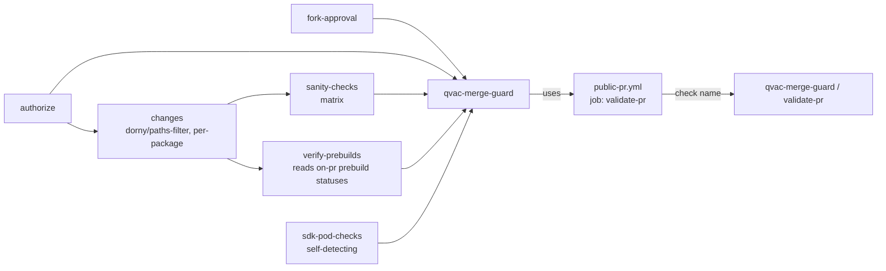

# Merge Guard — wiring a new job into the required status check

`qvac-merge-guard / validate-pr` is the **single** GitHub required status check gating merges to `main`. It exists so the branch ruleset never has to track individual job names — no matter how many jobs run on a PR, GitHub only ever needs to require the one aggregated check. This doc is the reference for *adding a new job so it correctly feeds into that aggregate*, instead of accidentally creating a second, disconnected check that the ruleset doesn't require and nobody notices when it fails.

Folding a new job into `qvac-merge-guard` (below) is what every new merge-gating job does — the ruleset only ever requires this one aggregated check, regardless of how many jobs feed into it.

## Hard rule: nothing else may produce the `qvac-merge-guard / validate-pr` check name

Exactly one job in this repo may produce the check context `qvac-merge-guard / validate-pr`: the `qvac-merge-guard` job in `pr-gate-merge.yml` calling `public-pr.yml`'s `validate-pr` job. No other workflow may define a job with id `qvac-merge-guard` (or any job that itself calls a reusable workflow whose job id is `validate-pr`) — doing so would produce the identical check-context string and let that other workflow's result silently satisfy the required check instead of the real Merge Guard gate.

Before merging any workflow change, verify:

```bash
grep -rl "^  qvac-merge-guard:$" .github/workflows/*.yml
```

This must return **only** `pr-gate-merge.yml`. If it returns more than one file, that's the collision — rename the job id in whichever file didn't earn the name (see the general check-name-collision guidance the org already applies when centralizing per-addon jobs).

**This applies to any new job or workflow, in any domain** — a new addon's sanity check, an SDK check, a docs-validation job, a security scan, a licensing gate, anything. The three patterns below (fold-in / caller-workflow / new-boolean) are generic decision points, not specific to packages or addons. The concrete `prebuilds-caller.yml` / addon examples used throughout are one worked instance of the pattern, not the only thing it applies to — substitute your own job/family/category wherever an addon or package name appears.

---

## The job graph

`.github/workflows/pr-gate-merge.yml` ("Merge Guard", triggers on `pull_request_target`):



The final job in `pr-gate-merge.yml`:

```yaml
qvac-merge-guard:
  needs: [authorize, fork-approval, changes, sanity-checks, verify-prebuilds, sdk-pod-checks]
  if: |
    always() && !cancelled() &&
    (needs.changes.result == 'success' || needs.changes.result == 'skipped')
  permissions:
    contents: read
    packages: read
  uses: ./.github/workflows/public-pr.yml
  with:
    sanity-checks-status: ${{ needs.fork-approval.result == 'success' && needs.authorize.result == 'success' && needs.authorize.outputs.allowed == 'true' && (needs.sanity-checks.result == 'success' || needs.sanity-checks.result == 'skipped') }}
    build-status: ${{ needs.fork-approval.result == 'success' && needs.authorize.result == 'success' && needs.authorize.outputs.allowed == 'true' && (needs.verify-prebuilds.result == 'success' || needs.verify-prebuilds.result == 'skipped') }}
    general-checks-status: ${{ needs.fork-approval.result == 'success' && needs.authorize.result == 'success' && needs.authorize.outputs.allowed == 'true' && (needs.sdk-pod-checks.result == 'success' || needs.sdk-pod-checks.result == 'skipped') }}
```

A skipped gated job (`sanity-checks`, `verify-prebuilds`, `sdk-pod-checks`) counts as success **only when the PR was actually authorized**. Those jobs `if`-gate on `authorize.outputs.allowed == 'true'`, so an unapproved external fork (fork-approval failed, authorize skipped, or `allowed=false`) skips all of them — and a bare `skipped → success` mapping would green the required check. Each status input therefore requires the full chain (`fork-approval` success **and** `authorize` success **and** `allowed == 'true'`) before trusting a skip, so unauthorized PRs fail closed (`validate-pr` returns a failing required check).

### `verify-prebuilds`: Merge Guard checks prebuilds, it does not trigger them

`build-status` comes from `verify-prebuilds`, which **reads** rather than **runs** prebuilds. Building is owned by the label-gated `on-pr-<pkg>.yml` flows (so their native-change detection + artifact-reuse optimisations are preserved and prebuilds don't run on every PR). Each prebuild-bearing `on-pr-<pkg>.yml` has a `publish-prebuild-status` job that posts a `qvac/prebuild-<pkg>` commit status on the PR head SHA — `success` when the prebuild passed *or* reused an artifact *or* was **legitimately** skipped, `failure` otherwise. The prebuild job uses `if: always() && …`, so an upstream failure (e.g. `ci-router`, which produces `run_prebuilds`, erroring) doesn't fail that job — it makes its `if` fall through and the job comes back `skipped`. A bare `skipped → success` mapping would therefore turn a crashed pipeline into a green prebuild. To fail closed, the publish job forwards `ci-router`'s `result` and `run_prebuilds`, and a skip is trusted only when `ci-router` succeeded and deliberately chose not to build (`run_prebuilds == 'false'`, i.e. no prebuild label); any other skip publishes `failure`. That job stamps its own run URL into the status `target_url`, binding the status to the exact `on-pr-<pkg>` run that produced it. `verify-prebuilds` intersects the changed packages with its `PREBUILD_KEYS` allowlist and, for each, waits for and mirrors that commit status (fail-closed on timeout). It selects the newest matching status across **all** pages of the statuses API (paginated results are slurped and flattened, so a context that appears on more than one page is never split).

Both sides share one unit-tested module in `.github/scripts/prebuild-status/` (`lib.mjs` holds the pure state-mapping / selection / run-binding / freshness logic; `publish.mjs` and `verify.mjs` are thin CLIs that inject the GitHub API calls). The producing `on-pr-<pkg>` publish jobs and the merge-guard verify job each `sparse-checkout` only that scripts directory from the trusted default branch (never PR head code) and run the corresponding CLI. The logic is covered by `.github/scripts/test/prebuild-status.test.mjs`.

To avoid trusting a **superseded** status (e.g. a `skipped = success` from an earlier no-label run that is later relabelled to build on the same SHA), `verify-prebuilds` reads the producing run — by the id embedded in `target_url` — and trusts the status only when that run (a) is the `on-pr-<pkg>` workflow and (b) was triggered at/after this PR event (`run.created_at >= github.event.pull_request.updated_at`). Because the run id comes from the status itself, this never depends on the Actions API having *listed* the newest run for the SHA — so there is no listing-lag window, and a status produced by a pre-label run (whose `created_at` predates the label) is rejected even if its own timestamp happens to post-date the label. `concurrency.cancel-in-progress: true` additionally cancels an older in-flight Merge Guard run so only the newest run (with the newest threshold) gates the PR, and as cheap defense-in-depth `verify-prebuilds` only trusts statuses whose `creator.login` is `github-actions[bot]`. It compiles nothing and inherits no secrets. When you add a new prebuild-bearing addon, add its key to `PREBUILD_KEYS` and give its `on-pr-<pkg>.yml` a `publish-prebuild-status` job that stamps `target_url` with its run URL.

> **Known limitation — relabel-after-green window.** A PR that changes a prebuild-bearing package *without* the prebuild label legitimately greens `qvac-merge-guard / validate-pr` (no build required — matches the "doc/version-bump changes shouldn't rebuild" goal). If someone then adds the prebuild label, a new Merge Guard run starts and its `verify-prebuilds` correctly waits for the real build, but GitHub keys required checks by **commit SHA**, so the earlier green can remain valid on that same SHA until the new run reports. `concurrency.cancel-in-progress: true` closes the *in-flight* variant (a run still polling when the label lands is cancelled), and the newly-triggered run re-marks the check pending under GitHub's latest-run-for-context semantics. The window cannot be closed by posting a same-named `pending` commit status: GitHub requires that when a check and a commit status share a name, **both** must pass, and `validate-pr` only ever reports a check-run — a same-named status would deadlock every merge. Mitigation: don't rely on auto-merge firing between adding a prebuild label and the labeled build completing; push a new commit (new SHA) if in doubt.

> **Historical note:** an earlier design had Merge Guard call a `prebuilds-caller.yml` reusable workflow that built every changed package itself. That file was removed — it double-ran prebuilds (once here, once in the label-gated `on-pr` flow) and bypassed the reuse optimisations. The caller-workflow *pattern* described below is still a valid general shape; `prebuilds-caller.yml` is just no longer a live instance of it.

`public-pr.yml`'s single job (`validate-pr`) fails the check if any of the boolean inputs it receives is `false` (sanity checks, builds, integration tests, etc.). External fork secret-bearing jobs are gated upstream by the `fork-ci` environment (`fork-approval` job); see [`LABELS.md`](LABELS.md). Its check name — `qvac-merge-guard / validate-pr` — is the *only* thing the ruleset requires. It also already accepts two boolean inputs `pr-gate-merge.yml` doesn't use yet: `integration-tests-status` and `build-with-model-status` — see the caller-workflow pattern below for how to use the spare `integration-tests-status` slot instead of inventing a new one.

### Gotcha: `sdk-pod-checks` reports under two check names

`pr-checks-sdk-pod.yml` has both a `pull_request` trigger (covers `release-*`/`feature-*`/`tmp-*`, which Merge Guard doesn't) and `workflow_call` (how `pr-gate-merge.yml` pulls it in). On `main`, both fire: the direct trigger reports as `SDK Pod Checks`, the `workflow_call` one as `sdk-pod-checks / SDK Pod Checks`. Same logic, two check-context strings — not a ruleset requirement (only `Check Approvals` and `qvac-merge-guard / validate-pr` are actually required), just branch coverage. Match both strings if you're regex-matching this check by name.

---

## Adding a new job — pick the right pattern

However you're extending Merge Guard, you're always in one of three situations. **If you're an agent following this doc on someone's behalf, ask which pattern applies as an explicit question rather than inferring it from repo state** (e.g. an existing half-built caller workflow doesn't necessarily mean pattern 2 is what the human wants) — confirm, then proceed. Work out which one applies *before* touching any YAML:

### 1. Folds into an existing category

Use this when the new job is just another instance of a check `qvac-merge-guard` already gates on (another sanity check, another build, another SDK-pod-style check) — no matter what triggers it or what it validates.

If it's matrix-driven off `changes`, add an entry to the `changes` job's `dorny/paths-filter` map (one entry: `<key>: ["<path-glob-that-should-trigger-it>", ...]`) and it flows through the existing matrix/caller automatically — `qvac-merge-guard` and `public-pr.yml` need no changes. The addon-package example: `<pkg>: ["packages/<pkg>/**", ".github/workflows/prebuilds-<pkg>.yml"]`.

If it's a single job that's close to an existing category but isn't matrix-driven, add it to that category's `needs:` and fold its result into the existing boolean's expression, e.g.:

```yaml
general-checks-status: ${{ (needs.sdk-pod-checks.result == 'success' || needs.sdk-pod-checks.result == 'skipped') && (needs.my-new-job.result == 'success' || needs.my-new-job.result == 'skipped') }}
```

### 2. A repeated, growing family of similarly-shaped jobs — build a caller workflow

**Don't reach for this with only one target.** If today there's exactly one thing to gate on (e.g. only `ocr-ggml` needs an integration-test job right now), that's pattern 1 or pattern 3, not this one — wire that single job in directly, no caller workflow. A caller workflow's entire value is dispatching to *multiple* targets from one place; with one target it's pure indirection for zero benefit (an extra file, an extra `uses:` hop, nothing gained). Build the caller **later**, when a second target actually shows up — refactoring one direct job into a one-job caller at that point is a small, mechanical change, not a reason to build it preemptively.

Use this pattern only once you're actually adding **more than one or two** near-identical jobs that only differ by which thing they target — one per addon package, one per platform, one per service, one per whatever. The naming pattern doesn't matter (`integration-*`, `lint-*`, `deploy-*`, anything) — what matters is "this is a family that will keep growing as new targets get added," not "this looks like it structurally resembles `prebuilds-caller.yml`."

**Even then, check whether you actually need a caller, or just a matrix.** This repo already has both shapes for the same "one-per-package" problem, chosen for different reasons — pick based on which is actually true of your case:

- **Matrix** (`sanity-checks`) — use when every target runs the **same job body**, just parameterized (same composite action, same steps, only `workdir`/similar inputs differ). One job definition, `strategy.matrix.include: ${{ fromJSON(needs.changes.outputs.packages-with-path) }}`, done. No caller workflow needed at all — the matrix *is* the aggregation, and `qvac-merge-guard` depends on the single `sanity-checks` job.
- **Caller workflow, one named job per target** (`prebuilds-caller.yml`) — use when each target's job is genuinely **heterogeneous**: different `uses:` (each package has its own `prebuilds-<pkg>.yml`), potentially different inputs/secrets/permissions per target, or steps that diverge enough that forcing them into one matrix body would obscure more than it clarifies. The caller exists mainly for **readability and separation** — one clearly-named job per package instead of one matrix job whose per-iteration behavior is harder to follow — not because the jobs can't technically be expressed as a matrix.

If your new family's job body is uniform across targets, default to a matrix and skip the caller workflow entirely. Only reach for the caller-with-individual-jobs shape when the targets' jobs genuinely diverge enough that a single matrix body would hurt readability.

**Don't** wire each member of the family individually into `qvac-merge-guard`'s `needs:` array one at a time — that's how the array becomes an unreadable, ever-growing list, and it's the same anti-pattern as the 15 legacy `on-pr-<pkg>.yml` workflows the org is trying to move away from (see `packages/ocr-ggml/.agent/knowledge/ci-validation.md`). Whichever shape (matrix or caller) you land on, it's still exactly one job in `qvac-merge-guard`'s `needs:`.

Instead, follow the exact precedent already in this repo: **`prebuilds-caller.yml`**. It's a reusable `workflow_call` workflow with one job per target, each gated on a membership check against a JSON list of what changed/applies:

```yaml
# .github/workflows/prebuilds-caller.yml (existing, for reference)
on:
  workflow_call:
    inputs:
      changed-packages:
        required: true
        type: string
      repository:
        required: false
        type: string
        default: "tetherto/qvac"
      ref:
        required: false
        type: string

jobs:
  ocr-ggml-build:
    if: contains(fromJSON(inputs.changed-packages), 'ocr-ggml')
    uses: ./.github/workflows/prebuilds-ocr-ggml.yml
    secrets: inherit
    with:
      repository: ${{ inputs.repository }}
      ref: ${{ inputs.ref }}
  # ...one block per package
```

Because it's called via `uses:` as a single job in `pr-gate-merge.yml`, that one job's `result` already reflects the aggregate of every inner job (success only if all ran-or-skipped cleanly) — no extra aggregation step needed.

To wire any such family in the same shape (worked example below uses a hypothetical `integration-*` family — substitute your own):

1. Create a new caller workflow (e.g. `.github/workflows/integration-tests-caller.yml`), mirroring `prebuilds-caller.yml`'s structure — one job per target, `if: contains(fromJSON(inputs.changed-packages), '<target>')` (or whatever list your family keys off), each calling that target's existing job/workflow.
2. Add exactly one job to `pr-gate-merge.yml`:
   ```yaml
   integration-tests-caller:
     needs: [authorize, fork-approval, changes]
     if: needs.authorize.outputs.allowed == 'true'
     permissions:
       contents: read
     uses: ./.github/workflows/integration-tests-caller.yml
     secrets: inherit
     with:
       changed-packages: ${{ needs.changes.outputs.packages || '[]' }}
       repository: ${{ github.event.pull_request.head.repo.full_name }}
       ref: ${{ github.event.pull_request.head.sha }}
   ```
3. Add `integration-tests-caller` to `qvac-merge-guard`'s `needs:`, and wire its result into the **already-existing** `integration-tests-status` input on `public-pr.yml` (no change to `public-pr.yml` needed — that boolean is unused today, this is exactly what it's for):
   ```yaml
   integration-tests-status: ${{ needs.integration-tests-caller.result == 'success' || needs.integration-tests-caller.result == 'skipped' }}
   ```

Still exactly one check reported: `qvac-merge-guard / validate-pr`.

### 3. A genuinely new category — one-off job, not a repeated family, doesn't fit any existing boolean

Add the job to `pr-gate-merge.yml`, add it to `qvac-merge-guard`'s `needs:`, and add a **new** boolean input — first check whether `public-pr.yml` already has a spare unused input (`build-with-model-status` is also currently unused, alongside `integration-tests-status` if you haven't claimed it per pattern 2) before adding a brand new one to `workflow_call.inputs` and the shell check block.

### What NOT to do

Never give a new job its own top-level `pull_request_target` trigger with no `needs:` link into `qvac-merge-guard`. That produces a second, disconnected check name the ruleset doesn't require — a failure there is invisible to the merge gate. This is the exact anti-pattern the legacy per-package `on-pr-<pkg>.yml` workflows represent; wiring many similarly-named jobs straight into `needs:` one-by-one instead of behind a caller workflow is the same anti-pattern in miniature.

---

## Verification after wiring a new job

1. Open a real (or throwaway) PR touching the new job's trigger paths.
2. Confirm via `gh pr checks <n> --repo tetherto/qvac` that `qvac-merge-guard / validate-pr` still appears exactly once, and its pass/fail reflects the new job's outcome (force the new job to fail once to confirm the aggregate check goes red).
3. Because `pr-gate-merge.yml` is `pull_request_target`-triggered, it always runs the version of the workflow from `main` — a PR that edits `pr-gate-merge.yml` itself cannot self-validate its own wiring change pre-merge. Merge first, then validate on a subsequent PR against the updated `main`.

## See also

- [`docs/ci/LABELS.md`](LABELS.md) — fork-ci environment and retired `verified` label.
- [`docs/ci/TEAMS.md`](TEAMS.md) — who can approve the `fork-ci` environment.
- `qv-merge-guard-wire` skill (`.cursor/skills/qv-merge-guard-wire/`) — this doc's content as an actionable Claude/Cursor skill.
