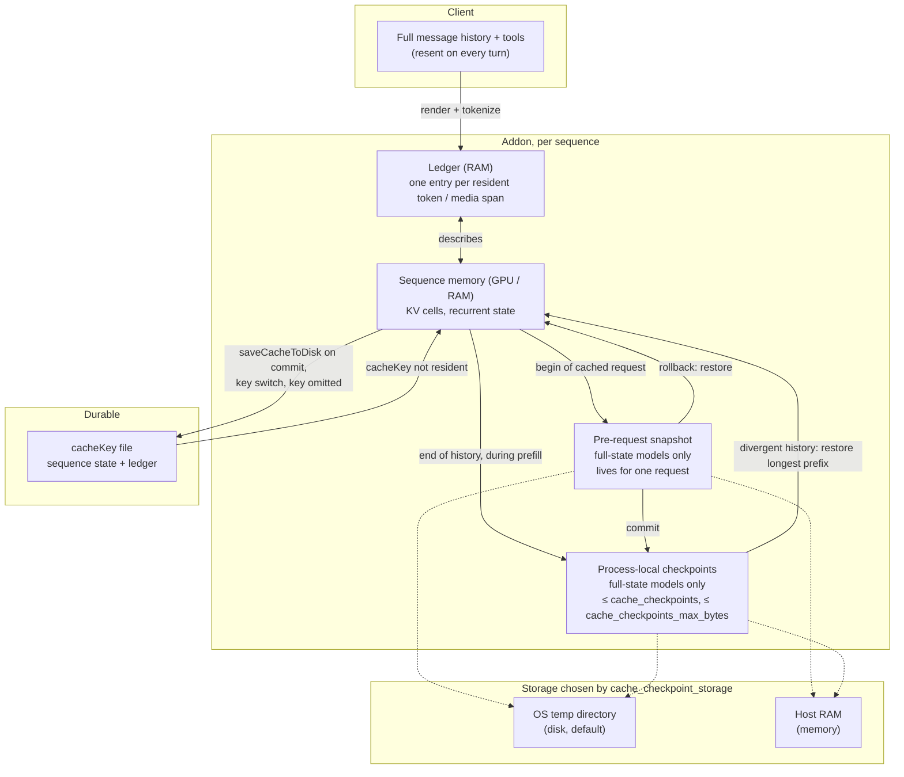
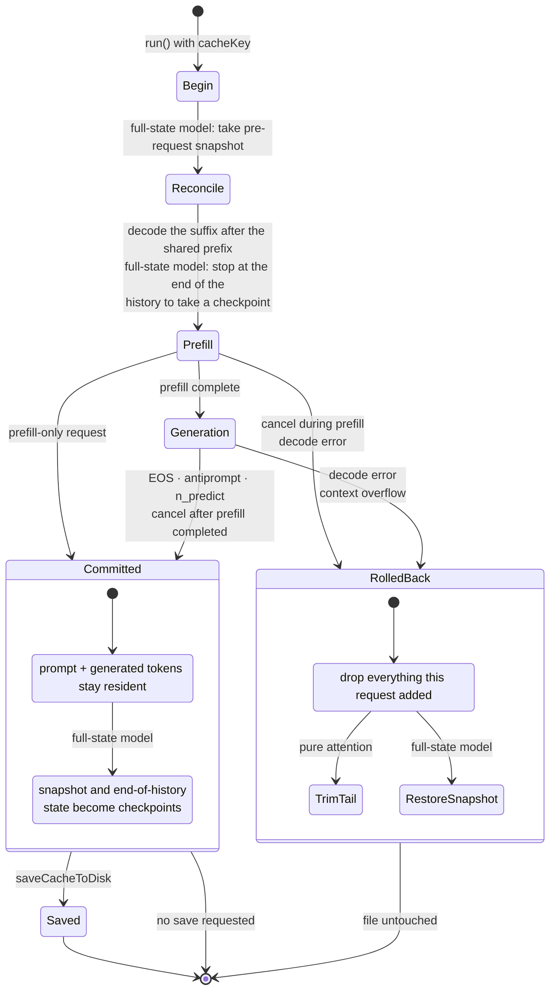
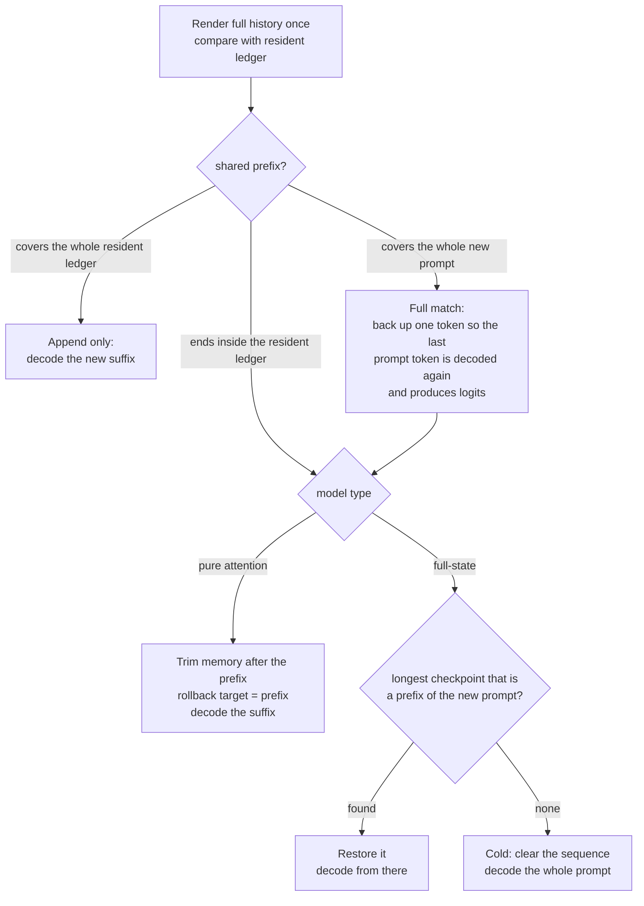
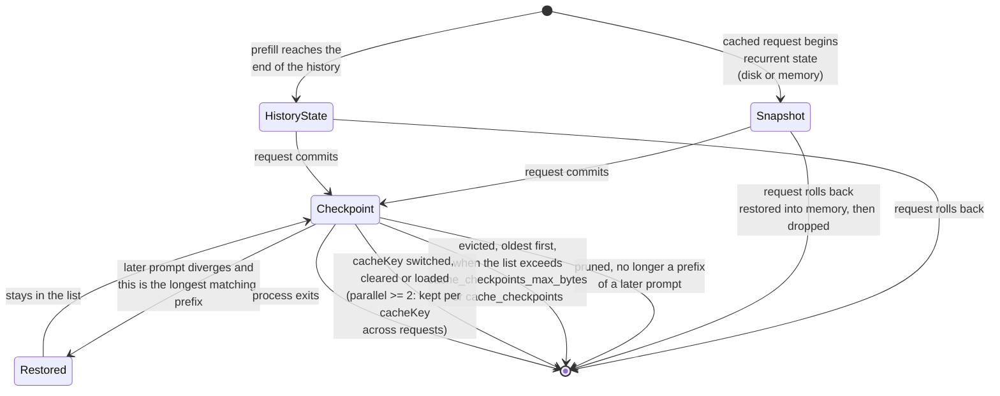
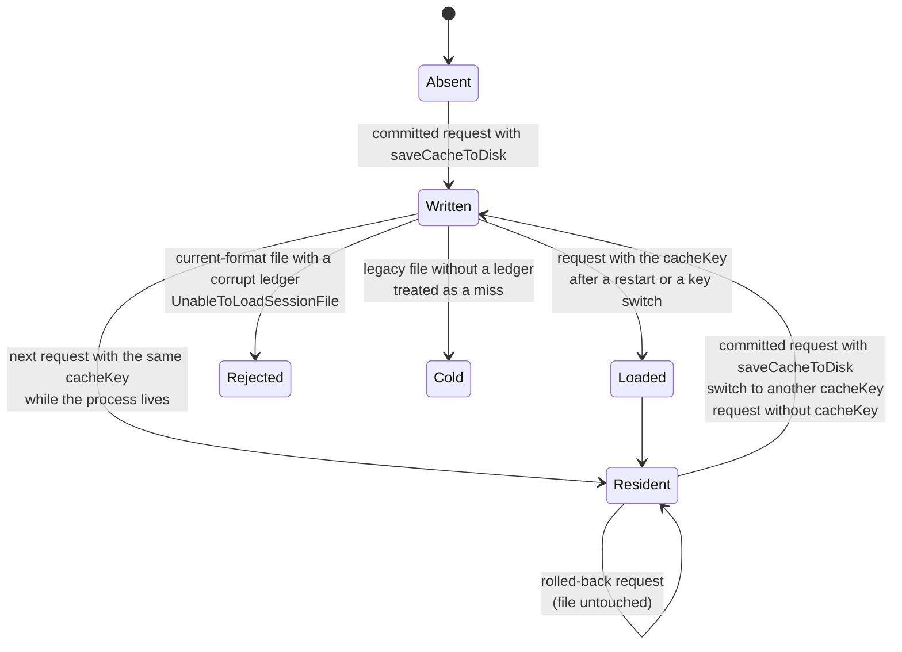

# Cache lifecycle

How the addon-owned prompt cache behaves end to end: what is stored where, how
a request is reconciled with what is resident, when it commits or rolls back,
and what the process-local checkpoints do on models that cannot trim their
memory. For the API surface (`cacheKey`, `saveCacheToDisk`, `prefill`) see
[cache-api.md](./cache-api.md); this page explains the machine behind it.

## The pieces

- The **ledger** is the addon's description of what the sequence memory holds.
  It is compared against the newly rendered prompt to find the longest shared
  prefix, and it is serialized into the `cacheKey` file next to the state.
- The **sequence memory** is llama.cpp's own KV cache and, on hybrid or
  recurrent models, the recurrent state. It is the conversation.
- The **pre-request snapshot** and the **checkpoints** exist only on models
  that cannot trim their memory (see below). Pure-attention models never
  create either, in any storage mode. On hybrid and recurrent models both hold
  only the recurrent state (`LLAMA_STATE_SEQ_FLAGS_PARTIAL_ONLY`); restoring
  one puts that state back and trims the attention KV to its position.
- The **`cacheKey` file** is the only durable artifact. Checkpoints are never
  written into it and do not survive a process restart.

## Two kinds of models

| | Pure attention (Qwen3, Llama, Gemma, ...) | Full-state (Qwen3.5, Jamba, Granite-Hybrid, DeepSeek V4, ...) |
|---|---|---|
| Can drop a memory tail at a position | yes, `llama_memory_seq_rm` | no |
| Reuse of a diverging history | trim to the shared prefix, decode the rest | restore the longest checkpoint that is a prefix, decode the rest; cold prefill if none |
| Pre-request snapshot | never | at the start of every cached request |
| Checkpoints | never | two per committed cached request: its pre-request snapshot and one at the end of its history |
| Rollback target | shared prefix with the request's prompt | state before the prompt was sent (the snapshot) |
| Disk writes for a chat with one `cacheKey` and no `saveCacheToDisk` | none | none with `cache_checkpoint_storage: memory`, temp files otherwise |

The decision is `needsFullStateSnapshot` in `ModelMemoryPolicy.hpp`: recurrent
or hybrid per llama.cpp, or the DeepSeek V4 architecture.

## A cached request

The rule is the same with or without `cacheKey`. Without one nothing reuses
the state, so the only visible effect is `CacheTokens`, which reports the
tokens actually decoded.

## Reconciling the new prompt with the resident ledger

On a full-state model the back-up-one step of a full match also goes through
the checkpoint search, because one token cannot be trimmed. A "regenerate"
therefore restores the previous prompt's end-of-history checkpoint and decodes
only its generation prompt again.

The end-of-history checkpoint is what makes an ordinary next turn cheap. The
template renders the previous answer differently from how it was generated
(Qwen3.5 drops its reasoning), so the new prompt diverges right after that
answer's assistant header. Only a checkpoint at or before that point can be
restored, and the end of the previous history is the latest such point. The
addon finds it by matching the template's generation prompt against the end
of the rendered prompt; a template without one takes no such checkpoint.

After every divergence, checkpoints that are no longer a prefix of the new
prompt are deleted.

## Checkpoint lifecycle (full-state models)

Eviction checks the byte budget first, then the count. A budget that cannot
hold `cache_checkpoints` checkpoints of the largest size the context allows is
rejected at model load with `InvalidArgument`; the addon measures that size on
the loaded model rather than estimating it.

## The `cacheKey` file

Loading a file restores the sequence state and the ledger, with an empty
checkpoint list, except with `parallel >= 2`: there the scheduler hands the
new slot the checkpoints the previous request on the same `cacheKey` left
behind, and each is checked against the loaded ledger before use. The first
diverging turn after a restart on a full-state model is a cold prefill until
new checkpoints accumulate.

## Configuration that shapes the machine

| Setting | Where | Effect |
|---|---|---|
| `cacheKey` | `runOptions` | Turns the cache on for this sequence and names the durable file. |
| `saveCacheToDisk` | `runOptions` | Write the file when this request commits. |
| `prefill` | `runOptions` | Warm the cache without generating; commits as soon as prefill completes. Needs `saveCacheToDisk` on `parallel >= 2`. |
| `cache_checkpoints` | load config | Checkpoints kept per sequence (default 32, 0 disables). Full-state models only. |
| `cache_checkpoints_max_bytes` | load config | Byte budget for those checkpoints, enforced before the count; fails the load early if too small. |
| `cache_checkpoint_storage` | load config | `disk` (temp files) or `memory` (host RAM) for snapshots and checkpoints. |
| `parallel` | load config | With `>= 2` each request runs in a slot that is wiped afterwards; the sequence state survives between requests only through the file, and the checkpoints in the scheduler, per `cacheKey`. |

## Where each thing lives, at a glance

| | Pure attention | Full-state, `disk` | Full-state, `memory` |
|---|---|---|---|
| Conversation state | sequence memory | sequence memory | sequence memory |
| Ledger | RAM | RAM | RAM |
| Pre-request snapshot | none | temp file, one per running request | host RAM, one per running request |
| Checkpoints | none | temp files | host RAM |
| `cacheKey` file | only on the three saves | only on the three saves | only on the three saves |
