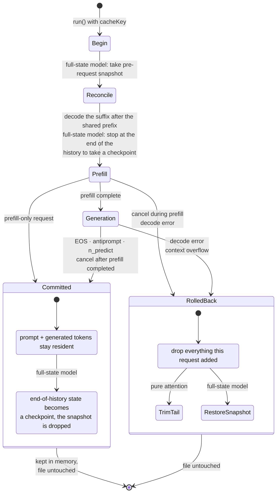
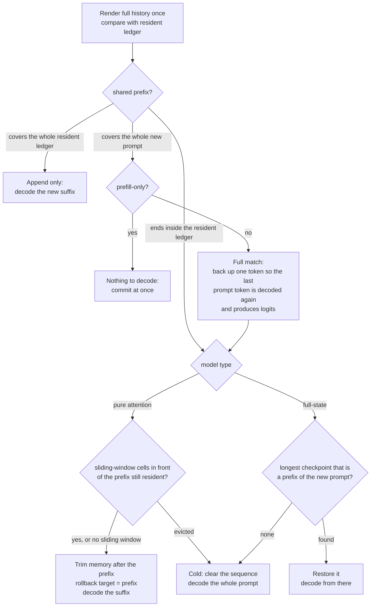
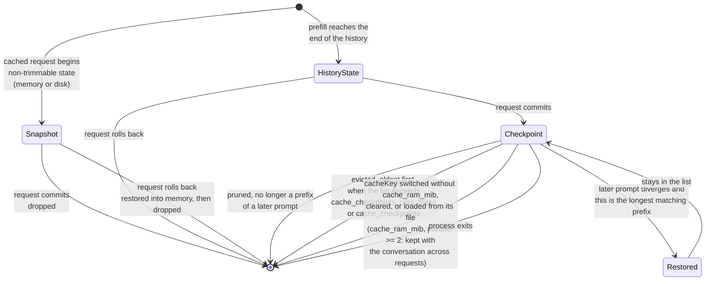
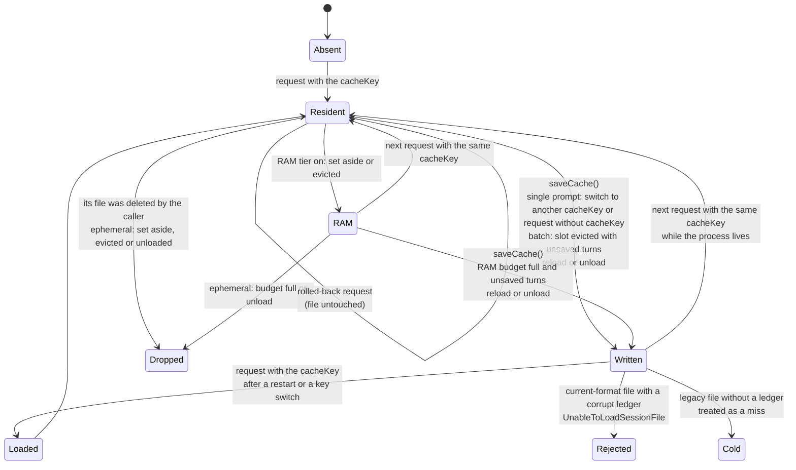
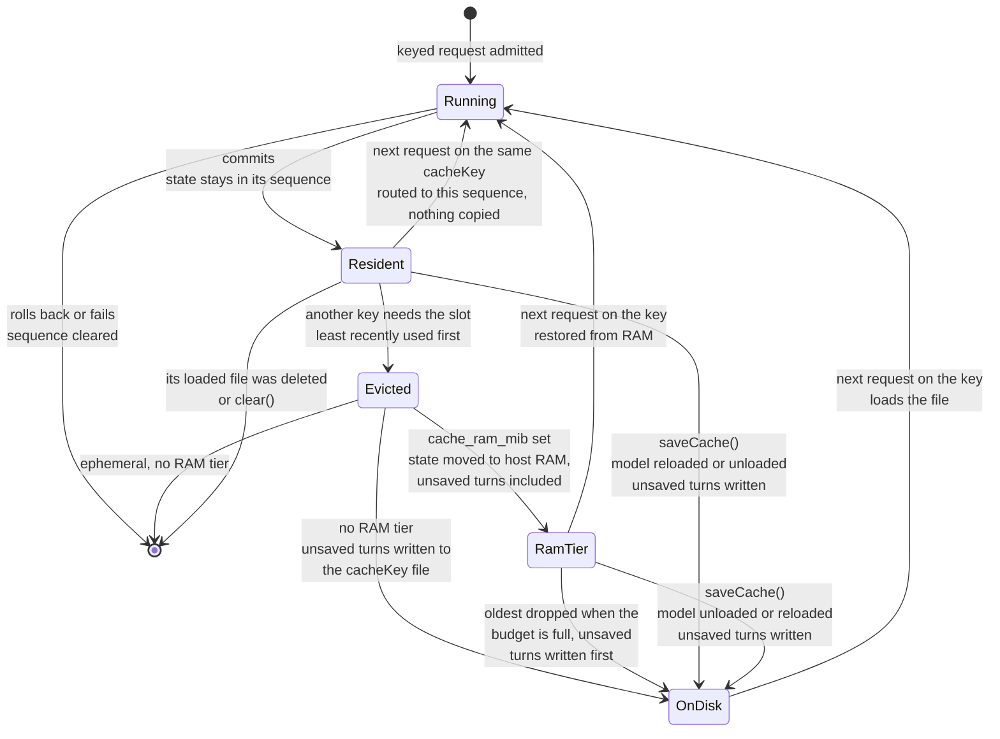

# Cache lifecycle

How the addon-owned prompt cache behaves end to end: what is stored where, how
a request is reconciled with what is resident, when it commits or rolls back,
and what the process-local checkpoints do on models that cannot trim their
memory. For the API surface (`cacheKey`, `ephemeral`, `prefill`,
`saveCache()`) see
[cache-api.md](./cache-api.md); this page explains the machine behind it.

## The pieces

```mermaid
graph TB
    subgraph Client
        HIST["Full message history + tools<br/>(resent on every turn)"]
    end

    subgraph "Addon, per sequence"
        LEDGER["Ledger (RAM)<br/>one entry per resident token / media span"]
        KV["Sequence memory (GPU / RAM)<br/>KV cells, recurrent state"]
        SNAP["Pre-request snapshot<br/>full-state models only<br/>lives for one request"]
        CKPT["Process-local checkpoints<br/>full-state models only<br/>≤ cache_checkpoints, ≤ cache_checkpoints_max_bytes"]
    end

    subgraph "Storage chosen by cache_checkpoint_storage"
        TMPD["cache_checkpoint_dir<br/>(disk)"]
        HRAM["Host RAM<br/>(memory)"]
    end

    subgraph "Durable"
        FILE["cacheKey file<br/>sequence state + ledger"]
    end

    HIST -->|render + tokenize| LEDGER
    LEDGER <-->|describes| KV
    KV -->|begin of cached request| SNAP
    KV -->|end of history, during prefill| CKPT
    SNAP -->|rollback: restore| KV
    CKPT -->|divergent history: restore longest prefix| KV
    SNAP -.-> TMPD
    SNAP -.-> HRAM
    CKPT -.-> TMPD
    CKPT -.-> HRAM
    KV -->|saveCache(), key switch, key omitted,<br/>eviction, reload, unload| FILE
    FILE -->|cacheKey not resident| KV
```

- The **ledger** is the addon's description of what the sequence memory holds.
  It is compared against the newly rendered prompt to find the longest shared
  prefix, and it is serialized into the `cacheKey` file next to the state.
- The **sequence memory** is llama.cpp's own KV cache and, on hybrid or
  recurrent models, the recurrent state. It is the conversation.
- The **pre-request snapshot** and the **checkpoints** exist only on models
  that cannot trim their memory (see below). Pure-attention models never
  create either, in any storage mode. Both hold only the part of the memory a
  tail trim cannot rebuild (`LLAMA_STATE_SEQ_FLAGS_PARTIAL_ONLY`): the
  recurrent state on hybrid and recurrent models, the sliding-window cells and
  compressor states on DeepSeek V4. Restoring one puts that part back and
  trims the rest to its position (see [Restoring a
  checkpoint](#restoring-a-checkpoint)).
- The **`cacheKey` file** is the only durable artifact. Checkpoints are never
  written into it and do not survive a process restart.

## Two kinds of models

| | Pure attention (Qwen3, Llama, Gemma, ...) | Full-state (Qwen3.5, Jamba, Granite-Hybrid, DeepSeek V4, ...) |
|---|---|---|
| Can drop a memory tail at a position | yes, `llama_memory_seq_rm` | no |
| Reuse of a diverging history | trim to the shared prefix, decode the rest | restore the longest checkpoint that is a prefix, decode the rest; cold prefill if none |
| Pre-request snapshot | never | at the start of every cached request |
| Checkpoints | never | one per committed cached request, at the end of its history (the pre-request snapshot only serves rollback) |
| Rollback target | shared prefix with the request's prompt | state before the prompt was sent (the snapshot); the restored checkpoint when the request diverged |
| Disk writes for a chat with one `cacheKey`, before `saveCache()` or unload | none | none by default; checkpoint files in `cache_checkpoint_dir` with `cache_checkpoint_storage: disk` |

The decision is `needsFullStateSnapshot` in `ModelMemoryPolicy.hpp`, by
architecture: recurrent or hybrid per llama.cpp, or DeepSeek V4. All of them
snapshot only what a tail trim cannot rebuild (`untrimmableSnapshotScope`),
and all of them keep 1 checkpoint by default (`cache_checkpoints`).

## A cached request


```mermaid
stateDiagram-v2
    [*] --> Begin: run() with cacheKey
    Begin --> Reconcile: full-state model: take pre-request snapshot
    Reconcile --> Prefill: decode the suffix after the shared prefix<br/>full-state model: stop at the end of the<br/>history to take a checkpoint
    Prefill --> Committed: prefill-only request
    Prefill --> Generation: prefill complete
    Prefill --> RolledBack: cancel during prefill<br/>decode error
    Generation --> Committed: EOS · antiprompt · n_predict<br/>cancel after prefill completed
    Generation --> RolledBack: decode error<br/>context overflow
    Committed --> [*]: kept in memory,<br/>file untouched
    RolledBack --> [*]: file untouched

    state Committed {
        [*] --> KeepTokens
        KeepTokens: prompt + generated tokens stay resident
        KeepTokens --> PushCheckpoint: full-state model
        PushCheckpoint: end-of-history state becomes<br/>a checkpoint, the snapshot is dropped
    }
    state RolledBack {
        [*] --> Drop
        Drop: drop everything this request added
        Drop --> TrimTail: pure attention
        Drop --> RestoreSnapshot: full-state model
    }
```

The rule is the same with or without `cacheKey`. Without one nothing reuses
the state, so the only visible effect is `CacheTokens`, which reports the
tokens actually decoded.

## Reconciling the new prompt with the resident ledger


```mermaid
flowchart TD
    A[Render full history once<br/>compare with resident ledger] --> B{shared prefix?}
    B -->|covers the whole resident ledger| C[Append only:<br/>decode the new suffix]
    B -->|covers the whole new prompt| P{prefill-only?}
    P -->|yes| Q[Nothing to decode:<br/>commit at once]
    P -->|no| D[Full match:<br/>back up one token so the last<br/>prompt token is decoded again<br/>and produces logits]
    B -->|ends inside the resident ledger| E{model type}
    E -->|pure attention| W{sliding-window cells in front<br/>of the prefix still resident?}
    W -->|yes, or no sliding window| F[Trim memory after the prefix<br/>rollback target = prefix<br/>decode the suffix]
    W -->|evicted| I
    E -->|full-state| G{longest checkpoint that is<br/>a prefix of the new prompt?}
    G -->|found| H[Restore it<br/>decode from there]
    G -->|none| I[Cold: clear the sequence<br/>decode the whole prompt]
    D --> E
```

On a full-state model the back-up-one step of a full match also goes through
the checkpoint search, because one token cannot be trimmed. A "regenerate"
therefore restores the previous prompt's end-of-history checkpoint and decodes
only its generation prompt again.

The end-of-history checkpoint is what makes an ordinary next turn cheap. The
template renders the previous answer differently from how it was generated
(Qwen3.5 drops its reasoning), so the new prompt diverges right after that
answer's assistant header. Only a checkpoint at or before that point can be
restored, and the end of the previous history is the latest such point. The
addon finds it by matching the template's generation prompt against the end
of the rendered prompt; a template without one takes no such checkpoint.

The same rewrite is why the pre-request snapshot is not kept as a checkpoint:
it holds the previous answer as generated, so no later prompt would match it.
The checkpoint one turn older does match an edit of the last user message,
because it also stops before an answer; with `cache_checkpoints: 2`, an edit
decodes the previous answer and the edited message again and nothing before
them. The default keeps one, so an edit of the last user message is a cold
prefill.

Sliding-window models (Gemma 3/4, gpt-oss, without `swa_full`) keep only the
last `n_swa` positions in their window layers. A trim back to the shared prefix
is refused when the cells in front of it were already evicted (the same
`llama_memory_seq_pos_min` test llama-server uses): the suffix would attend to
a truncated window, so the prompt is reprocessed from scratch instead. A
rollback applies the same test to its target before trimming: when the request
decoded past the window, the sequence is cleared and the next turn starts cold.
Those models take no checkpoints yet.

A prefill-only request whose whole prompt is already resident has nothing to
decode. It is admitted with an empty plan and commits immediately, on the
single-prompt and batch paths alike.

After every divergence, checkpoints that are no longer a prefix of the new
prompt are deleted.

**Cost.** Decoding is paid once per token, because the shared prefix is
reused. Rendering and tokenizing are not: every cached turn renders and
tokenizes the whole history, so that part grows with the conversation, and
summed over a session it grows with the square of its length. On the batch
path it runs on the scheduler's worker thread, so other slots wait for it. As
a rough figure, on Qwen3-0.6B (Apple Silicon, prefill-only turns of about 27
tokens) a turn took about 70 ms with 500 tokens of history and 180–260 ms
with 3,200; the opt-in `KvCacheExtended.RenderCostPerTurn` test reproduces
the measurement.

## Checkpoint lifecycle (full-state models)


```mermaid
stateDiagram-v2
    [*] --> Snapshot: cached request begins<br/>non-trimmable state<br/>(memory or disk)
    [*] --> HistoryState: prefill reaches the<br/>end of the history
    Snapshot --> [*]: request commits<br/>dropped
    HistoryState --> Checkpoint: request commits
    HistoryState --> [*]: request rolls back
    Snapshot --> [*]: request rolls back<br/>restored into memory, then dropped
    Checkpoint --> Restored: later prompt diverges and<br/>this is the longest matching prefix
    Restored --> Checkpoint: stays in the list
    Checkpoint --> [*]: pruned, no longer a prefix<br/>of a later prompt
    Checkpoint --> [*]: evicted, oldest first,<br/>when the list exceeds<br/>cache_checkpoints_max_bytes<br/>or cache_checkpoints
    Checkpoint --> [*]: cacheKey switched without cache_ram_mib,<br/>cleared, or loaded from its file<br/>(cache_ram_mib, parallel >= 2: kept with<br/>the conversation across requests)
    Checkpoint --> [*]: process exits
```

Eviction checks the byte budget first, then the count. A budget that cannot
hold `cache_checkpoints` checkpoints of the largest size the context allows is
rejected at model load with `InvalidArgument`; the addon measures that size on
the loaded model rather than estimating it.

## When checkpoints are taken

Two states are captured per cached request on a full-state model, at fixed
points of the pipeline. The **pre-request snapshot** serves only that
request's rollback; the **end-of-history checkpoint** is the only one kept.

Where in the conversation, for turn 2 of a chat:

```
[sys][user 1][assistant 1 (as re-rendered)][user 2][<assistant header>]
                                                   ▲                   ▲
                                     end-of-history checkpoint   generation starts
```

The checkpoint sits after the last user message and before the template's
generation prompt (`<｜Assistant｜>`, `<|im_start|>assistant\n<think>\n`):
the prompt length minus the generation prompt's token count.

When in the pipeline (single-prompt path; the multimodal context is the same,
with media spans as ledger entries):

```
run() → render and tokenize the full history
  ① pre-request snapshot          beginCacheRequest, before reconciliation:
                                   memory exactly as the previous turn left it
  reconcile                        longest common prefix with the resident
                                   ledger; a divergence restores the longest
                                   checkpoint that is a prefix
  prefill, in n_batch chunks       the chunk that reaches the end of the
                                   history ends exactly there
  ② end-of-history checkpoint     captureHistoryCheckpoint, right after that
                                   chunk's llama_decode; held as pending
  prefill continues                decodes the generation prompt
  generation
  commit                           EOS, stop string, n_predict, or a cancel
                                   after prefill: ① is dropped, ② is appended
                                   to the checkpoints, the oldest dropped past
                                   cache_checkpoints_max_bytes, then
                                   cache_checkpoints
  rollback                         cancel during prefill, decode error, context
                                   overflow: memory is restored from ①, ② is
                                   discarded. A request that diverged and
                                   restored a checkpoint retakes ① there, so
                                   the rollback lands on that checkpoint
```

The next request uses the kept checkpoints in its reconcile step, before it
decodes anything.

With `parallel >= 2` the points are the same:

1. The prefill plan carries the stop (`PrefillPlan::checkpointAtTextTokens`),
   and the batcher stops feeding that slot there, as it does at a media
   barrier.
2. Between batches, after `advance()` has confirmed the decode,
   `serviceCheckpointStopsLocked` captures ② for the slot, and its feed
   resumes with the generation prompt.
3. When the slot is freed, the checkpoints go with the conversation: into its
   parked slot state, into the RAM tier (`cache_ram_mib`) when the slot is
   evicted, or into the scheduler's per-`cacheKey` store when the state is only
   on disk. The next request on the key takes them at admission
   (`adoptCheckpoints`). See [continuous-batching.md](./continuous-batching.md).

What is kept after a few turns:

| After turn | Default (`cache_checkpoints: 1`) | `cache_checkpoints: 2` |
|---|---|---|
| 1 | end of `[user 1]` | end of `[user 1]` |
| 2 | end of `[user 2]` | end of `[user 1]`, end of `[user 2]` |
| 3 | end of `[user 3]` | end of `[user 2]`, end of `[user 3]` |

The newest serves the next turn and a regenerate. With 2, the older one
serves an edit of the last user message; with the default 1 that edit has no
checkpoint in front of it and reprocesses the whole conversation. In general,
changing the user message *k*-th from the end (1 = the last) needs the
checkpoint at the end of the user message before it, which is the
(*k* + 1)-th newest, so `cache_checkpoints` must be at least *k* + 1 (see
[cache-api.md](./cache-api.md#checkpoints-on-hybrid-and-recurrent-models)).
After the edit, the checkpoints past the change are pruned. During a request up to two more states exist besides the kept ones:
the pre-request snapshot and the pending end-of-history checkpoint. Neither
counts toward `cache_checkpoints` or `cache_checkpoints_max_bytes`.

The pre-request snapshot is not kept because it holds the previous answer as
generated, and a template that rewrites earlier answers (thinking models drop
the reasoning) never renders those tokens again, so no later prompt would
match it.

No end-of-history checkpoint is taken for:

- a prefill-only request (no generation prompt to stop in front of);
- a template without a generation prompt, or an encoder model;
- a request whose history ends inside the reused prefix: a regenerate, for
  example, already has a checkpoint at that point;
- `cache_checkpoints: 0`: nothing would keep it, so the prefill does not stop
  for it either.

### Restoring a checkpoint

A restore writes the saved part back
(`llama_state_seq_set_data_ext(..., LLAMA_STATE_SEQ_FLAGS_PARTIAL_ONLY)`) and
then trims the sequence to the checkpoint's position
(`llama_memory_seq_rm(seq, nPast, -1)`). The trim rebuilds what was not saved:

- Hybrid models: the attention KV past the position is dropped; the cells in
  front of it are the same ones the checkpoint was taken over.
- DeepSeek V4: the saved part is the 128-token sliding window and the CSA,
  HCA and indexer compressor states, which hold each compressor's unfinished
  block. The compressed rows are not saved and the trim does not clear them:
  a row sits at `pos / ratio`, a query reads only the rows its own position
  has completed, and the token that completes a block rewrites its row. Rows
  from before the checkpoint are reused as they are, and rows past it are
  overwritten before anything can read them.

Sizes are fixed by the model, whatever the conversation length: about 20 MB
on Qwen3.5-0.8B and 18 MB on DeepSeek V4-Flash, against ~233 MB for a full
copy of Qwen3.5-0.8B at 32k tokens. They live in host RAM by default
(`cache_checkpoint_storage: memory`) or in files in `cache_checkpoint_dir`
with `disk`, and are
never written into the `cacheKey` file. On the single-prompt path a
conversation loaded from its file starts without checkpoints; with
`parallel >= 2` the scheduler keeps a key's checkpoints across that file
round-trip while the process lives. After a restart there are none.

## The `cacheKey` file


```mermaid
stateDiagram-v2
    [*] --> Absent
    Absent --> Resident: request with the cacheKey
    Resident --> Written: saveCache()<br/>single prompt: switch to another cacheKey or request without cacheKey<br/>batch: slot evicted with unsaved turns<br/>reload or unload
    Resident --> RAM: RAM tier on: set aside or evicted
    RAM --> Written: saveCache()<br/>RAM budget full and unsaved turns<br/>reload or unload
    RAM --> Resident: next request with the same cacheKey
    Resident --> Dropped: its file was deleted by the caller<br/>ephemeral: set aside, evicted or unloaded
    RAM --> Dropped: ephemeral: budget full or unload
    Written --> Resident: next request with the same cacheKey<br/>while the process lives
    Written --> Loaded: request with the cacheKey<br/>after a restart or a key switch
    Loaded --> Resident
    Written --> Rejected: current-format file with a corrupt ledger<br/>UnableToLoadSessionFile
    Written --> Cold: legacy file without a ledger<br/>treated as a miss
    Resident --> Resident: committed request<br/>(memory advances, file does not)
    Resident --> Resident: rolled-back request<br/>(file untouched)
```

Loading a file restores the sequence state and the ledger, with an empty
checkpoint list, except with `parallel >= 2`: there the scheduler hands the
new slot the checkpoints the previous request on the same `cacheKey` left
behind, and each is checked against the loaded ledger before use. The first
diverging turn after a restart on a full-state model is a cold prefill until
new checkpoints accumulate.

Every edge into `Written` and `Dropped` is detailed in the next section.

## How the `cacheKey` file is written

The `cacheKey` file is the only thing the cache ever writes to disk. It is
written in two ways: when the caller asks, with `saveCache(cacheKey)`, and
automatically when a conversation would otherwise be lost with turns the file
does not hold. No request writes it by itself. This section describes every
write, on both paths.

### What the file holds

The file is a standard llama.cpp sequence-state file
(`llama_state_seq_save_file`) whose token list carries the addon's ledger:

| Part | Contents |
|---|---|
| llama.cpp header | magic, format version, number of tokens that follow |
| ledger, stored as the token list | `QLDG` marker, ledger version, `nPast`, KV-cell count, entry count, a checksum over the entries, one reserved word; then five words per entry: kind (text token or media span), identity (the token id, or a hash of the media) in two words, positions, KV cells |
| sequence state | the sequence's complete memory: every KV cell, and the recurrent state on hybrid and recurrent models (on DeepSeek V4: the sliding window, the compressed rows and the compressor states) |

The state is always written in full, unlike the partial snapshots and
checkpoints, which are never written into the file. A load checks the ledger
against the state it describes: a corrupt current-format file is an error
(`UnableToLoadSessionFile`), and a file without a ledger is a cold miss.

### How a write is done

Every write, whichever path triggers it, does the same two steps:

1. The state and the ledger are written to `<cacheKey>.tmp`. On failure the
   temporary file is deleted and `UnableToSaveSessionFile` is raised.
2. The temporary file replaces `<cacheKey>` in one step: `rename` on Linux
   and macOS, `MoveFileExW` with replace and write-through on Windows. Until
   that step succeeds the old file is untouched, so a crash never leaves a
   half-written cache. A `cacheKey` that names a directory fails the write.

The RAM tier writes the same file format from its copy of the state, so a
file written from RAM loads exactly like one written from a sequence.

### When the caller asks: `saveCache(cacheKey)`

`saveCache` writes the conversation kept for a key, wherever it is:

| Where the conversation is | `parallel = 1` | `parallel >= 2` | What happens |
|---|---|---|---|
| active / resident, idle | the session in sequence 0 | its parked slot | written from the live sequence |
| in the RAM tier | ✓ | ✓ | written from the stored bytes |
| only on disk | ✓ | ✓ | nothing to do: the file is current |
| a request on the key is running | ✓ | ✓ | waits for it to finish, then writes what it committed |
| nowhere, and no file | ✓ | ✓ | rejected with `InvalidArgument` |

Two rules make it safe:

1. **It writes the last committed state, never a request in progress.** A
   running request holds tokens that could still be rolled back, so the save
   waits for it. On the single-prompt path the save takes the same lock a
   request holds for its whole run; on the batch path it waits until no slot
   runs a request on that key (requests on one key are already served in
   order).
2. **It runs where decoding is not.** All sequences share one
   `llama_context`, and copying a sequence's state while another one decodes
   is not safe on GPU backends. On the batch path the save is a job for the
   scheduler's worker, which runs it between two decode steps under the
   scheduler lock, where evictions already write; the call may wait about one
   decode step and other slots keep generating.

It writes when the conversation has unsaved turns or its file is missing,
and does nothing when the file already holds it. Ephemeral conversations are
written too (the flag means "never write automatically"), and so are
conversations whose old file the caller deleted. A failed write rejects the
call and leaves the conversation in memory, still unsaved, so it can be
retried.

### Automatically: single prompt (`parallel = 1`)

One conversation is active at a time, in the context's sequence 0.

1. **Before a request runs**, the conversation already in memory is dealt
   with, based on the request's `cacheKey`:
   - **same key**: nothing is written; the conversation continues in memory;
   - **another key**, or **no key**: the conversation is set aside before the
     request is served (with no key, it is then cleared). Setting aside goes
     through these checks in order:
     1. it was loaded from, or written to, its file and that file (or its
        directory) is now missing or empty: the caller deleted it, so it is
        dropped and nothing is written;
     2. nothing is committed in it (its only request rolled back): dropped;
     3. the RAM tier is on: it moves to RAM, and nothing is written yet;
     4. it is ephemeral: dropped;
     5. no request ran on it since its file was last written or loaded, and
        the file is still there: the file is current, so nothing is written;
     6. otherwise its file is written.
2. **After the request**, nothing is written: a request that commits leaves
   its conversation in memory, and one that rolls back leaves the file as it
   was.
3. **On a reload** (finetuning reloads the model) **and on an unload**, the
   active conversation is written if it has turns its file does not hold,
   unless it is ephemeral or empty.

### Automatically: batch (`parallel >= 2`)

Each of the `parallel` sequences ("slots") holds at most one conversation.

1. **A request finishes.** Nothing is written. A committed request with a
   `cacheKey` leaves its state in the slot ("resident") for the next request
   on that key, marked as having turns its file does not hold, with the
   time it was last used and the request's `ephemeral` flag. Requests without
   a `cacheKey`, and requests that rolled back, leave nothing: their slot is
   cleared.
2. **A request picks a slot**: the free slot already holding its key's
   conversation (nothing is read); otherwise an empty slot, filled from the RAM
   tier, else from the file, else cold; otherwise the free slot whose resident
   conversation was used least recently, which is evicted first.
3. **A resident conversation is evicted**, through these checks in order:
   1. its loaded or saved file is now missing or empty: it is dropped, nothing
      is written;
   2. the RAM tier is on: its state is copied to RAM with its ledger,
      checkpoints, unsaved-turns mark and `ephemeral` flag, and nothing is
      written yet (unless the copy is larger than the whole RAM budget, which
      falls through to the next check);
   3. it has unsaved turns and is not ephemeral: its file is written;
      otherwise it is dropped.

   Then the slot is cleared. If it did not go to RAM, its checkpoints are kept
   in memory per `cacheKey` for its next load.
4. **The RAM tier is full.** To fit a new entry, the oldest entries are
   removed; each one with unsaved turns that is not ephemeral is written to
   its file first.
5. **On a reload and on an unload**, every resident conversation with unsaved
   turns is written, then every RAM entry with unsaved turns, ephemeral ones
   excepted. This is skipped, with a warning, while a batch request is still
   running.

Every `run()` on a parallel model, single prompts included, goes through the
scheduler and takes any free slot by the rules in step 2; nothing is tied to
sequence 0. The model's internal single-prompt context, which is fixed to
sequence 0, is not reachable from `run()` there (only direct C++ calls to
`LlamaModel::processPrompt()` use it). As a safety net, such a call first
evicts a conversation parked on sequence 0, as in step 3.

### Rules common to both paths

- **Never during a request.** Nothing is written during prefill or
  generation, a request that commits only advances memory, and a request that
  rolls back leaves the file exactly as it was.
- **No change, no write.** Each conversation carries a mark for turns its file
  does not hold: set when a request runs on it, cleared when its file is
  written or loaded. Automatic writes happen only when the mark is set.
- **Ephemeral means never automatically.** Every automatic write above drops
  an ephemeral conversation instead. The flag comes from the conversation's
  latest request.
- **A deleted file drops the conversation.** The cache remembers whether a
  conversation came from, or was written to, its file. Before writing it back
  automatically it checks the file: missing (or its directory missing) or
  empty means the caller deleted it, so the conversation is discarded instead
  of written back. That only works once the conversation has been written: a
  conversation that never was is unaffected by deleting a file. `discardCache`
  drops a conversation either way (`saveCache`'s ordering, no write).
- **Failures.** A failed `saveCache()` rejects and keeps the conversation,
  still unsaved. A failed single-prompt switch save is reported by that
  `run()` and the old conversation is dropped. A failed write during an
  eviction, a RAM-tier eviction or a flush is logged and never fails a
  request: that conversation's unsaved turns are lost.
- **A crash or a kill loses what was only in memory.** A clean unload writes
  everything that is not ephemeral; a process the OS kills (common for
  backgrounded mobile apps) does not unload, so call `saveCache()` at the
  points that must survive one.

## Batch mode: where a conversation lives between requests

With `parallel >= 2` each request gets a fresh driver in a scheduler slot, but
a keyed conversation's state does not have to leave the slot when it ends.


```mermaid
stateDiagram-v2
    [*] --> Running: keyed request admitted
    Running --> Resident: commits<br/>state stays in its sequence
    Running --> [*]: rolls back or fails<br/>sequence cleared
    Resident --> Running: next request on the same cacheKey<br/>routed to this sequence, nothing copied
    Resident --> Evicted: another key needs the slot<br/>least recently used first
    Evicted --> RamTier: cache_ram_mib set<br/>state moved to host RAM,<br/>unsaved turns included
    Evicted --> OnDisk: no RAM tier<br/>unsaved turns written to<br/>the cacheKey file
    Evicted --> [*]: ephemeral, no RAM tier
    RamTier --> Running: next request on the key<br/>restored from RAM
    RamTier --> OnDisk: oldest dropped when the<br/>budget is full, unsaved<br/>turns written first
    OnDisk --> Running: next request on the key<br/>loads the file
    Resident --> OnDisk: saveCache()<br/>model reloaded or unloaded<br/>unsaved turns written
    RamTier --> OnDisk: saveCache()<br/>model unloaded or reloaded<br/>unsaved turns written
    Resident --> [*]: its loaded file was deleted<br/>or clear()
```

- A request whose `cacheKey` is already running waits in the scheduler until
  that request ends, so a key never has two committed states to reconcile.
- Checkpoints travel with the state: resident, in the RAM tier, or kept per
  `cacheKey` for the next load of its file.
- Every source is validated like a file load before it is used: the ledger
  must match the memory it describes, or the state is dropped and the next
  source is tried.
- The batch entry wipe of stale single-prompt state skips resident
  conversations. A direct C++ call to the internal single-prompt context
  (not reachable from `run()` on a parallel model) first evicts whatever is
  resident on sequence 0, which that context shares.

## Configuration that shapes the machine

| Setting | Where | Effect |
|---|---|---|
| `cacheKey` | `runOptions` | Turns the cache on for this sequence and names the durable file. |
| `ephemeral` | `runOptions` | Never write this conversation automatically: drop it instead. |
| `saveCache(cacheKey)` | model method | Write the conversation kept for the key now (see above). |
| `prefill` | `runOptions` | Warm the cache without generating; commits as soon as prefill completes. Needs a `cacheKey` on `parallel >= 2`. |
| `cache_checkpoints` | load config | Checkpoints kept per sequence (default 1: the last request's end-of-history checkpoint; 2 also serves an edit of the last user message; 0 disables them and their capture). Full-state models only. |
| `cache_checkpoints_max_bytes` | load config | Byte budget for those checkpoints, enforced before the count; fails the load early if too small. |
| `cache_checkpoint_storage` | load config | `memory` (host RAM, default) or `disk` (files in `cache_checkpoint_dir`) for snapshots and checkpoints. |
| `cache_checkpoint_dir` | load config | Required with `disk`, refused without it: where checkpoint files go, inside a private directory created in it (0700; on Windows, the directory itself). |
| `parallel` | load config | With `>= 2` each request runs in its own slot; a committed keyed conversation stays resident in it for the next request on its `cacheKey` (see above). |
| `cache_ram_mib` | load config | Host-RAM budget for conversations that are not running: switched away on the single-prompt path, or evicted from their batch slot. Write-back: files are written on budget eviction, `saveCache()`, reload or unload (default 0, off). |

## Where each thing lives, at a glance

| | Pure attention | Full-state, `disk` | Full-state, `memory` (default) |
|---|---|---|---|
| Conversation state | sequence memory | sequence memory | sequence memory |
| Ledger | RAM | RAM | RAM |
| Pre-request snapshot | none | temp file, one per running request | host RAM, one per running request |
| Checkpoints | none | temp files | host RAM |
| `cacheKey` file | only on the writes in [How the `cacheKey` file is written](#how-the-cachekey-file-is-written) | same | same |
