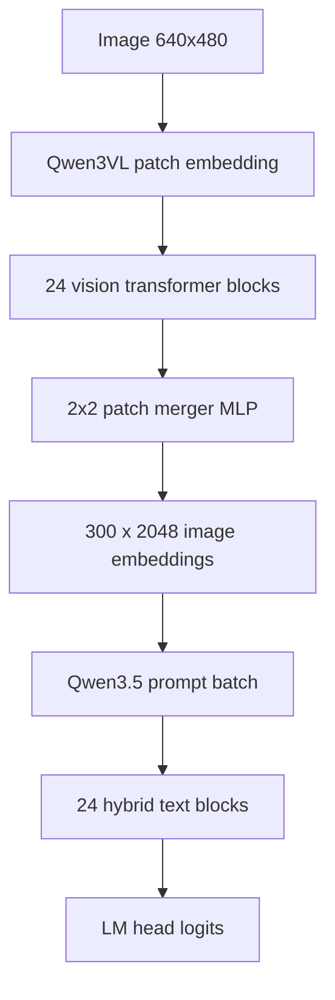

# Qwen3.5-VL Architecture And Optimization Opportunities

## Scope

This report maps the Qwen3.5-VL projection-model path used in the LLM Addon 0.18.0 VLM optimization work and ranks implementation opportunities for Phase 3.

Primary platforms:

- Android Adreno 830 via llama.cpp OpenCL
- Android Mali-G715 via llama.cpp Vulkan

Secondary platform:

- iOS / Apple Metal

Out of scope:

- Imagination IMG DXT / Pixel 10. Existing Phase 1 data is noisy and the task explicitly defers this platform.

Source evidence:

- `qvac-runtime-experminents/results/benchmark-results.md`
- `qvac-runtime-experminents/results/phase1-report.md`
- `qvac-runtime-experminents/results/phase2-report.md`
- `qvac-runtime-experminents/VULKAN_DEBUG_HANDOFF.md`
- `qvac-runtime-experminents/docs/existing-findings.md`
- `qvac-runtime-experminents/build/llama.cpp/tools/mtmd/models/qwen3vl.cpp`
- `qvac-runtime-experminents/build/llama.cpp/src/models/qwen35.cpp`

FLOP estimates count one multiply-add as 2 FLOPs. They are dense upper-bound estimates for the observed 640x480 test image producing 1200 vision patches and 300 merged image tokens.

## Executive Summary

The tested model is Qwen3.5-2B with a Qwen3VL merger projector. The text model is a 24-layer hybrid Qwen3.5 architecture with recurrent Gated Delta Net / SSM layers and periodic full-attention layers. The vision side is a 24-layer ViT-style Qwen3VL encoder with 1024 hidden width, 16 heads, 4096 FFN width, 16x16 patch embedding, and 2x2 patch merge to 300 image tokens.

Current platform findings:

- Adreno 830 OpenCL is the current Android production path. It is coherent on S25 and S25 Ultra, reaches about 474-479 tok/s pp256 and about 18-20 tok/s tg64, and avoids CPU/GPU copies through SVM.
- Mali-G715 Vulkan is now narrowed to two correctness-sensitive Qwen3.5 text SSM ops. Vulkan mmproj is coherent. Full Vulkan op-offload works when the small `q8_0 x f32` SSM alpha projection and the SSM `RMS_NORM` tensor are kept on CPU.
- Metal is the reference high-performance backend. M3 Ultra reaches about 4114 tok/s pp256 and about 196 tok/s tg64; iPhone 17 Metal is coherent and materially faster than CPU.

The highest-value Phase 3 work is not to re-debug CLIP. It is to specialize Qwen3.5 SSM kernels and reduce mmproj TTFT on mobile GPUs.

## Evidence Corrections

The older Phase 1 and Phase 2 reports are still useful for platform timing, backend selection, and TTFT breakdowns, but their Vulkan root-cause conclusion is stale.

| Earlier claim | Current status | Superseding evidence |
|---|---|---|
| Vulkan garbled VLM output is caused by CLIP/mmproj corruption. | Superseded. | `VULKAN_DEBUG_HANDOFF.md` shows isolated Vulkan mmproj is good; the coherent full-pipeline fix is two Qwen3.5 text SSM CPU fallbacks. |
| Text-only Vulkan is fine, therefore the decoder path is not involved. | Superseded nuance. | Text-only tests did not exercise the same Qwen3.5 VLM op-offload path and SSM tensor shapes as the image-token prompt. |
| `check 584` Q5_K matmul drift is the primary shader bug. | Superseded. | CPU replay and row scans indicated a checker/reference/layout mismatch; confirmed garble-causing failures are checks 590 and 593. |
| IMG DXT / Pixel 10 should be included in the same recommendation set. | Out of scope. | The current task scope keeps Adreno and Mali primary, iOS secondary, IMG deferred. |

## Model Configuration

### Text Model

| Property | Value | Evidence |
|---|---:|---|
| Architecture | `qwen35` | runtime metadata |
| Parameters | 1.88B | runtime metadata |
| Quantization | Q4_K - Medium, 5.40 BPW | runtime metadata |
| Tensor mix | 133 f32, 36 q8_0, 98 q4_K, 36 q5_K, 17 q6_K | runtime metadata |
| Layers | 24 | runtime metadata |
| Hidden size | 2048 | runtime metadata |
| FFN size | 6144 | runtime metadata |
| Heads | 8 | runtime metadata |
| KV heads | 2 | runtime metadata |
| Head dim | 256 | runtime metadata |
| Context train length | 262144 | runtime metadata |
| Full attention interval | 4 | runtime metadata |
| SSM conv kernel | 4 | runtime metadata |
| SSM state size | 128 | runtime metadata |
| SSM group count | 16 | runtime metadata |
| SSM time-step rank | 16 | runtime metadata |
| SSM inner size | 2048 | runtime metadata |

With `full_attention_interval=4`, the 24 text layers are treated here as approximately 6 full-attention layers and 18 recurrent SSM layers.

### Vision / Projector Model

| Property | Value | Evidence |
|---|---:|---|
| Projector type | `qwen3vl_merger` | runtime metadata |
| Vision hidden size | 1024 | runtime metadata |
| Vision heads | 16 | runtime metadata |
| Vision layers | 24 | runtime metadata |
| Vision FFN size | 4096 | runtime metadata |
| Projection dim | 2048 | runtime metadata |
| Patch size | 16 | runtime metadata |
| Merge factor | 2x2 | runtime metadata |
| Test image patch grid | 40 x 30 = 1200 patches | debug graph |
| Merged image tokens | 300 | debug graph |
| mmproj file | `mmproj-F16.gguf`, 637 MiB | benchmark results |

## End-To-End Data Flow

## Layer-By-Layer Architecture Breakdown

### Vision Encoder And Projector

| Stage | Frequency | Input shape | Output shape | Dtype observed | Op types | Estimated FLOPs |
|---|---:|---|---|---|---|---:|
| Patch embedding 0 | 1 | image 640x480x3, im2col 768 x 1200 | 1024 x 1200 | f16 im2col, f32 matmul | IM2COL, RESHAPE, MUL_MAT, CONT | 1.89B |
| Patch embedding 1 | 1 | image 640x480x3, im2col 768 x 1200 | 1024 x 1200 | f16 im2col, f32 matmul | IM2COL, RESHAPE, MUL_MAT, CONT | 1.89B |
| Patch sum + fold | 1 | two 40 x 30 x 1024 maps | 1024 x 1200 | f32 | ADD, PERMUTE, CONT, RESHAPE | memory-bound |
| Position embedding resize/add | 1 | position table 1024 x 48 x 48 | 1024 x 1200 | f32 | UPSCALE, PERMUTE, CONT, ADD | memory-bound |
| Vision layer norm 1 | 24 | 1024 x 1200 | 1024 x 1200 | f32 | NORM, MUL, ADD | ~0.05B total |
| Vision QKV projection | 24 | 1024 x 1200 | 3072 x 1200 | f32 weights in mmproj | MUL_MAT, ADD, VIEW | 7.55B/layer |
| Vision M-RoPE | 24 | Q/K: 64 x 16 x 1200 | same | f32 | ROPE | memory + trig |
| Vision attention | 24 | Q/K/V: 64 x 16 x 1200 | 1024 x 1200 | f32/f16 copies | FLASH_ATTN_EXT, RESHAPE | ~5.90B/layer |
| Vision attention output | 24 | 1024 x 1200 | 1024 x 1200 | f32 | MUL_MAT, ADD | 2.52B/layer |
| Vision layer norm 2 | 24 | 1024 x 1200 | 1024 x 1200 | f32 | NORM, MUL, ADD | ~0.05B total |
| Vision FFN up | 24 | 1024 x 1200 | 4096 x 1200 | f32 | MUL_MAT, ADD | 10.07B/layer |
| Vision GELU | 24 | 4096 x 1200 | 4096 x 1200 | f32 | GELU | ~0.12B total |
| Vision FFN down | 24 | 4096 x 1200 | 1024 x 1200 | f32 | MUL_MAT, ADD | 10.07B/layer |
| Vision residuals | 48 | 1024 x 1200 | 1024 x 1200 | f32 | ADD | memory-bound |
| Post-layer norm | 1 | 1024 x 1200 | 1024 x 1200 | f32 | NORM | ~0.01B |
| 2x2 merge reshape | 1 | 1024 x 1200 | 4096 x 300 | f32 | RESHAPE | metadata/memory |
| Merger MLP up | 1 | 4096 x 300 | 4096 x 300 | f32 | MUL_MAT, GELU | ~10.07B |
| Merger MLP down | 1 | 4096 x 300 | 2048 x 300 | f32 | MUL_MAT | ~5.03B |
| Final image embeddings | 1 | 2048 x 300 | 2048 x 300 | f32 | backend tensor get/set into text path | memory-bound |

Approximate vision dense compute for the tested image is about 880-900B FLOPs, dominated by the 24 vision blocks. This explains why mmproj is a TTFT bottleneck on mobile: Phase 2 measured mmproj at about 2.5s on Adreno OpenCL and more than 20s on Mali Vulkan configurations.

### Qwen3.5 Text Model

| Stage | Frequency | Input shape for VLM prompt | Output shape | Current dtype mix | Op types | Estimated FLOPs |
|---|---:|---|---|---|---|---:|
| Token/image embedding input | 1 | 300 image tokens + text tokens, width 2048 | T x 2048 | f32 activations | EMBD / SET | memory-bound |
| Pre-attn RMS_NORM | 24 | 2048 x T | 2048 x T | f32 | RMS_NORM, MUL | ~0.03B total at T=300 |
| Recurrent SSM qkv projection | ~18 | 2048 x T | 6144 x T | q/K mix by tensor | MUL_MAT | 7.55B/layer |
| Recurrent SSM z projection | ~18 | 2048 x T | 2048 x T | q4_K in observed `z-*` | MUL_MAT | 2.52B/layer |
| Recurrent beta projection | ~18 | 2048 x T | 16 x T | quantized small matrix | MUL_MAT, SIGMOID | 0.02B/layer |
| Recurrent alpha projection | ~18 | 2048 x T | 16 x T | q8_0 in failing check 590 | MUL_MAT, SOFTPLUS, MUL | 0.02B/layer |
| SSM conv | ~18 | conv input 6144 x T | 6144 x T | f32 activation, small conv kernel | CONCAT, SSM_CONV, SILU | ~0.02B/layer |
| Q/K L2 norms | ~18 | 128 x 16 x T | same | f32 | L2_NORM | memory + reductions |
| Gated Delta Net | ~18 | q/k/v/gate/beta/state | 128 x 16 x T | f32 | GATED_DELTA_NET / SSM state update | ~1-2B/layer estimate |
| SSM gated RMS_NORM | ~18 | 128 x 16 x T | same | f32 | RMS_NORM, SILU, MUL | reduction-bound |
| SSM output projection | ~18 | 2048 x T | 2048 x T | quantized | MUL_MAT | 2.52B/layer |
| Full-attn Q+gate projection | ~6 | 2048 x T | 4096 x T | quantized | MUL_MAT, VIEW | 5.03B/layer |
| Full-attn K/V projections | ~6 | 2048 x T | 512 x T each | quantized | MUL_MAT, RMS_NORM | 1.26B/layer |
| Full attention | ~6 | Q 8 heads, KV 2 heads, T=300 | 2048 x T | f32/f16 | ROPE, FLASH_ATTN_EXT, MUL gate | ~0.75B/layer |
| Full-attn output projection | ~6 | 2048 x T | 2048 x T | quantized | MUL_MAT | 2.52B/layer |
| FFN gate projection | 24 | 2048 x T | 6144 x T | q/K mix | MUL_MAT | 7.55B/layer |
| FFN up projection | 24 | 2048 x T | 6144 x T | q/K mix | MUL_MAT | 7.55B/layer |
| SwiGLU | 24 | 6144 x T | 6144 x T | f32 | GLU | activation-bound |
| FFN down projection | 24 | 6144 x T | 2048 x T | q/K mix | MUL_MAT | 7.55B/layer |
| Residual adds | 48 | 2048 x T | 2048 x T | f32 | ADD | memory-bound |
| Output norm + LM head | 1 | 2048 x generated positions | vocab logits | quantized output | RMS_NORM, MUL_MAT | depends on sampled rows |

At T=300, recurrent SSM layers are roughly 33-36B FLOPs each; full-attention layers are roughly 31-33B FLOPs each. The FFN projections dominate dense math, while the confirmed Vulkan correctness failures live in the small SSM projections and SSM normalization path.

## Platform Bottlenecks

| Platform | Current best backend | Evidence | Bottleneck interpretation |
|---|---|---|---|
| Adreno 830 | OpenCL | S25/S25 Ultra coherent; pp256 ~474-479 tok/s; VLM total ~19s | Production-ready correctness; optimize TTFT and reduce decode overhead |
| Mali-G715 | Vulkan | mmproj coherent; full text op-offload coherent with two fallbacks | Needs two SSM Vulkan kernel fixes and mmproj TTFT work |
| iOS / Apple | Metal | M3 Ultra and iPhone 17 coherent; Metal much faster than CPU | Use as reference for fusion and memory layout, but iOS is secondary |

## Recommended Build Profiles

The project should keep separate Android build artifacts for production GPU paths and CPU fallback/profiling. The existing `qvac-runtime-experminents/scripts/build-android.ps1` already exposes `-Backend vulkan`, `-Backend opencl`, and `-Backend cpu`; the recommended usage is to preserve that split instead of shipping one generic binary.

| Profile | Target | Key CMake flags | Runtime recommendation | Why |
|---|---|---|---|---|
| Adreno production | Samsung S25/S25 Ultra, Adreno 830 | `GGML_OPENCL=ON`, `GGML_OPENCL_USE_ADRENO_KERNELS=ON`, `GGML_OPENMP=ON`, `GGML_CPU_KLEIDIAI=ON`, `GGML_CPU_ALL_VARIANTS=ON`, `BUILD_SHARED_LIBS=ON`, `GGML_BACKEND_DL=ON` | Use OpenCL as default backend; keep CPU fallback enabled for unsupported ops. | Current best Android path: coherent output, OpenCL SVM, ~474-479 tok/s pp256, ~18 tok/s decode. |
| Mali Vulkan production/fix validation | Pixel 9/9 Pro, Mali-G715 | `GGML_VULKAN=ON`, `GGML_VULKAN_CHECK_RESULTS=OFF`, `BUILD_SHARED_LIBS=OFF`, `GGML_BACKEND_DL=OFF`, `GGML_OPENMP=OFF`, `GGML_CPU_KLEIDIAI=OFF` | Use `--device Vulkan0 --op-offload --mmproj-offload -ngl 0` with the two narrow CPU fallback guards until real kernels are fixed. | Avoids dynamic-backend/linking issues seen during debugging and keeps final quality runs free of checker overhead. |
| Mali Vulkan debug/checker | Pixel 9/9 Pro, Mali-G715 | Same as Vulkan production, but `GGML_VULKAN_CHECK_RESULTS=ON` | Use only for isolating ops; skip or fallback known checker noise. | Required to catch catastrophic failures like checks 590 and 593, but not suitable for final performance or quality. |
| CPU optimized fallback | All Android ARM64 devices | `GGML_NATIVE=OFF`, `GGML_OPENMP=ON`, `GGML_CPU_KLEIDIAI=ON`, `GGML_CPU_ALL_VARIANTS=ON`, `BUILD_SHARED_LIBS=ON`, `GGML_BACKEND_DL=ON`, `GGML_LLAMAFILE=OFF` | Use as correctness fallback, unsupported-op fallback, and benchmark baseline. | Lets Android CPU path use KleidiAI and variant dispatch instead of a minimal portable CPU build. |

CPU optimization should not be disabled in Adreno/OpenCL builds, because OpenCL still falls back to CPU for some ops such as `UPSCALE`. For the current Mali Vulkan production binary, CPU optimization is deliberately off in the script to reduce moving parts while debugging Vulkan correctness; after the two Vulkan SSM kernels are fixed, retest a Vulkan build with `GGML_OPENMP=ON`, `GGML_CPU_KLEIDIAI=ON`, and `GGML_CPU_ALL_VARIANTS=ON` to see whether the remaining CPU fallbacks improve without destabilizing the Android Vulkan binary.

## Quantization Opportunity Table

Rows are layer classes; each row applies to every instance of that layer class.

| Rank | Layer | Current dtype | Candidate dtype | Expected speed-up | Expected quality risk | Notes |
|---:|---|---|---|---|---|---|
| 1 | Vision FFN up/down (`v.blk.*.ffn_*`) | mmproj f32/f16 file, f32 matmul activations | FP16 weights + FP16 accumulation where supported | 1.3-1.8x mmproj block speed | Low-medium | Largest repeated vision MLP cost; keep GELU in f32 if quality drifts. |
| 2 | Vision QKV and output projections | f32 matmul activations | FP16 weights, optional Q5_K after validation | 1.2-1.6x vision block speed | Medium | Attention projections are sensitive; start with FP16 on Adreno/Mali, compare embeddings. |
| 3 | Merger MLP (`mm_0`, `mm_1`) | f32/f16 mmproj tensors | FP16 or Q8_0 | 1.2-1.5x merger speed | Medium-high | Directly forms text embeddings; avoid Q4 until image-description quality is tested. |
| 4 | Text FFN gate/up/down | Q4_K/Q5_K/Q6_K mix | Keep Q4_K_M, test Q4_0 for Adreno OpenCL | 1.1-1.4x on Adreno if kernels match | Medium | Adreno optimized OpenCL supports Q4_0 best; conversion risk must be measured. |
| 5 | Text full-attn Q/K/V/O projections | Q4_K/Q5_K mix | Q5_K or Q4_0 per backend | 1.1-1.3x prompt speed | Medium | Q5_K checker drift appears tolerance-like; do not overfit checker failures. |
| 6 | SSM qkv/z/out projections | Q4_K/Q5_K mix | Q5_K for quality, Q4_0 for Adreno speed | 1.1-1.4x SSM block speed | Medium | These dominate recurrent text layers after FFN. |
| 7 | SSM alpha/beta projections | q8_0 small matrices | Keep q8_0 or FP16; avoid Vulkan q8_0 path until fixed | Correctness first, not speed | Low | `q8_0 x f32` small-M Vulkan path is confirmed broken on Mali. |
| 8 | Vision patch embedding conv weights | f16/f32 | FP16 | 1.1-1.3x patch stage | Low | Matmul over im2col 768 x 1200; quality risk lower than merger. |
| 9 | Position embeddings, norms, biases | f32 | Keep f32 | None | Low | Not worth quantizing; memory and reductions dominate. |
| 10 | LM head/output | quantized | Existing quantization | Small | Medium | Not a VLM TTFT bottleneck for short generation; leave for later. |

## Layer Fusion Opportunity Table

| Op pair/triplet | Frequency in graph | Expected speed-up | Implementation cost | Notes |
|---|---:|---|---|---|
| `MUL_MAT + ADD` for vision QKV/attn/FFN | 24 QKV + 24 attn_out + 48 FFN | 3-8% mmproj | M | Bias add is separate in debug graph; fold into matmul epilogue. |
| `NORM + MUL + ADD` for vision layernorm with weight/bias | 48+ | 2-5% mmproj | M | Vision graph uses norm then scale then bias add. |
| Patch embedding `IM2COL + MUL_MAT` | 2 | 5-15% image encode | L | Avoid materializing im2col; use direct conv/patch embedding kernel. |
| Position `UPSCALE + PERMUTE + CONT + ADD` | 1 | 1-4% image encode | M | OpenCL UPSCALE fallback is harmless but still a sync opportunity. |
| Qwen3.5 `alpha + bias + softplus + mul` | ~18 | 2-5% text prompt | S/M | SSM alpha path currently emits ADD, SOFTPLUS, MUL. |
| `SSM_CONV + SILU + Q/K/V views` | ~18 | 3-8% text prompt | M | Reduces memory traffic in recurrent layers. |
| `RMS_NORM + SILU(gate) + MUL` gated norm | ~18 | 3-8% text prompt | M | The Vulkan RMS_NORM part is correctness-sensitive on Mali. |
| `FFN gate/up matmuls + SwiGLU` | 24 | 5-12% text prompt | L | Fusing two matmuls is hard; fusing activation epilogue is easier. |
| `MUL_MAT + residual ADD` | 24+ | 2-5% text prompt | S/M | Common backend epilogue opportunity. |
| `ROPE + PERMUTE + CPY` attention prep | ~6 text + 24 vision | 2-6% prompt/mmproj | M | Debug graph shows explicit permutes and f16 copies before flash attention. |

## Kernel Rewrite Candidates

| Rank | Op | Current backend impl | Bottleneck reason | Proposed change | Expected speed-up | Cost |
|---:|---|---|---|---|---|---|
| 1 | `q8_0 x f32` small-M matmul (`M=16,N>=32,K=2048`) | Vulkan `mul_mm.comp` path | Confirmed catastrophic failure at check 590; N tile boundary bug; fallbacks required for coherent output | Add specialized Vulkan kernel or fix shared Q8_0 load/store indexing for small M | Correctness fix; restores full Vulkan for SSM alpha | M |
| 2 | SSM `RMS_NORM` shape `[128,16,T,1]` | Vulkan RMS_NORM | Confirmed catastrophic failure at check 593 | Add exact-shape 3D RMS_NORM kernel or fix stride/reduction handling | Correctness fix; removes CPU fallback | M |
| 3 | Qwen3VL patch embedding | im2col + matmul | mmproj TTFT is 2.5s on Adreno and 20s+ on Mali; im2col materialization is memory-heavy | Direct patch embedding conv kernel for Vulkan/OpenCL | 5-15% image encode | L |
| 4 | Qwen3VL vision FFN matmuls | General matmul + separate GELU | Vision blocks dominate mmproj FLOPs | Backend-specific FP16/tiled FFN kernels with GELU epilogue | 10-20% mmproj | L |
| 5 | Qwen3VL attention prep | ROPE/PERMUTE/CPY + flash attention | Many memory transforms before attention | Fuse rope/layout conversion into attention input packing | 3-8% mmproj | M/L |
| 6 | Adreno OpenCL Qwen3.5 quantized matmul | Optimized OpenCL path, strongest for Q4_0 | Current model is Q4_K_M mix; OpenCL optimized path favors Q4_0/Q6_K/Q8_0 | Evaluate Q4_0 conversion or add K-quant OpenCL kernels | 5-20% text prompt | M/L |
| 7 | OpenCL UPSCALE in mmproj | CPU fallback warning | Output coherent but fallback implies sync | Add OpenCL UPSCALE kernel or precompute resized position embeddings | 1-4% TTFT | S/M |
| 8 | Mali graph synchronization | Vulkan graph splits/copies | Phase 2 indicates likely memory/sync bound behavior | Reduce CPU/GPU transitions and avoid checker/debug syncs in production | 5-15% prompt | M |

## MLX Gap-Closing Cross-Reference

Source: `https://app.asana.com/app/asana/-/get_asset?asset_id=1214354742954516`, derived from Sero's MLX analysis. The roadmap is decode-focused, so these items complement the VLM/mmproj TTFT work rather than replacing it.

| Sero / MLX gap item | Description | Portable to Vulkan/OpenCL? | Android interpretation |
|---|---|---|---|
| Metal gated-delta specialization | MLX-style backend specialization for Qwen3.5 recurrent gated-delta decode. | Partially portable | Kernel idea is portable, but Vulkan/OpenCL need backend-specific SSM/Gated Delta Net kernels. On Mali, correctness for SSM matmul/RMS_NORM comes first. |
| `mx.compile`-style decode replay | Cache and replay a stable decode execution plan for repeated `n_tokens=1` steps. | Partially portable | Cannot copy MLX compiler directly, but llama.cpp can reuse scheduler decisions, backend splits, allocations, descriptor setup, and command plans. Roadmap expected gain: +3% to +8% decode tok/s. |
| Hybrid cache tuning | Reduce bookkeeping and graph invalidation for recurrent state plus KV attention cache. | Mostly portable | Maps to llama.cpp hybrid memory and graph input reuse. Roadmap expected gain: +1% to +4% decode tok/s. |
| Low-bit Q8/Q4 decode kernels | Improve dequant + compute balance and quantized layout behavior. | Partially portable | Backend-specific kernels needed, but target applies to Metal, Vulkan, OpenCL, and CPU. Roadmap expected gain: +5% to +15% on low-bit decode. |
| Transfer overhead reduction | Reduce small host/device copies, staging buffers, and backend split churn in token loops. | Partially portable | Apple UMA is not portable, but fewer graph splits, persistent buffers, and fewer small transfers are portable goals. Roadmap expected gain: +2% to +6% decode tok/s. |

### Portability Assessment

The most feasible Android mapping is not to port MLX internals directly. It is to copy the performance principle and implement it in llama.cpp/backend terms:

- `mx.compile` maps to decode execution-plan reuse and backend split reuse.
- MLX low-bit work maps to Adreno OpenCL low-bit kernels, Vulkan quantized matmul fixes, and Android CPU KleidiAI/variant dispatch.
- MLX hybrid-cache work maps to `llama-memory-hybrid*` and graph input reuse.
- MLX transfer reduction maps to fewer CPU/GPU graph splits and stable persistent buffers.
- MLX gated-delta specialization maps to Qwen3.5 SSM/Gated Delta Net kernels, but this is a later performance item on Mali until checks 590 and 593 are fixed.

### Not Directly Portable

| MLX feature | Reason |
|---|---|
| Exact `mx.compile` implementation | MLX tracing/compiler machinery is framework-specific; llama.cpp needs a scheduler/backend execution-plan replay mechanism. |
| Metal command encoder internals | Useful design reference, but Vulkan command buffers and OpenCL command queues require separate implementations. |
| Apple unified memory behavior | Android GPUs do not expose the same Apple UMA/cache coherency model. OpenCL SVM helps on Adreno but is not equivalent. |
| Metal function-constant kernel cache | Vulkan/OpenCL need separate shader specialization and pipeline-cache strategies. |
| Apple BF16 fast paths | Mali logs show no BF16; FP16 is the safer portable target unless Adreno support is verified. |

## Ranked Phase 3 Recommendations

This ranking favors expected speed-up divided by implementation cost. The top entries are the most feasible near-term wins; later entries are larger backend projects that can produce more upside but require deeper kernel work.

| Rank | Recommendation | Target | Expected impact | Cost | Why it ranks here | Validation |
|---:|---|---|---|---|---|---|
| 1 | Enable/evaluate Android build flags missing from current `qvac-fabric`: `GGML_OPENCL_USE_ADRENO_KERNELS=ON`, `GGML_CPU_KLEIDIAI=ON`, and scoped testing of `GGML_OPENMP=ON`. | Adreno OpenCL, CPU fallback, CPU-only Android | Low-risk immediate boost. `asanaphase1.md` shows optimized CPU builds materially improve decode and TTFT on Pixel/S25/Pixel 10. | S | Build-only change plus A/B packaging validation. Current `qvac-fabric` has `GGML_CPU_ALL_VARIANTS=ON` and `GGML_CPU_REPACK=ON`, but `GGML_OPENMP=OFF` and no explicit KleidiAI/Adreno-kernel flag. | Compare VLM TTFT/decode on S25 Ultra and Pixel CPU-only; verify no Android runtime packaging/threading regression. |
| 2 | Force/keep Adreno production path on OpenCL and avoid Vulkan for Qwen3.5. | Adreno 830 | Correctness and performance win already proven: coherent output and ~474-479 tok/s pp256. | S | This is selection policy, not kernel work. It prevents known Vulkan instability on Adreno while using the strongest Android backend. | Backend-selection unit tests plus S25/S25 Ultra VLM run. |
| 3 | Keep production Vulkan checker/logging off and preserve Mali two-op CPU fallback until real kernels land. | Mali-G715 Vulkan | Preserves current coherent full-pipeline behavior and avoids debug overhead. | S | This protects the practical fix: Vulkan mmproj + text op-offload with two exact CPU fallbacks. | No-check VLM quality run stays coherent; checker build remains debug-only. |
| 4 | Add image/vision embedding prefix caching keyed by image hash for follow-up questions. | All backends | Eliminates repeated mmproj/image encode for same-image turns; very high TTFT impact when UX asks multiple questions per image. | M | Pure software optimization. It does not fix first-turn speed, but can remove the largest repeated VLM cost. | Re-ask same image twice; second turn should skip mmproj and match cached embeddings. |
| 5 | Add MLX-inspired decode execution-plan reuse and transfer trimming. | Metal first, then Vulkan/OpenCL where backend graph is stable | Roadmap expected gain: +3% to +8% decode for replay, +2% to +6% for transfer trimming. | M/L | Directly targets Sero gap items and should improve all repeated `n_tokens=1` decode paths. | Track eval tok/s, p95 token latency, graph-reuse hits, backend copy/split counters. |
| 6 | Fix Mali Vulkan Qwen3.5 SSM correctness kernels: `q8_0 x f32` small-M matmul and SSM `RMS_NORM`. | Mali-G715 Vulkan | Correctness blocker; removes CPU fallbacks and enables cleaner full Vulkan. | M/L | Required for true Mali Vulkan completion, but deeper than build/profile changes. | `GGML_VULKAN_CHECK_RESULTS=ON` passes checks 590/593 and no-check VLM remains coherent. |
| 7 | Optimize Qwen3VL mmproj patch embedding and vision FFN kernels. | Mali Vulkan, Adreno OpenCL | TTFT reduction; mmproj dominates image path. | L | High upside but requires backend-specific kernels and careful embedding parity checks. | Compare image encode/decode time and final embeddings against baseline. |
| 8 | Low-bit Q8/Q4 kernel and layout program. | Adreno OpenCL, Vulkan, Metal, CPU | Roadmap expected gain: +5% to +15% on low-bit decode. | L | Strong MLX gap item and relevant to Q4_K/Q5_K/Q8_0 tensor mix, but needs backend-specific kernel work. | A/B Q4_K/Q4_0/Q8 runs with logit/token parity and decode tok/s. |
| 9 | Static graph fusions for SSM and FFN patterns. | Mali, Adreno, Metal | 2-12% local improvements depending on op group. | M/L | Portable concept, but each fusion needs correctness gating and backend epilogues. | Per-fusion env flag, token/logit parity, and median-of-N latency. |
| 10 | Quantization sweeps for mmproj and SSM projections. | Adreno and Mali | Potential memory/bandwidth gains. | M | Useful but quality-sensitive; avoid aggressive Q4 on vision-sensitive layers until embedding and output quality gates exist. | Compare embeddings, image-answer quality, and decode/TTFT metrics. |

### Additional Bets To Track

- OpenCL `UPSCALE` kernel or precomputed resized position embeddings for mmproj. This is smaller but low risk because OpenCL output is already coherent.
- Direct patch-embedding conv kernel to avoid `IM2COL + MUL_MAT` materialization.
- Fused RoPE/layout conversion before attention to reduce dispatches and copies.
- Backend split/copy counters in production telemetry so transfer overhead can be measured, not guessed.
- Vulkan shared-memory/MMQ upstream fixes such as commit `706fbd8` should be tested against check 590, but they do not address the separate SSM `RMS_NORM` failure.

## Implementation Notes For Phase 3

- Keep IMG DXT out of this workstream per task scope.
- Use no-check output quality as the final correctness gate for quantized matmul drift. Checker failures 584/594/608/618 are small and visually close.
- Use checker runs only to isolate catastrophic failures like 590 and 593.
- Do not regress the current working command: `--device Vulkan0 --op-offload --mmproj-offload` with two targeted CPU fallbacks on Mali.
