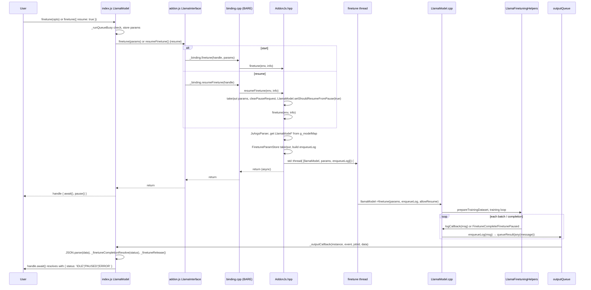
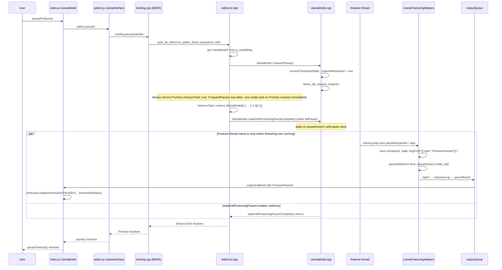

# Finetuning Guide

This document describes how to use the LoRA (Low-Rank Adaptation) finetuning feature in `@qvac/llm-llamacpp`. It covers the JavaScript API, dataset formats, parameters, and usage examples.

**Backend:** Finetuning uses the `fabric-llm-finetune` branch of [tetherto/qvac-fabric-llm.cpp](https://github.com/tetherto/qvac-fabric-llm.cpp) (a llama.cpp fork), pulled in via vcpkg.

---

## Table of Contents

- [Overview](#overview)
- [How It Works](#how-it-works)
- [JavaScript API](#javascript-api)
- [Finetuning Parameters](#finetuning-parameters)
- [Implementation Notes](#implementation-notes)
  - [UML: finetune and pauseFinetune flow (JS → C++)](#uml-finetune-and-pausefinetune-flow-js--c)
  - [C++ Backend Overview](#cpp-backend-overview)
- [Dataset Format](#dataset-format)
- [Examples](#examples)
- [Checkpoints and Output](#checkpoints-and-output)
- [Requirements and Limitations](#requirements-and-limitations)

---

## Overview

The library supports **LoRA finetuning** of GGUF models. LoRA trains small adapter weights that can be applied on top of a base model, making finetuning memory-efficient and fast. The finetuned adapter is saved as a `.gguf` file and can be loaded at inference time via the `lora` config option.

**Key capabilities:**
- LoRA finetuning with configurable target modules
- Chat-format (SFT) or causal (next-token) training
- Pause and resume from checkpoints
- Periodic checkpoint saving during training
- Run inference while finetuning is paused (see [examples/simple-lora-finetune-pause-inference-resume.js](../examples/simple-lora-finetune-pause-inference-resume.js))

---

## How It Works

### Architecture

1. **Model loading**: Load a base GGUF model (e.g., Qwen3-0.6B-Q8_0.gguf) with `model.load()`.
2. **Dataset preparation**: Training data is read from JSONL (chat format) or plain text files.
3. **LoRA adapter**: A LoRA adapter is initialized and attached to the model. Only the specified modules (e.g., attention, FFN) are trained.
4. **Training loop**: The optimizer runs for the configured number of epochs. Progress is streamed to stdout (e.g. `data=X/Y loss=...` where X/Y is current batch / total batches per epoch).
5. **Output**: The trained LoRA adapter is saved to `outputParametersDir` (e.g., `./finetuned-model-direct/trained-lora-adapter.gguf`).

### Training Modes

| Mode | `assistantLossOnly` | Dataset Format | Use Case |
|------|---------------------|----------------|----------|
| **SFT (Supervised Fine-Tuning)** | `true` | JSONL with `messages` | Chat/instruction tuning |
| **Causal** | `false` | Plain text | Next-token prediction |

### LoRA Target Modules

You can specify which model layers to adapt via `loraModules`. Available modules:

- `attn_q`, `attn_k`, `attn_v`, `attn_o` — attention layers
- `ffn_gate`, `ffn_up`, `ffn_down` — feed-forward layers
- `output` — output projection
- `all` — all applicable modules

Default (when `loraModules` is empty): attention Q, K, V, O only.

---

## JavaScript API

### `finetune(finetuningOptions?, options?)`

Starts or resumes finetuning. If the model is not loaded, it will be loaded first. Finetuning runs exclusively (no concurrent inference). Returns a handle immediately (like `run()`); use `handle.await()` to wait for completion.

```js
const handle = await model.finetune(finetuningOptions)
const result = await handle.await()

const resumeHandle = await model.finetune({ resume: true })
const resumeResult = await resumeHandle.await()
```

- **Parameters**
  - `finetuningOptions` — Object with [finetuning parameters](#finetuning-parameters). Omit to use params from construction or a previous call. When resuming, use `finetune({ resume: true })` and omit this (params are stored).
  - `options` — Optional. `{ resume: true }` to resume from a pause checkpoint. Shorthand: call `finetune({ resume: true })` with a single argument. **Resume contract:** call `finetune({ resume: true })` only after you have **awaited** `pauseFinetune()`. Once `pauseFinetune()` resolves, you are paused (or it was a no-op); no status to check. There is no status API; await the previous command to know something is done.
- **Returns** — `Promise<FinetuneHandle>`. The handle has:
  - `await()` — Returns `Promise<{ status: string }>` when training completes or pauses. `status` is `'IDLE'` (completed), `'ERROR'` (failure), or `'PAUSED'` (paused). Use only if you need to distinguish e.g. "training finished before we paused" (IDLE) from "we paused" (PAUSED); otherwise awaiting `pauseFinetune()` is enough.
  - `pause()` — Convenience for `model.pauseFinetune()`.

**Related example:** [examples/simple-lora-finetune.js](../examples/simple-lora-finetune.js) — Run with: `bare examples/simple-lora-finetune.js`

### `pauseFinetune()`

Pauses finetuning and saves a checkpoint to `checkpointSaveDir` for later resume. Pause takes effect after the current batch completes.

- **Behavior** — Same principle as `cancel`: does not throw when nothing is running; always awaitable.
- **Resolution** — The returned Promise resolves when the C++ backend has finished the pause (training thread has saved the checkpoint or reported save failure), or immediately if finetuning is not running. A single await; no event-based resolution.
- **Convenience** — Use `handle.pause()` instead of `model.pauseFinetune()` when you have the finetune handle.

```js
await model.pauseFinetune()
```

**Returns** — `Promise<void>`. Resolves when pause has completed (or immediately if not finetuning). Does not throw when nothing is running. Once resolved, you can call `finetune({ resume: true })`; no separate pause status to check.

**Related example:** [examples/simple-lora-finetune-pause-resume.js](../examples/simple-lora-finetune-pause-resume.js) — Run with: `bare examples/simple-lora-finetune-pause-resume.js`

---

## Finetuning Parameters

| Parameter | Type | Required | Default | Description |
|-----------|------|----------|---------|-------------|
| `trainDatasetDir` | string | Yes | — | Path to training dataset file (e.g. `.jsonl` for SFT, `.txt` for causal) |
| `evalDatasetDir` | string | Yes | — | Path to eval dataset file. When different from `trainDatasetDir`, disables the automatic 5% validation split from training data. The eval file content is not used for evaluation in the current implementation. |
| `outputParametersDir` | string | Yes | — | Directory (or file path) for the final LoRA adapter |
| `numberOfEpochs` | number | Yes | — | Number of training epochs |
| `learningRate` | number | Yes | — | Initial learning rate (e.g., 1e-5) |
| `contextLength` | number | No | ctx_size/2 | Training sequence length |
| `microBatchSize` | number | No | 1 | Samples per optimizer step (messages per batch in SFT). Adjusted to gcd(datasetSampleCount, requested) if needed. For 256 samples, valid values: 1, 2, 4, 8, 16, 32, 64, 128, 256. |
| `batchSize` | number | No | 0 | **Unused** in the current implementation. Only `microBatchSize` controls batch size. |
| `assistantLossOnly` | boolean | No | false | Use SFT (chat) mode; if false, causal mode |
| `loraModules` | string | No | attn_q,k,v,o | Comma-separated target modules |
| `loraRank` | number | No | 8 | LoRA rank |
| `loraAlpha` | number | No | 16.0 | LoRA alpha (scaling) |
| `loraDropout` | number | No | 0 | LoRA dropout |
| `loraInitStd` | number | No | 0.01 | LoRA init std |
| `checkpointSaveDir` | string | No | `./checkpoints` | Directory for checkpoints |
| `checkpointSaveSteps` | number | No | 0 | Save checkpoint every N steps (0 = only pause) |
| `chatTemplatePath` | string | No | `""` | Path to chat template (for SFT) |
| `lrScheduler` | string | No | `"constant"` | `"constant"`, `"cosine"`, or `"linear"` |
| `lrMin` | number | No | 0 | Minimum learning rate (for cosine/linear) |
| `warmupRatio` | number | No | 0 | Warmup ratio (0–1). Requires `warmupRatioSet: true` to take effect. |
| `warmupRatioSet` | boolean | No | false | When true, warmup steps = `warmupRatio × totalSteps`. |
| `warmupStepsSet` | boolean | No | false | When true, use `warmupSteps` directly instead of ratio. |
| `warmupSteps` | number | No | 0 | Explicit warmup steps (used when `warmupStepsSet: true`). |
| `weightDecay` | number | No | 0 | Weight decay |

---

## Implementation Notes

### Atomic Flags and Event-Driven Flow

The finetuning and pause/resume flow uses **wait conditions** and **events** only. There is **no status API**: to know something is completed, **await the previous command** (e.g. `handle.await()`, `pauseFinetune()`). No polling or status checks in the binding.

| Flow | Mechanism |
|------|------------|
| **Completion** | `handle.await()` resolves when event `FinetuneComplete` (IDLE/ERROR) or `FinetunePaused` (PAUSED) is emitted. |
| **Training started** | Event `FinetuningStarted` emitted when the first batch is processed. |
| **Request pause** | `requestPause()` sets `pauseRequested` and `llama_opt_request_stop()`. The binding runs `waitUntilFinetuningPauseComplete()` on a background thread (same pattern as cancel): blocks on a condition variable until the training thread signals pause done (checkpoint saved or save failed); the Promise resolves when that wait returns. |
| **Resume** | When you call `finetune({ resume: true })`, the JS calls `addon.resumeFinetune()` (not `activate()`). The binding `resumeFinetune()` runs the resume path: sets the per-instance `shouldResumeFromPause` flag on the LlamaModel, clears pause request, and invokes `finetune()` (spawns C++ finetune thread with `allowResume=true`). **Contract:** call `finetune({ resume: true })` only after you have **awaited** `pauseFinetune()`. No status check in the binding. |

**Wait conditions in C++:** `pauseDoneCv` / `pauseWaitDone` signal when pause has completed. The C++ decides “resume from checkpoint” internally when starting with `allowResume=true` (e.g. presence of `pausedCheckpointState_`). Atomic flags in `TrainingCheckpointState`: `pauseRequested`, `shouldExit`, `pauseCheckpointSaved`; each LlamaModel has its own `shouldResumeFromPause` (per-instance, no global).

### How the JS API Calls the Backend

| API | Backend behavior |
|-----|------------------|
| **`finetune(opts?, options?)`** | When `resume: true` (e.g. `finetune({ resume: true })`), calls `addon.resumeFinetune()` (resume path only; no status check). Otherwise calls `addon.finetune()`. Returns a handle; `handle.await()` resolves when `FinetuneComplete` (IDLE/ERROR) or `FinetunePaused` (PAUSED) is emitted. Call `finetune({ resume: true })` only after awaiting `pauseFinetune()`. |
| **`pauseFinetune()`** | Calls `addon.pause()` → C++ `requestPause()` then runs `waitUntilFinetuningPauseComplete()` on a background thread (same pattern as cancel). The returned Promise resolves when the training thread has completed the pause path (checkpoint saved or save failed), or immediately if not finetuning. Does not throw when nothing is running. |

### UML: finetune and pauseFinetune flow (JS → C++)

The following sequence diagrams show how `finetune()` and `pauseFinetune()` call from JavaScript into the native addon and back.

#### finetune() flow



#### pauseFinetune() flow



#### Component overview (JS ↔ C++)

| Layer | Component | Role |
|-------|-----------|------|
| JS | `index.js` → `LlamaModel` | Public API: `finetune()`, `pauseFinetune()`, run-queue busy check, handle with `await()` / `pause()`. Wires `_outputCallback` to resolve finetune completion and release queue. |
| JS | `addon.js` → `LlamaInterface` | Thin wrapper: `finetune(params)` → `_binding.finetune(handle, params)`, `resumeFinetune()` → `_binding.resumeFinetune(handle)`, `pause()` → `_binding.pause(handle)`. |
| C++ | `binding.cpp` | BARE exports: `finetune`, `resumeFinetune`, `pause` (→ `pauseFinetuning`) → `qvac_lib_inference_addon_llama::*`. |
| C++ | `AddonJs.hpp` | Parses JS args, gets `LlamaModel*`, stores params; `finetune` spawns thread calling `LlamaModel::finetune`; `activate` delegates to base (initial load); `resumeFinetune` runs resume path only (no status check); `pauseFinetuning` (exported as `pause`) calls `requestPause()` then always `JsAsyncTask::run` (waitUntilFinetuningPauseComplete when didPause, else empty task)—always returns Promise. |
| C++ | `LlamaModel.cpp` | `finetune(params, logCallback, allowResume)` runs training; `requestPause()`, `waitUntilFinetuningPauseComplete()`, `clearPauseRequest()`. Emits completion via `logCallback` (e.g. `FinetuneComplete`, progress). |
| C++ | `LlamaFinetuningHelpers.cpp` | Training loop; on pause writes checkpoint and emits `{"type":"FinetunePaused"}` via `state->logFn`, then signals `pauseDoneCv`. |
| C++ → JS | `outputQueue` + `OutputCallBackJs` | `enqueueLog` → `queueResult(any(string))`; addon drains queue and invokes JS `outputCallback`. JS parses JSON for `FinetuneComplete` / `FinetunePaused` and resolves `handle.await()`. |

### Parameter Notes

| Parameter | Status |
|-----------|--------|
| `batchSize` | **Unused** — only `microBatchSize` controls the batch size. |
| `warmupRatio` | Requires `warmupRatioSet: true` to take effect; otherwise warmup is disabled. |
| `evalDatasetDir` | When different from `trainDatasetDir`, disables the 5% validation split. The eval file content is not used for evaluation. |

### C++ Backend Overview

The finetuning backend lives in `addon/src/` and uses the llama.cpp optimizer API (`ggml_opt_*`, `llama_opt_*`). Key components:

| Component | Location | Role |
|-----------|----------|------|
| **Addon bindings** | `addon/src/addon/AddonJs.hpp` | `finetune()`, `pause()`, `activate()`, `resumeFinetune()` — parse JS args, spawn finetune thread, call `LlamaModel` |
| **LlamaModel** | `addon/src/model-interface/LlamaModel.cpp` | Main orchestrator: `finetune()`, `requestPause()`, `prepareTrainingDataset()`, `executeTrainingLoop()`, `saveLoraAdapter()` |
| **LlamaFinetuningHelpers** | `addon/src/model-interface/LlamaFinetuningHelpers.cpp/.hpp` | Dataset prep, checkpoint I/O, per-batch callback, LoRA config |

**Training flow**

1. **Dataset** — `prepareTrainingDataset()`: SFT mode reads JSONL and builds chat-formatted samples; causal mode tokenizes plain text and builds next-token pairs via `buildNextTokenDataset()`.
2. **Checkpoint state** — `initializeCheckpointing()` creates `TrainingCheckpointState` (ctx, model, adapter, checkpoint dir, atomic flags). Stored in `LlamaModel` and optionally in a global pointer for the epoch callback.
3. **Resume** — When `allowResumeFromPause` is true: `findLatestPauseCheckpoint()` locates the latest `pause_checkpoint_step_*` dir; `parseCheckpointMetadata()` loads epoch/step; `configureOptimizer()` passes `checkpoint_path` to `llama_opt_init` to restore optimizer and adapter state.
4. **Optimizer** — `configureOptimizer()` sets up `llama_opt_params` (AdamW, LoRA param filter, LR scheduler). `schedulerOptimizerParams` provides per-step learning rate.
5. **Training loop** — `executeTrainingLoop()` calls `llama_opt_epoch()` for each epoch. The per-batch callback is `optEpochCallbackWrapper` → `optEpochCallback()`.
6. **Per-batch callback** — `optEpochCallback()`: increments `globalStep`; on first batch, emits `FinetuningStarted` and sets `isFinetuning=true`; if `pauseRequested` is set, calls `savePauseCheckpoint()` (model.gguf, optimizer.gguf, metadata.json), sets `shouldExit`, `pauseCheckpointSaved`, `isPaused` (and clears `isFinetuning`), notifies the pause waiter, and emits `FinetunePaused`; otherwise, saves periodic checkpoints when `checkpointInterval` is reached.
7. **Pause** — `requestPause()`: if `currentCheckpointState_` or global state exists, sets `pauseRequested.store(true)` and `llama_opt_request_stop(ctx)`; returns immediately. Returns `false` if no checkpoint state exists (e.g. training not started yet).
8. **Completion** — On normal finish: `saveLoraAdapter()` writes the final LoRA to `outputParametersDir`; emits `FinetuneComplete` (IDLE). On error: emits `FinetuneComplete` (ERROR).

**Wait conditions and internal state** — `TrainingCheckpointState` holds `pauseRequested`, `shouldExit`, `pauseCheckpointSaved`, and wait condition `pauseDoneCv` / `pauseWaitDone`. The binding does not read status (e.g. `isPaused`); resume is driven by user intent (`finetune({ resume: true })` after awaiting `pauseFinetune()`). C++ uses `pausedCheckpointState_` internally when starting with `allowResume=true`. Each LlamaModel has a per-instance `shouldResumeFromPause` flag (no global) so multiple model instances work correctly.

---

## Dataset Format

### Chat Format (SFT) — `assistantLossOnly: true`

Use JSONL where each line is a JSON object with a `messages` array. Each message has `role` and `content`:

```json
{"messages":[{"role":"system","content":"You are a helpful assistant."},{"role":"user","content":"What is 2+2?"},{"role":"assistant","content":"2+2 equals 4."}]}
{"messages":[{"role":"user","content":"What is the capital of France?"},{"role":"assistant","content":"The capital of France is Paris."}]}
```

- **Roles**: `system`, `user`, `assistant` (and optionally `tool`).
- **File**: Single `.jsonl` file path (e.g., `./examples/input/small_train_HF.jsonl`).

### Plain Text (Causal) — `assistantLossOnly: false`

Plain text file. The model learns next-token prediction over the entire text. Useful for domain adaptation or completion-style training.

```
This is sample training text.
Another paragraph of content.
```

**Related example:** The examples use chat format. For dataset creation in code, see [test/integration/utils.js](../test/integration/utils.js) `createTestDataset()`.

---

## Examples

### 1. Basic Finetuning

Minimal example: load model, run finetuning, wait for completion.

**Run:** `bare examples/simple-lora-finetune.js`

```js
'use strict'

const LlmLlamacpp = require('@qvac/llm-llamacpp')
const FilesystemDL = require('@qvac/dl-filesystem')
const path = require('bare-path')

async function main() {
  const modelDir = path.resolve('./models')
  const loader = new FilesystemDL({ dirPath: modelDir })

  const model = new LlmLlamacpp(
    {
      loader,
      opts: { stats: true },
      logger: console,
      diskPath: modelDir,
      modelName: 'Qwen3-0.6B-Q8_0.gguf'
    },
    {
      gpu_layers: '999',
      ctx_size: '512',
      device: 'gpu',
      flash_attn: 'off'
    }
  )

  await model.load()

  const finetuneOptions = {
    trainDatasetDir: './examples/input/small_train_HF.jsonl',
    evalDatasetDir: './examples/input/eval_HF.jsonl',
    numberOfEpochs: 8,
    learningRate: 1e-5,
    lrMin: 1e-8,
    lrScheduler: 'cosine',
    warmupRatio: 0.1,
    warmupRatioSet: true,
    contextLength: 128,
    microBatchSize: 128,
    loraModules: 'attn_q,attn_k,attn_v,attn_o,ffn_gate,ffn_up,ffn_down',
    assistantLossOnly: true,
    checkpointSaveSteps: 2,
    checkpointSaveDir: './lora_checkpoints',
    outputParametersDir: './finetuned-model-direct'
  }

  const handle = await model.finetune(finetuneOptions)
  const result = await handle.await()
  console.log('Finetune completed:', result)

  await model.unload()
}

main().catch(console.error)
```

### 2. Pause and Resume

Start finetuning, wait for training to begin (e.g. fixed sleep), pause, then resume and wait for completion. `pauseFinetune()` does not throw when nothing is running; after `pauseFinetune()` resolves you can call `finetune({ resume: true })`; use `handle.await()` only if you need to detect early completion (IDLE). You can also use `handle.pause()` instead of `model.pauseFinetune()`.

**Run:** `bare examples/simple-lora-finetune-pause-resume.js`

For multiple pause/resume cycles, see [examples/simple-lora-finetune-multiple-pause-resume.js](../examples/simple-lora-finetune-multiple-pause-resume.js).

```js
const finetuneHandle = await model.finetune(finetuneOptions)
await sleep(90000)
await finetuneHandle.pause()
const resumeHandle = await model.finetune({ resume: true })
const result = await resumeHandle.await()
console.log('Finetune completed:', result)
```

The [simple-lora-finetune-pause-resume.js](../examples/simple-lora-finetune-pause-resume.js) example uses a fixed sleep (`sleep(90000)`) to allow training to start before pausing.

### 3. Inference with Finetuned LoRA

After finetuning, the LoRA adapter is saved to `outputParametersDir`. Use the `lora` config option to load it for inference.

**Run:** `bare examples/simple-lora-inference.js`

```js
const config = {
  device: 'gpu',
  gpu_layers: '999',
  ctx_size: '4096',
  temp: '0.0',
  n_predict: '256',
  lora: './finetuned-model-direct/trained-lora-adapter.gguf'
}

const model = new LlmLlamacpp(args, config)
await model.load()

const messages = [
  { role: 'system', content: 'You are a helpful healthcare assistant.' },
  { role: 'user', content: "Do nurses' involvement in patient education improve outcomes?" }
]

const response = await model.run(messages)
await response.onUpdate(token => process.stdout.write(token)).await()
```

### 3b. Pause, Run Inference, Then Resume

You can pause finetuning, run inference with the current LoRA checkpoint, then resume training. This workflow is useful for evaluating the model mid-training.

**Run:** `bare examples/simple-lora-finetune-pause-inference-resume.js`

### 4. Creating a Chat Dataset

Example of writing a minimal JSONL training file. The test utilities in [test/integration/utils.js](../test/integration/utils.js) use a similar pattern via `createTestDataset()`.

```js
const fs = require('bare-fs')
const path = require('bare-path')

const samples = [
  {
    messages: [
      { role: 'system', content: 'You are a helpful assistant.' },
      { role: 'user', content: 'What is 2+2?' },
      { role: 'assistant', content: '2+2 equals 4.' }
    ]
  },
  {
    messages: [
      { role: 'user', content: 'What is the capital of France?' },
      { role: 'assistant', content: 'The capital of France is Paris.' }
    ]
  }
]

const filePath = path.join('./models', 'train.jsonl')
fs.mkdirSync(path.dirname(filePath), { recursive: true })
fs.writeFileSync(filePath, samples.map(s => JSON.stringify(s)).join('\n'))
```

---

## Checkpoints and Output

### Output Structure

- **Final adapter**: `{outputParametersDir}/trained-lora-adapter.gguf` (or the path you specify if it ends in `.gguf`).
- **Periodic checkpoints**: `{checkpointSaveDir}/checkpoint_step_0000000N/` (when `checkpointSaveSteps > 0`).
- **Pause checkpoints**: `{checkpointSaveDir}/pause_checkpoint_step_0000000N/` (when you call `pauseFinetune()`).

Each checkpoint directory typically contains:
- `model.gguf` — LoRA adapter weights
- `optimizer.gguf` — optimizer state (for resume)
- `metadata.json` — epoch, step, LoRA params

### Resume from Pause

Call `finetune({ resume: true })` to resume. The addon automatically finds the latest `pause_checkpoint_step_*` in `checkpointSaveDir` and continues training from there. Finetuning parameters are stored from the original run and reused automatically.

**Backend fix:** The `fabric-llm-finetune` branch includes a fix in `llama-context.cpp` for mid-epoch resume: when resuming from a pause checkpoint, the batch index (`ibatch`) passed to the epoch callback is now corrected so it reflects the epoch-relative batch number (0, 1, 2, …) rather than the loop iteration. This ensures resume verification, progress logging, and checkpoint logic work correctly when training resumes mid-epoch.

---

## Requirements and Limitations

- **Flash Attention**: Disabled during finetuning (`flash_attn: 'off'` is enforced when finetuning params are provided).
- **Exclusive access**: Finetuning and inference cannot run concurrently. Use `pauseFinetune()` if you need to run inference, then `finetune({ resume: true })` to continue.
- **Dataset size**: For SFT, ensure enough samples. For causal mode, the text must have more tokens than `contextLength + 1`.
- **Model format**: Base model must be a supported GGUF (e.g., LLaMA, Qwen architecture).
- **Platform**: Same platforms as inference (macOS, Linux, Windows, iOS, Android).

---

## See Also

| Example | Description | Run command |
|---------|-------------|-------------|
| [simple-lora-finetune.js](../examples/simple-lora-finetune.js) | Basic finetuning | `bare examples/simple-lora-finetune.js` |
| [simple-lora-finetune-pause-resume.js](../examples/simple-lora-finetune-pause-resume.js) | Pause and resume | `bare examples/simple-lora-finetune-pause-resume.js` |
| [simple-lora-finetune-pause-inference-resume.js](../examples/simple-lora-finetune-pause-inference-resume.js) | Pause, run inference, resume | `bare examples/simple-lora-finetune-pause-inference-resume.js` |
| [simple-lora-finetune-multiple-pause-resume.js](../examples/simple-lora-finetune-multiple-pause-resume.js) | Multiple pause/resume cycles | `bare examples/simple-lora-finetune-multiple-pause-resume.js` |
| [simple-lora-inference.js](../examples/simple-lora-inference.js) | Inference with LoRA adapter | `bare examples/simple-lora-inference.js` |

Run commands assume you are in the package root directory.

**Prerequisites:** Finetuning examples download the model automatically. Training datasets are in `./examples/input/` (`small_train_HF.jsonl`, `eval_HF.jsonl`). To create your own, use the [Creating a Chat Dataset](#4-creating-a-chat-dataset) pattern or [test/integration/utils.js](../test/integration/utils.js) `createTestDataset()`. The inference example expects a LoRA checkpoint from a prior finetuning run.
