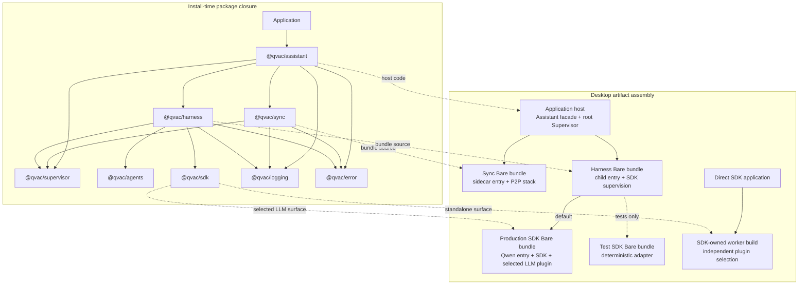

# Composable Agent Runtime PoC

This private workspace tests the package and runtime boundaries proposed by the
Composable Agent Runtime QIP. It is evidence, not a production package source.

## Boundaries under test

- `@qvac/assistant` is the application facade and root lifecycle owner.
- `@qvac/sync` owns cryptographic device identity and replicated state.
- `@qvac/harness` owns ready-to-run agent execution.
- `@qvac/agents` contains transport-free agent primitives.
- `@qvac/sdk` or `@qvac/core` owns inference inside an isolated Bare runtime.
- `@qvac/supervisor` contains lifecycle mechanics without product policy.

The Supervisor package is extracted from the Workbench `core-v2` implementation
at commit `53ec6927f5707b5078d0ca41707559d9134b7e04`. It includes bounded restart,
backoff, terminal `gave-up` escalation, suspend reconciliation, reload, nested
trees, and stow sidecar/relay adapters. Assistant translates its named events
into the facade's stable lifecycle event envelope.

The task application owns human profile fields, task schemas, ordering, and
completion policy. QVAC packages do not infer those domain semantics.

## Build hierarchy

The package closure and emitted runtime artifacts are related but not
identical. Solid arrows in the first group are manifest dependencies. The
second group shows the desktop artifacts selected and stowed by Assistant.



The current desktop PoC builds the three Bare bundles lazily on first startup
with `bare-stow`. Harness receives the selected SDK entry and starts that child
only when inference is first requested. Production composition selects the
Qwen entry, which composes `@qvac/sdk` and registers the LLM plugin. Tests
select the deterministic entry, which implements the same runtime port without
importing `@qvac/sdk`. A direct SDK consumer follows a separate SDK-owned build
and lifecycle path.

Sync and Harness are siblings in Assistant's package and artifact hierarchy.
Neither package depends on the other. The current PoC's Sync-backed Harness
state adapter lives in Assistant. Each runtime package owns its generated HRPC
schema, runtime information, errors, and protocol version. Assistant owns the
small compatibility check that composes those independent contracts.

## Sync lifecycle tree

`@qvac/sync` is itself a lifecycle boundary. `SyncCore` owns a nested
`Supervisor` with three inspectable children:

```text
local-metadata-store ───────┐
                            ├─> replicated-mesh-network
identity-corestore ─────────┘
```

The network child owns the real Hyperswarm, Mesh, and PairingCoordinator. Its
dependencies keep local metadata and cryptographic identity alive until network
shutdown completes. Supervisor then closes storage in reverse-safe order.
Product-specific pairing and replication policy remains in Sync, while
`@qvac/supervisor` supplies only lifecycle ordering and inspection mechanics.

## Integrate Assistant

The production-oriented path has durable storage, Qwen 3.5 4B, model source,
run ID, and trace ID defaults:

```ts
import { createAssistant } from '@qvac/assistant'

const assistant = createAssistant()
await assistant.ready()

const run = assistant.run({
  messages: [{ role: 'user', content: 'Process my pending tasks' }]
})

for await (const event of run) {
  console.log(event)
}

await assistant.close()
```

`run.id` and `run.traceId` are available immediately for UI state,
correlation, and later `readRun(run.id)` calls. Tests opt into
`{ inference: { kind: 'deterministic' } }` explicitly.

`assistant.state` is a stable facade. It can be captured before `ready()`, and
each operation waits for readiness and resolves the current Sync endpoint after
runtime replacement. Active watch iterators are not silently reconnected; a
runtime failure terminates the current stream so the application can observe
the discontinuity.

## Run the desktop slice

Install once from this directory:

```sh
bun install --ignore-scripts
```

Use separate commands so storage is closed and reopened between host runs:

```sh
node --experimental-strip-types apps/task-cli/index.ts seed --storage /tmp/qvac-task-poc --name Ada --age 37
node --experimental-strip-types apps/task-cli/index.ts observe --storage /tmp/qvac-task-poc --once
node --experimental-strip-types apps/task-cli/index.ts execute --storage /tmp/qvac-task-poc --trace
```

The real-model smoke is explicit and never downloads:

```sh
node --experimental-strip-types apps/task-cli/index.ts seed --storage /tmp/qvac-task-qwen --name Ada --age 37
bun run --cwd apps/task-cli smoke:qwen -- --storage /tmp/qvac-task-qwen --trace
```

The task runner disables the model reasoning channel for this workflow so the
persisted result contains only the requested answer.

Run package, graph, clean-consumer, and type verification with:

```sh
bun run verify
```

## Run the physical-Android gate

Attach an Android 10 or newer device, then build the Worklets, native addon
set, app, and launch target with:

```sh
cd apps/task-mobile
bun run android
```

The Pixel 9 Pro gate passed concurrent Sync, Harness, and SDK runtimes, Harness
and SDK handshake plus suspend/resume, real Sync writer admission, a
phone-created task completed by desktop Qwen, durable force-stop recovery, and
background retention. The follow-up gate moved SDK into a private
`:qvac_sdk` Service process. Native abort killed only that process, Android
reported `APP CRASH(NATIVE)`, the host PID and Harness survived, and a new SDK
process completed a fresh handshake. This proves Android crash containment for
the lightweight SDK probe, not yet for a real model-loaded SDK worker.

## Run the physical-iOS gate

Prepare direct BareKit Worklet bundles and link the SDK crash-probe addon:

```sh
cd apps/task-mobile
bun run build:worklets
bun run build:ios-addons
```

Then vendor the generated XCFramework:

```sh
cd ios
pod install
cd ..
```

Build for an attached device, substituting local signing and device values:

```sh
xcodebuild -workspace ios/ComposableRuntimeFeasibility.xcworkspace -scheme ComposableRuntimeFeasibility -configuration Release -destination 'id=<DEVICE_UDID>' -allowProvisioningUpdates DEVELOPMENT_TEAM=<APPLE_TEAM_ID> CODE_SIGN_STYLE=Automatic build
```

The iOS host uses the versioned application protocol directly over
`BareKit.IPC`. The sidecar-oriented `bare-stow` child shim uses `Bare.IPC` and
is not compatible with Worklets. The measured gate confirms three concurrent
Worklets and host-owned lifecycle control, but native SDK abort terminates the
whole app because Worklets share its process.

The follow-up process-isolation gate found an iOS 26 Enhanced Security helper
extension as a real process-boundary candidate. The automated abort,
interruption, and restart probe compiles, but the configured Personal Team
cannot provision the Enhanced Security capability. Physical crash-containment
and multi-gigabyte Metal viability remain unverified.

## Evidence policy

Fast tests use deterministic adapters. Separate integration tests exercise real
HRPC sessions, HyperDHT testnet replication, spawned Bare runtimes, crash
containment, and a pre-provisioned Qwen model. A stub may not replace a boundary
that the PoC claims to validate.
