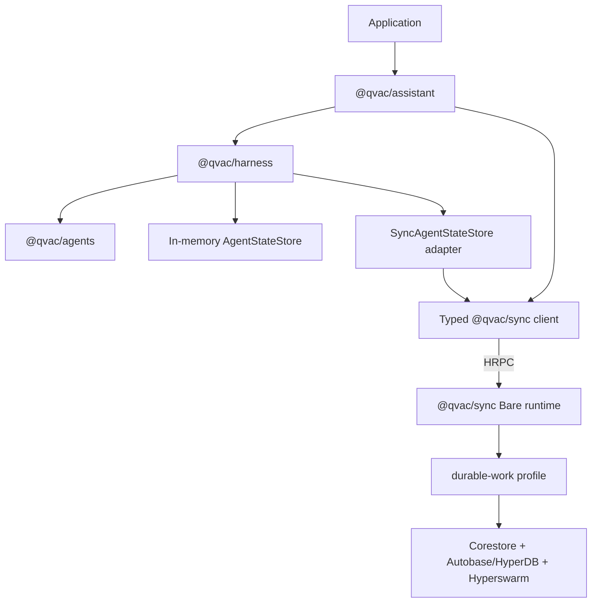
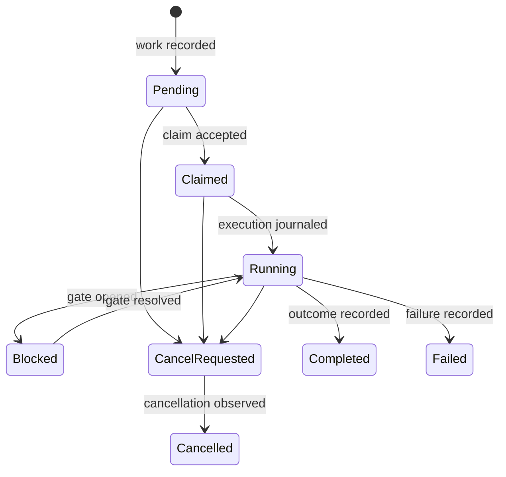
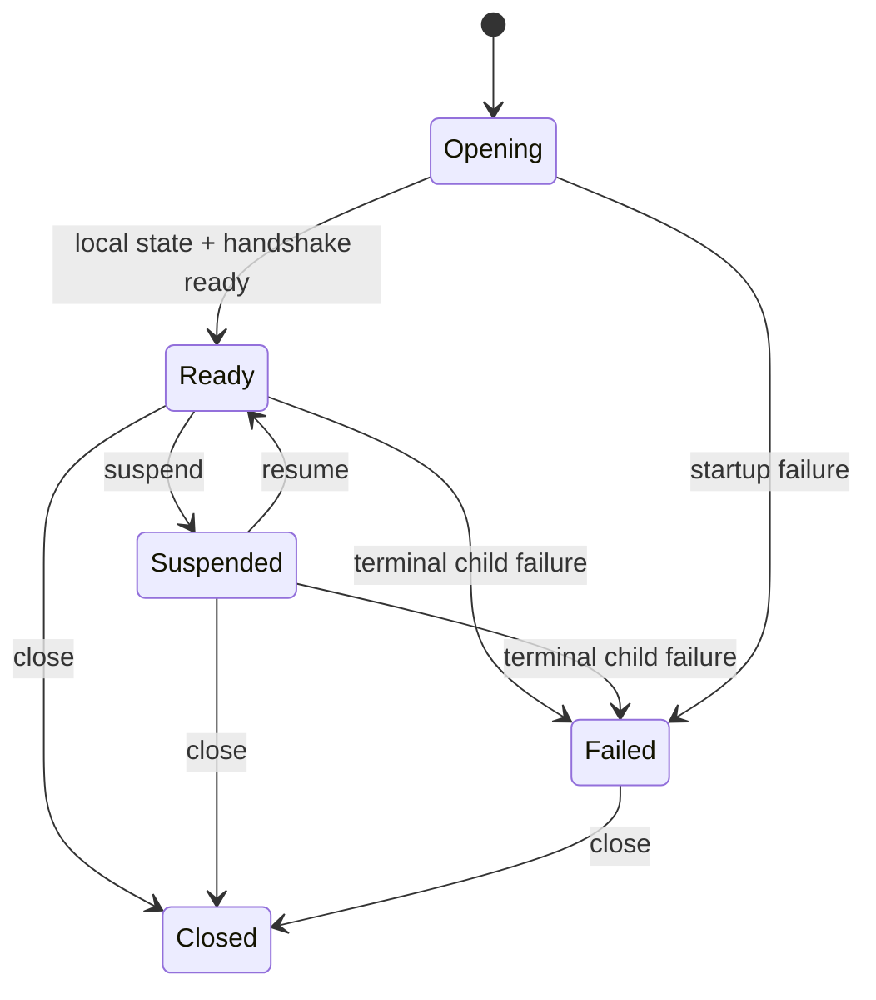

# `@qvac/sync` Package Design

Status: Approved design for PoC implementation planning  
Date: 2026-08-03  
Related QIP: `arch/qips/agentic-sdk-p2p-layering.md`

## Summary

`@qvac/sync` is a reusable replicated-state runtime, not an Assistant backend and
not a general-purpose database toolkit.

Its stable public API has three responsibilities:

1. runtime lifecycle and diagnostics;
2. mesh identity and membership;
3. typed, versioned state profiles with `apply`, `query`, and `watch`.

Agent execution lifecycle methods do not belong directly on Sync. `@qvac/agents`
defines transport-independent state interfaces and run-state types.
`@qvac/harness` owns execution policy and adapts those interfaces to either
in-memory state or Sync's built-in `durable-work` profile. Sync persists and
replicates durable facts, enforces deterministic state transitions, and resolves
distributed conflicts without knowing how an agent loop works.

## Problem

The current PoC exposes a small but domain-specific Sync contract:

- runtime identity and description;
- user profile reads and writes;
- task CRUD and watches;
- pairing invite approval and rejection.

This contract proves transport, replication, and packaging, but it does not
cover the lifecycle required by the QIP. It lacks dynamic mesh lifecycle,
suspend and resume, health reporting, durable claims, cancellation, approvals,
checkpoints, outcomes, and capability/liveness state.

The originating Workbench Assistant contract contains those concerns, but it
also combines chats, chunks, RAG, attachments, model downloads, voice, tools,
skills, image processing, app configuration, and execution. Copying that API
would couple Sync to one application and recreate the monolithic boundary that
the QIP is intended to split.

Exposing raw replicated collections or generic key/value storage would avoid
Assistant coupling but create a different problem. Applications would depend on
HyperDB and Autobase semantics, bypass typed migrations and visibility policy,
and turn storage internals into a permanent public contract.

## Goals

- Support Assistant, Harness, and other agentic applications without importing
  Assistant concepts into Sync core.
- Preserve the QIP dependency direction. Sync must not depend on Assistant,
  Harness, Agents, or SDK.
- Give direct Sync consumers package-owned worker startup, typed clients,
  lifecycle control, and normalized death reporting.
- Keep durable state available offline. Readiness must not depend on DHT
  reachability or peers.
- Make retries idempotent and distributed conflicts explicit.
- Support typed advanced profiles without runtime schema injection.
- Preserve separate Bare runtime boundaries on every supported target.
- Provide an implementation path from the current PoC without copying the full
  Workbench API.

## Non-goals

- Exposing inference, model management, tools, skills, speech, or agent loops.
- Defining Assistant conversations, chunks, UI projections, or app config in
  Sync core.
- Designing RAG/vector replication, attachment retention, or blob cache policy.
- Providing raw Corestore, HyperDB, Autobase, Hyperswarm, HRPC, or schema-router
  handles to applications.
- Providing a runtime `registerCollection()` API.
- Letting Sync choose an executor, dispatch work, retry an agent run, or replay
  side effects.
- Settling claim delivery guarantees before QIP gate G1.

## Architecture



`@qvac/agents` owns the semantic persistence port but stores nothing:

```ts
interface AgentStateStore {
  loadRun(runId: string): Promise<RunState | null>
  appendEvents(input: AppendEvents): Promise<Revision>
  saveCheckpoint(input: SaveCheckpoint): Promise<Revision>
  watchAvailableWork(input: WatchWork): AsyncIterable<WorkChange>
}
```

`@qvac/harness` supplies two implementations:

- `InMemoryAgentStateStore` for standalone local execution;
- `SyncAgentStateStore` for durable multi-device execution.

The Sync-backed adapter translates agent operations into commands and queries
for the `durable-work` profile. The adapter belongs to Harness, so Sync does not
import Agents or Harness.

## Public Package Surface

### Main entry

The main `@qvac/sync` entry exports:

- `createSync`;
- `SyncRuntime`;
- `SyncClient`;
- `SyncWatch`;
- runtime, mesh, diagnostics, error, and compatibility types.

It does not export `SyncCore`, generated HRPC bindings, raw worker entries, or
storage/network implementation types.

Illustrative direct use:

```ts
const sync = createSync({ storagePath })

await sync.ready()

const identity = await sync.mesh.identity()
const status = await sync.runtime.status()

await sync.suspend()
await sync.resume()
await sync.close()
```

`createSync` owns package-specific worker selection, launch arguments, handshake,
and platform death-signal normalization. It reports worker exit but does not
choose restart policy. Assistant's Supervisor owns restart and replacement.

### Mesh control plane

The mesh namespace exposes identity and membership lifecycle rather than storage
internals:

```ts
sync.mesh.identity()
sync.mesh.status()
sync.mesh.watchStatus()
sync.mesh.createInvite()
sync.mesh.join()
sync.mesh.cancelJoin()
sync.mesh.leave()
sync.mesh.listDevices()
sync.mesh.watchDevices()
sync.mesh.renameDevice()
sync.mesh.removeDevice()
sync.mesh.watchPairingRequests()
sync.mesh.approvePairingRequest()
sync.mesh.rejectPairingRequest()
```

Assistant wraps these primitives with product-facing pairing and device UX.

### Profile access

State is accessed through a typed profile client:

```ts
const state = sync.openProfile(durableWorkProfile)

await state.apply(command, {
  operationId,
  expectedRevision,
  traceId
})

const result = await state.query(query)

for await (const frame of state.watch(query, { after: cursor, signal })) {
  consume(frame)
}
```

The conceptual contract is:

```ts
interface SyncProfileClient<Profile extends SyncProfileContract> {
  apply(
    command: Profile["command"],
    options: {
      operationId: string
      expectedRevision?: string
      traceId?: string
    }
  ): Promise<{ revision: string }>

  query<Query extends Profile["query"]>(
    query: Query
  ): Promise<ProfileResult<Profile, Query>>

  watch<Query extends Profile["query"]>(
    query: Query,
    options?: {
      after?: string
      signal?: AbortSignal
    }
  ): SyncWatch<ProfileChange<Profile, Query>>
}
```

Generated profile bindings may provide named convenience methods, but the
stable Sync abstraction remains `apply`, `query`, and `watch`. Harness owns
agent-lifecycle convenience methods.

## Profile Contract

A profile declares:

- a globally unique ID;
- a major data-contract version;
- supported capabilities;
- command and query schemas;
- deterministic reducers and materialized views;
- replay and migration behavior;
- authorization and visibility policy;
- generated client types and compatibility fixtures.

Profile reducers must be deterministic and side-effect free. They cannot read
the clock, generate random values, access the network, or call application code.
All nondeterministic input is supplied in a validated command and recorded in
the replicated log.

Every mutation carries a stable `operationId`. Repeating an operation that is
present in the converged log returns the existing result rather than appending a
duplicate effect.

`expectedRevision` is optional at the generic protocol level. A profile command
may require it when optimistic concurrency or fencing is part of the state
transition. In the current multi-writer PoC it rejects stale local views and
drives deterministic conflict resolution, but local success is not a
globally-committed fencing decision. Strong distributed claims remain gated by
G1 and must not be inferred from `apply()` success.

### Advanced extension

Advanced profiles are defined at build time:

```ts
const profile = defineSyncProfile({
  id: "com.example.agent-app",
  version: 1,
  operations,
  views,
  migrations,
  visibility
})

createSyncWorker({
  profiles: [durableWorkProfile, profile]
})
```

The worker composition step generates profile codecs, handlers, client types,
and compatibility metadata. Applications do not register arbitrary code or
schemas after the worker starts.

Suggested subpath exports:

- `@qvac/sync/profile` for advanced profile authoring;
- `@qvac/sync/profiles/durable-work` for the built-in profile contract;
- `@qvac/sync/worker` for package and bundler integration;
- `@qvac/sync/expo-plugin` for mobile packaging;
- `@qvac/sync/testing` for deterministic profile and compatibility fixtures.

Host-specific worker entries and generated HRPC implementation files remain
internal package artifacts.

## Built-in `durable-work` Profile

The built-in profile is an execution-neutral durable work ledger. The initial
PoC stores:

- a work envelope with an opaque, versioned payload;
- an optional target identity;
- an append-only journal;
- cancellation intent;
- opaque checkpoint references with format and version metadata;
- generic gates and decisions;
- terminal outcomes;
- executor capability and liveness advertisements.

Claim, attempt, lease, capability-constraint matching, and strong fencing facts
are intentionally not implemented before QIP gate G1. Until then, consumers
must use a single executor for a work queue or tolerate duplicate execution.

Its query surface includes lookup by work ID, all-work snapshots, available-work
snapshots, journal entries, checkpoint references, and executor presence.
Application adapters use all-work snapshots for history while schedulers use
available-work snapshots for dispatch.

It does not store Assistant chats, chunk presentation types, model catalogs,
RAG indexes, product configuration, or SDK state.



This diagram is illustrative, not approval of the final claim model. Lease,
fencing, stale-claim resolution, and delivery guarantees remain gated by G1.

Harness decides:

- whether and when to claim work;
- which executor is suitable;
- retry and recovery policy;
- whether a checkpoint is safe to resume;
- whether a tool effect may be replayed;
- how gates map to agent approvals;
- when an outcome is terminal.

The initial PoC enforces:

- authenticated writer and visibility rules;
- command validity;
- idempotent operation IDs;
- deterministic state transitions;
- local optimistic revision constraints and deterministic conflict convergence;
- replicated conflict resolution;
- durable query and watch projections.

Future claim consistency cannot be implemented only in Harness. The Sync profile
reducer must atomically reject stale or competing claim transitions so that two
Harness peers cannot both observe successful ownership.

## Lifecycle



### Ready

`ready()` resolves after:

- device identity is available;
- local state and required profiles are open;
- migrations or deterministic view rebuilds have completed;
- the local HRPC contract and profile compatibility have been negotiated;
- observability configuration has been applied.

DHT reachability, peer discovery, writer availability, and remote execution are
reported separately. No network and no peers are healthy offline states.

### Suspend

`suspend()` is idempotent and:

1. stops accepting new profile mutations;
2. flushes already accepted writes;
3. suspends replication and networking;
4. closes active watches with a typed `suspended` reason;
5. suspends or closes storage resources according to the validated host policy.

Only lifecycle status and diagnostics remain callable while suspended. Profile
commands and queries fail explicitly rather than returning potentially stale
data.

### Resume

`resume()` is idempotent and:

1. restores identity and local profile state;
2. validates profile compatibility;
3. advances the runtime generation;
4. accepts local operations;
5. starts networking asynchronously.

Callers explicitly resubscribe to watches after resume.

### Close and crash

`close()` is terminal and performs dependency-ordered reverse shutdown.

A worker crash:

- rejects pending calls;
- terminates active watches;
- resolves the runtime's `exited` report;
- invalidates the generation-bound client.

The Sync package does not silently replace the client. Assistant's stable state
facade resolves the current Sync endpoint after Supervisor replacement. Direct
Sync consumers must choose their own explicit resubscription behavior.

### Internal supervision

The nested Sync supervisor uses different policy by child:

- networking, discovery, and pairing services may restart with bounded backoff;
- replaceable materialized-view services may rebuild from durable state;
- identity, migration, storage corruption, and repeated crash-loop exhaustion
  are terminal and escalate to the parent.

This replaces the PoC's current blanket `restart: "never"` policy without
letting Sync decide parent process replacement.

## Watch Semantics

Every watch is:

- typed to a profile query;
- explicitly cancellable;
- generation-scoped;
- cursor-bearing;
- finite when its backing runtime or mesh generation changes.

The first frame is a snapshot. Later frames carry changes and a cursor tied to
the shared profile head, suitable for detecting whether an explicit
resubscription starts from the same state:

```ts
type SyncWatchFrame<Value, Change> =
  | {
      kind: "snapshot"
      generation: string
      cursor: string
      value: Value
    }
  | {
      kind: "change"
      generation: string
      cursor: string
      change: Change
    }
```

The PoC does not replay missed frames. Every new watch begins with a fresh
snapshot. If the mesh or profile generation changed, the cursor changes with
it and does not pretend that the old cursor belongs to the new state history.

Transport loss, suspend, mesh replacement, and worker death terminate the
iterator with a sanitized reason. The Sync client does not silently reconnect.

## Errors

Errors crossing HRPC use a sanitized serializable envelope with:

- stable category;
- human-readable message;
- operation and trace identifiers when safe;
- retryability;
- safe diagnostic context;
- a sanitized cause chain.

The initial stable categories are:

- unavailable;
- suspended;
- incompatible runtime or profile;
- profile not installed;
- revision conflict;
- unauthorized;
- invalid or expired invitation;
- invalid profile transition;
- generation ended;
- migration or storage failure.

Assistant and Harness add domain context while preserving the underlying cause.
Sync does not expose Assistant-specific numeric codes or raw storage errors.

## Security and Visibility

Profile operations are default-deny. Every operation and view declares its
visibility and authorization requirements.

The extension contract must support the visibility classes required by QIP gate
G0:

- mesh-wide;
- role-restricted;
- peer-targeted;
- local-only.

Sync authenticates local callers at the process boundary, authenticates
replicated writers by device identity, and validates profile authorization
before accepting an operation. Paired identity alone never grants remote
execution authority.

Mesh root material and local credentials do not enter profile payloads and are
never exposed to Harness or SDK. Logs and errors redact prompts, tool arguments,
credentials, and private profile state before crossing boundaries.

The profile extension mechanism cannot ship as production-ready before G0
approves invite scope, revocation, key epochs, future-access behavior, and
visibility enforcement.

## Versioning and Migration

The handshake advertises:

- Sync contract name and protocol version;
- runtime build version;
- installed profile IDs and major versions;
- optional profile capabilities;
- required peer capabilities.

A profile major version identifies a durable compatibility boundary. Workers
must fail closed when a required major version is unavailable.

Within a major version, migrations are deterministic and idempotent. Prefer
rebuilding materialized views from the replicated operation log over mutating
historical operations. A change that cannot preserve deterministic replay uses
a new profile major and an explicit mesh migration path.

Profile migration code is compiled into the worker and covered by replay
fixtures. It is never downloaded or injected at runtime.

Migration from existing Assistant meshes remains a separate implementation
decision from the profile abstraction. The extraction must either:

- read and migrate the current schema with verified compatibility fixtures; or
- create a new mesh and provide an explicit export/import path.

It must not silently reinterpret existing Assistant data.

## Workbench Capability Placement

Only reusable runtime and mesh behavior should inform Sync core:

- mesh and network status;
- device identity and membership;
- invite, join, leave, and revocation;
- suspend and resume;
- diagnostics;
- current-mesh indirection;
- typed watch cancellation and generation handling.

Workbench behavior that maps to the `durable-work` adapter rather than Sync
methods includes:

- run request persistence;
- cancellation intent;
- approval resolution;
- durable progress and outcomes.

Behavior that stays in Assistant includes:

- agents as product configuration;
- chats and chunk presentation;
- app config;
- product-facing pairing UX.

Behavior that stays in Harness or SDK includes:

- run execution and stop policy;
- model and download lifecycle;
- skills and tools;
- transcription and speech;
- execution capability discovery.

RAG, knowledge, attachments, indexing, and image transcoding remain outside the
initial Sync surface.

## Proposed Implementation Structure

```text
packages/sync/
  index.ts
  lib/
    runtime/
      create-sync.ts
      runtime-handle.ts
      compatibility.ts
      diagnostics.ts
      errors.ts
    mesh/
      identity.ts
      membership.ts
      pairing.ts
      status.ts
    profiles/
      registry.ts
      profile-client.ts
      profile-runtime.ts
      watch.ts
      durable-work/
        contract.ts
        schema.ts
        reducer.ts
        views.ts
        migrations.ts
    worker/
      core.ts
      sidecar-entry.ts
      mobile-entry.ts
      composition.ts
  generated/
    runtime/
    profiles/
  expo-plugin.ts
```

The exact paths may follow package conventions during implementation. The
important boundary is that runtime, mesh, profile protocol, built-in profile,
and worker packaging remain independently testable.

## Migration from the PoC

### Keep and harden

- package-owned sidecar and mobile worker entries;
- generated HRPC contracts;
- transport-neutral `connect(stream)` internally;
- Corestore device identity;
- mesh replication and pairing;
- nested Supervisor resource ordering;
- runtime handshake and compatibility checks;
- clean-consumer and mobile packaging validation.

### Replace

- `getUserProfile`, `setUserProfile`, and `watchUserProfile` move to an
  Assistant-supplied profile or Assistant-local state;
- sample task apps translate their domain state through app-owned adapters over
  `durable-work`; Sync exposes no task CRUD compatibility API;
- startup-only pairing becomes dynamic mesh join and leave;
- blanket `restart: "never"` becomes child-specific bounded policy;
- direct console logging becomes injected observability configuration;
- uncancellable snapshot watches become generation-scoped cursor watches.

### Do not port

- the full Workbench Assistant capabilities contract;
- application config KV;
- chats, chunks, RAG, knowledge, and attachments;
- model, tool, skill, speech, and image APIs;
- automatic client watch reconnection.

## Implementation Sequence

1. **Stabilize runtime and mesh control**
   - Separate main exports from worker internals.
   - Add runtime status, diagnostics, dynamic join/leave, devices, suspend, and
     resume.
   - Introduce generation-bound watch termination.

2. **Introduce the profile protocol**
   - Add profile registry, handshake metadata, typed `apply/query/watch`, stable
     operation IDs, revisions, and deterministic test fixtures.
   - Migrate sample consumers directly to typed profiles without preserving the
     original task CRUD protocol.

3. **Implement `durable-work`**
   - Add work envelope, journal, cancellation, checkpoint, gate, outcome, and
     executor-presence records.
   - Leave final claim transitions behind a provisional interface until G1 is
     approved.

4. **Move agent lifecycle into Harness**
   - Define the `AgentStateStore` port in Agents.
   - Implement in-memory and Sync-backed stores in Harness.
   - Move submit, claim policy, cancellation behavior, approvals, recovery, and
     outcome orchestration behind Harness APIs.

5. **Compose Assistant**
   - Replace captured Sync clients with the stable Assistant state facade.
   - Add Assistant-specific conversation and agent-definition profiles only if
     their cross-application reuse is demonstrated.
   - Preserve explicit watch resubscription at the application layer.

6. **Ship advanced profile authoring**
   - Add deterministic profile validation, code generation, worker composition,
     migration fixtures, and visibility checks.
   - Gate production use on G0 security approval.

## Verification

The implementation must cover:

- local readiness with DHT unavailable and no peers;
- runtime and profile handshake compatibility;
- deterministic replay across Node and Bare;
- idempotent retry of the same operation ID;
- concurrent writers and revision conflicts;
- competing claim and stale fencing behavior after G1;
- offline writes and replication catch-up;
- profile migration and view rebuild from fixtures;
- explicit watch cancellation;
- watch termination on suspend, mesh replacement, and worker death;
- suspend flush ordering and rejection of operations while suspended;
- bounded network-child restart;
- terminal storage or migration failure escalation;
- Assistant replacement of a crashed Sync generation;
- in-memory and Sync-backed Harness conformance to the same Agents state port;
- desktop and physical mobile startup, suspend/resume, crash reporting, and
  shutdown;
- package tarball consumption without monorepo-relative imports.

## QIP Alignment

This design stays within the existing Composable Agent Runtime QIP:

- Sync remains the durable replicated-state engine.
- Harness owns execution policy.
- Agents remains transport and storage independent.
- Assistant remains the stable application facade and root lifecycle owner.
- Each worker-owning package owns its wire contract and startup adapter.
- Separate Bare runtime boundaries remain intact.

No additional QIP is required for this package design. A QIP update is required
if implementation instead exposes Sync as a general-purpose replicated database,
moves execution policy into Sync, changes runtime topology, or changes the G0/G1
security and claim guarantees.
