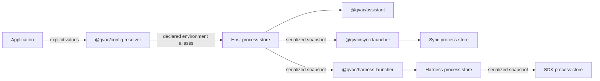

# `@qvac/config` Package Design

Status: Approved design for PoC implementation
Date: 2026-08-05
Related QIP: `docs/arch/qip/agentic-sdk-p2p-layering.md`

## Summary

`@qvac/config` is a generic, transport-neutral utility for resolving and
propagating immutable process configuration. It is a leaf dependency alongside
`@qvac/logging` and `@qvac/error`, not a seventh runtime component and not a
shared RPC contract.

Assistant resolves the composed application's snapshot once. Each
runtime-owning package carries that snapshot through its existing launch
transport and installs it before constructing runtime services. Standalone
Sync and Harness consumers resolve their own snapshot when no configuration is
already installed in the host process.

The first integration key is logging level. The package itself does not know
that key, its environment aliases, its allowed values, or its default.

## Problem

The PoC currently propagates logging through several unrelated mechanisms:

- Assistant passes a logging object to both Sync and Harness.
- Sync embeds that object in desktop and mobile options JSON.
- Harness converts it to `--logging` or `--debug` arguments, then repeats the
  conversion for its SDK child.
- Assistant, Sync, and Harness each construct and configure loggers separately.
- Mobile Assistant drops Sync logging, while mobile Harness accepts but ignores
  the option.

Adding another process-wide setting would repeat the same option plumbing,
validation, encoding, and restart behavior at every boundary. Environment-only
inheritance does not solve this because mobile worklets and platform process
hosts do not share one reliable environment.

## Goals

- Resolve process configuration once with deterministic precedence.
- Carry one versioned, JSON-safe snapshot through desktop and mobile launch
  boundaries.
- Install configuration before runtime services and loggers are created.
- Reuse the same snapshot when a supervised child is reconstructed.
- Keep direct Sync and Harness usage functional without Assistant.
- Keep package-specific keys, defaults, parsing, and transport ownership in the
  packages that define them.
- Run in Node, Bun, Bare, and React Native/Hermes hosts.

## Non-goals

- File discovery or `qvac.config.*` loading.
- Live reload, mutation, subscriptions, or runtime update RPCs.
- Secret or credential transport.
- Replicated application settings or storage in Sync.
- Per-instance operational options such as storage paths, mesh keys, model
  choices, or tool configuration.
- Defining argv names, HRPC methods, worker launchers, or process lifecycle.
- Constructing loggers or defining logging values.
- Replacing the production SDK configuration system.
- Changing production `@qvac/logging`.

## Architecture



`@qvac/config` owns snapshot mechanics only. Sync and Harness retain their
package-owned launch arguments and mobile argv layouts. No config message is
added to their HRPC contracts.

## Public concepts

### Values and snapshots

`ConfigValue` is the recursive JSON value set. A `ConfigSnapshot` contains:

```ts
interface ConfigSnapshot {
  readonly version: 1
  readonly values: Readonly<Record<string, ConfigValue>>
}
```

Snapshots are deeply cloned and frozen at creation and decode boundaries.
Serialization sorts object keys recursively so equivalent snapshots have one
deterministic representation.

### Key definitions

Callers define their own keys:

```ts
const loggingLevelKey = defineConfigKey({
  name: 'logging.level',
  env: ['QVAC_LOG_LEVEL', 'EXPO_PUBLIC_QVAC_LOG_LEVEL'],
  default: 'info',
  parse: parseLoggingLevel
})
```

The descriptor owns the key name, environment aliases, parser, and optional
default. `@qvac/config` provides the mechanism but contains no instantiated
QVAC key descriptors.

### Resolution

`resolveConfig` evaluates each declared key with this precedence:

1. an explicit value;
2. the first declared environment alias with a value;
3. the key default;
4. omission when no source provides a value.

Every selected value passes through the caller-owned parser. Invalid values
fail before a child starts. Unknown explicit keys are rejected so misspelled
configuration does not silently disappear.

Environment access is injectable for tests and explicit hosts. The default
adapter uses conditional package imports for Bare and a global process adapter
for Node, Bun, and compatible application hosts.

### Process-local store

`createConfigStore` creates an independent store for tests and embedding.
The default package store exposes:

- `installConfig(snapshot)`;
- `getConfigSnapshot()`;
- typed reads using a caller-owned key descriptor.

The first installation wins. Installing a byte-equivalent snapshot again is
an idempotent no-op. Installing a different snapshot throws a human-readable
configuration conflict error. Reading before installation throws a
human-readable not-installed error.

This store is intentionally process-wide. Per-instance settings remain normal
constructor or factory options.

## Runtime integration

Assistant converts its existing public `logging` convenience option into the
logging key's explicit value, resolves environment aliases and the default,
and installs the resulting snapshot before constructing its logger or child
components. It no longer forwards a logging object to Sync and Harness.

Sync and Harness use the installed host snapshot when available. If used
standalone, each resolves the same package-owned logging descriptor from its
own public logging option and environment. Each launcher serializes the
snapshot inside its existing package-owned launch payload.

Sidecar and mobile entries deserialize and install the snapshot before creating
their core service. Harness forwards the installed snapshot unchanged to its
SDK child. A restart reuses the immutable snapshot captured by the launcher.

Logger factories read `logging.level` from the installed snapshot. The value
definition remains package-owned even where a small structural definition is
duplicated to preserve the QIP dependency direction.

## Failure behavior

- Invalid explicit or environment values fail during root resolution.
- Malformed, unsupported-version, or non-JSON snapshot envelopes fail before
  runtime readiness.
- Missing child snapshots fail before service construction.
- Conflicting installation in one process fails instead of mutating live
  configuration.
- A child restart receives the original snapshot, not a fresh environment
  read.

Errors are human-readable because this PoC package is generic and does not own
an allocated `@qvac/error` code range.

## Security

Configuration snapshots are not a secrets channel. Runtime owners must not put
credentials, mesh keys, invite material, tokens, or prompt/tool content in
them. Sensitive values continue through their existing package-owned,
least-privilege transports.

The initial integration carries only logging level. Future keys require an
explicit owner and a review of which runtime processes receive them.

## Verification

The package is tested in Node, Bun, and Bare for resolution precedence,
validation, deep immutability, deterministic serialization, strict decoding,
idempotent installation, conflict rejection, missing installation, and
independent stores.

Stack tests prove the same snapshot reaches desktop Sync, Harness, and SDK
processes, reaches mobile Sync and Harness worklets, survives child restart,
and resolves from environment for standalone lower-layer usage. Clean-package
tests verify that `@qvac/config` remains a leaf utility and introduces no
product dependency cycle.
