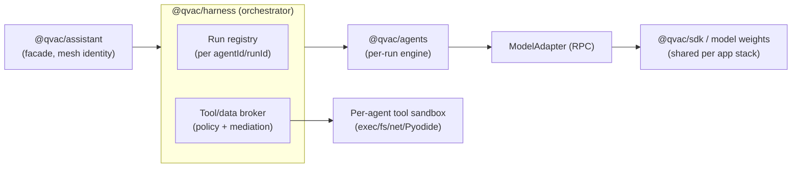
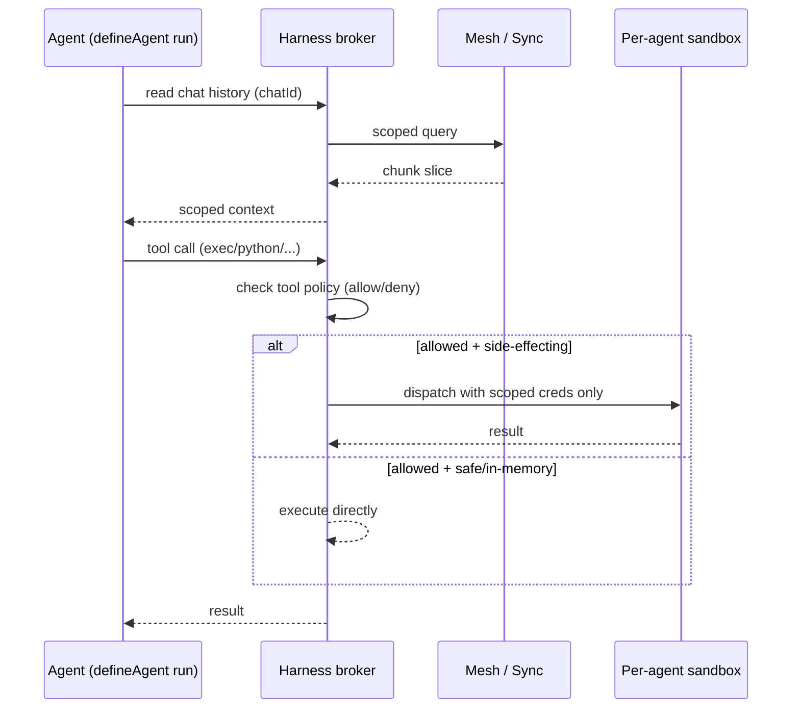
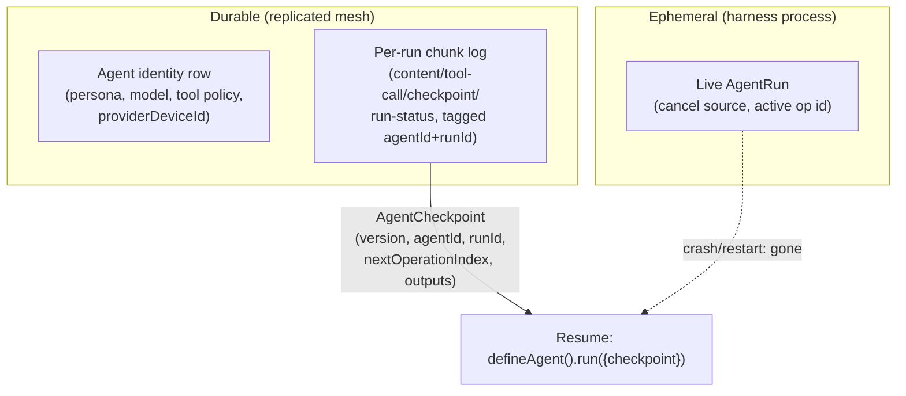

# ADR 0002: Multi-Agent Orchestration and Isolation

Status: Proposed
Date: 2026-07-28

## Context

`@qvac/agents` exists as a transport-free, single-run execution primitive
(workflow steps, checkpoint emission, cancel plumbing) but nothing in the PoC
or in qvac-app's `assistant` package currently orchestrates multiple agent
instances with it. That package's `QvacAssistant` improvised a
single-agent-per-chat dispatch loop (`_dispatch`/`_runs`/`_seen`/`_chats`)
directly inside the facade layer,
without `@qvac/agents`, without per-agent tool isolation, and without a
mediation boundary between agent code and the mesh/Sync layer.

This ADR proposes where multi-agent orchestration should live, how agent
state should be represented durably across devices, and how agents should be
isolated from each other and from direct P2P/Sync access.

## Proposed decision

### Orchestration ownership

`@qvac/harness` grows from a single-shot completion boundary into the
multi-agent orchestrator. `@qvac/agents` stays a pure per-run engine invoked
by harness; `@qvac/assistant` stays a thin facade that owns mesh/device
identity and never implements dispatch itself.

### Runtime topology

Three runtime roles per composed application stack, not one:

1. **Harness (orchestrator)** - one shared runtime. Hosts the run registry
   and the tool/data broker. Calls `@qvac/agents` per active run.
2. **SDK/model** - one shared runtime per composed application stack, sole
   owner of that stack's model weights and pools. Agents never load models
   themselves; they call the SDK through an RPC `ModelAdapter`, identical in
   shape to today's `createSdkModelAdapter`. The stack does not create another
   SDK runtime per agent. An application may explicitly compose an additional
   independent SDK client and worker when it intentionally needs one.
3. **Per-agent tool sandbox** - a lightweight, restartable unit (process or
   Worklet) that only side-effecting tool calls (`exec`, filesystem, network,
   MCP, Python/Pyodide) are routed into. One sandbox per agent, not shared and
   not spawned per-call. It may retain agent-local runtime state while active;
   idle teardown or agent GC discards that state. This is the agent's
   execution-state and lifecycle boundary; the orchestration loop itself is
   not isolated per agent, since it never touches raw external resources
   directly.

Skills are curated packages bundled with Harness. Harness loads their
manifests and resource files, derives their tool and resource grants, and
dispatches selected skill operations through the broker into the owning
agent's sandbox. User-defined agents bind available skills; they do not inject
arbitrary executable code into the Harness process.

The portable sandbox does not claim an OS security boundary on every platform.
A Worklet can isolate runtime state and lifecycle while still sharing the host
process. Authority is enforced by broker-mediated tools, scoped resource and
credential handles, and the absence of raw host or Sync handles. A process or
service backend may additionally provide crash containment where the platform
supports it.

### Mediation: no raw Sync/P2P handles in agent code

Agents call a broker inside harness, never the mesh directly:

Enforcement is layered, matching the separable axes proven out in production
multi-agent systems (OpenClaw's sandbox/tool-policy/elevated split):

- **Tool policy** (allow/deny per agent) decides which tools exist at all.
- **Sandbox** decides where an allowed, side-effecting tool call physically
  runs (this agent's sandbox unit, never another agent's).
- **Approval** gates specific calls behind a human decision, independent of
  the above two (extends the existing `approval-request` chunk type).

Cross-agent leakage prevention falls out of composing these, not from any
single layer: a coding agent's tool policy has no email tools, its sandbox
never receives email credentials, and even a successful prompt-injection
attempt is blocked by the broker before any sandbox is reached.

### Durable state: two tiers

- **Durable tier**: agent identity is a mesh row, cheap to keep forever.
  Each run's chunk log includes `@qvac/agents`' `checkpoint` event after
  every completed workflow step - the same mechanism already used for
  `content`/`tool-call`/`run-status` chunks today.
- **Ephemeral tier**: the live run object inside harness. Intentionally
  throwaway; recovery replays purely from the durable tier by feeding the
  last checkpoint back into `defineAgent().run()`.
- **Ownership/handoff**: unchanged from qvac-app's `assistant` package - only the device
  matching `providerDeviceId` executes; losing ownership mid-run aborts
  without a terminal chunk, so another device can claim and resume.
- **Cancellation**: explicit cancel durably records cancellation intent and
  tells the broker to abort any in-flight sandbox call for that run, not just
  the model completion. Terminal `run-canceled` means no later result may be
  committed. If an external effect cannot be confirmed stopped, recovery
  records it as interrupted or indeterminate rather than implying rollback or
  silently replaying it.

### Garbage collection - three independent clocks

| What | Lifetime | Mechanism |
|---|---|---|
| Agent identity | Forever until soft-deleted | `deletedAt` + active-agents view (existing) |
| Per-agent tool sandbox | Idle timeout, independent of agent deletion | New: teardown on inactivity, like sub-agent auto-archive |
| Chunk log | Unbounded today (open gap) | Needs a retention/compaction policy; `chunk.ts` already has a `@todo pagination` marker and multi-step agents make this worse |

### Event propagation into history

Extend the existing `AgentEvent`→chunk mapping to also carry
`@qvac/agents`' workflow-level events (`operation-started`, `checkpoint`,
`run-canceled`), tagged with `agentId`+`runId`. Additionally close a known
gap: qvac-app's `assistant` package's `HISTORY_TYPES` currently drops `tool-call`/
`tool-result`/`thinking` chunks from the next turn's prompt reconstruction.
That was tolerable for single-shot chat replies; it is wrong once agents run
multi-step workflows where their own prior tool use is working memory.
Agent-driven runs should reconstruct history with a bounded/summarized form
of those chunk types included.

## Consequences

### Positive

- Reuses proven pieces (`@qvac/agents` checkpointing, qvac-app's `assistant`
  package's chunk/ownership model) instead of inventing new mechanisms.
- Isolation boundary matches actual risk: side-effecting tool calls, not the
  orchestration loop, which never touches raw resources directly.
- GC has no single point of failure: agent identity, sandbox lifetime, and
  chunk retention decay independently and can be reasoned about separately.

### Trade-offs

- Harness takes on materially more responsibility (registry + broker) than
  today's single-shot completion boundary - this is new code, not a
  refactor.
- Worklet sandboxes provide runtime-state and lifecycle separation but not
  process crash containment. Platform process or service backends have
  stronger failure boundaries where available.
- Per-agent sandbox pooling (especially for Pyodide/Python) needs explicit
  reset discipline between an agent's own sequential calls at minimum, and
  careful handling if pool affinity is ever relaxed to allow sharing.
- Chunk log retention/compaction is left unresolved by this ADR and must be
  addressed before multi-step agent workflows ship broadly.

## Alternatives considered

### Isolate the whole agent loop per instance (not just tools)

Would give a stronger isolation guarantee (crash containment for the
orchestration loop itself) but is unjustified overhead once model weights
are confirmed to live only in the shared SDK process - the orchestration
loop never touches raw external resources, so isolating it duplicates the
sandbox's job. Rejected in favor of isolating tool execution only, matching
OpenClaw's production precedent.

### Keep dispatch logic in `@qvac/assistant`

This is the status quo in qvac-app's `assistant` package. Rejected because it couples the
facade/lifecycle layer to per-device execution mechanics, and because
`@qvac/harness` already owns the SDK/model boundary that the orchestrator
must call into on every run.

## Acceptance criteria

1. `@qvac/harness` hosts a run registry keyed by `agentId`/`runId` and
   dispatches into `@qvac/agents` per active run.
2. Agent code has no reachable path to `Mesh`/`Sync`/raw credentials except
   through the broker's capability calls.
3. Tool policy, sandbox scope, and approval gating are independently
   configurable per agent.
4. A killed/restarted harness process resumes interrupted runs purely from
   durable chunks + checkpoints, with no ephemeral state required.
5. Per-agent tool sandboxes tear down on idle timeout independent of agent
   deletion.
6. Bundled skill manifests and resources are loaded by Harness, but every
   side-effecting operation executes with only the selected agent's brokered
   grants.
7. Cancellation aborts the active model and sandbox work, rejects late result
   commits, and preserves an explicit interrupted/indeterminate outcome when
   an external effect cannot be confirmed stopped.

## Related material

- [Durable agent effect recovery](../tech-debt/TD-DURABLE-AGENT-EFFECT-RECOVERY.md)
- [Per-agent tool sandboxing](../tech-debt/TD-PER-AGENT-TOOL-SANDBOXING.md)

