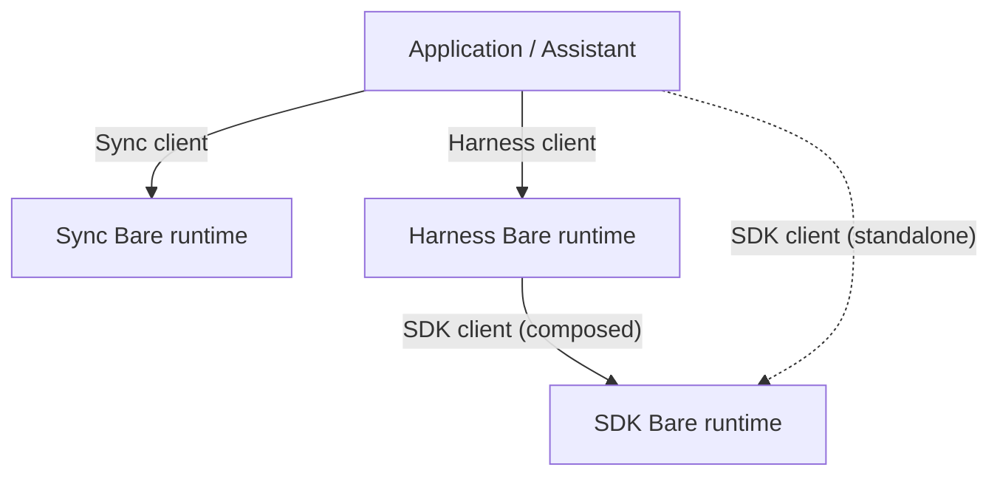

# ADR 0004: Separate Bare Runtimes for Sync, Harness, and SDK

Status: Proposed  
Date: 2026-08-05

## Context

Sync holds durable P2P state and device identity. Harness runs agent
execution. SDK runs native inference. Each can fail, restart, or be unused
while the others stay up.

Packaging them into one Bare process is the simplest deployment shape, but it
collapses those failure domains: an inference crash can tear down P2P state
and agent execution, and mesh secrets share an address space with native
addons. The topology choice needs an explicit decision so co-location is not
treated as an available optimization.

## Proposed decision

On every supported target, `@qvac/sync`, `@qvac/harness`, and `@qvac/sdk` each
run in their own separately restartable Bare runtime. Servers are Bare-only;
typed clients remain cross-host.

- **Restart domains.** Each runtime starts, fails, restarts, and shuts down
  independently under Supervisor. Missing platform containment is tech debt
  against this rule, not permission to merge runtimes.
- **Supervision.** Assistant (or a direct consumer) supervises Sync and
  Harness. Harness supervises SDK on the composed path; a direct SDK consumer
  owns SDK itself. Sync never launches Harness or SDK.
- **Resources.** Each runtime owns its storage, networking, and native
  resources. Sync Corestore/swarm identity is not shared with SDK downloads.

Incomplete hosts stay open debt (see Related). They do not authorize
collapsing two or more of these runtimes into one Bare core.

Out of scope: client/worker packaging (0001), per-agent tool sandboxes (0002),
which OS mechanism provides mobile crash containment, and P9 numeric budgets.

## Consequences

### Positive

- Inference or Harness failure leaves the other restart domains intact.
- Mesh secrets stay out of the inference address space.
- Each package remains usable without starting the other two.

### Trade-offs

- Higher startup, memory, packaging, and test cost than one Bare core.
- Isolation strength varies by host; closing gaps is tracked debt.
- If measured P9 budgets prove three runtimes infeasible, approvers must
  supersede this ADR explicitly rather than quietly co-locate.

## Alternatives considered

- **One Bare core for all three.** Rejected: shared failure domain and shared
  address space with native addons.
- **Co-locate Harness with SDK.** Rejected: removes the SDK restart domain
  Harness exists to own.
- **Co-locate Sync with Harness.** Rejected: Sync must survive Harness failure
  and remain usable without execution.
- **Desktop-only separation.** Rejected: same topology on every supported
  target; unfinished hosts are debt.
- **Per-deployment topology choice.** Rejected for the normal path; each
  package still keeps its own Bare server when used alone.

## Acceptance criteria

Change this ADR to Accepted only after:

1. Desktop keeps the three runtimes separate with independent Supervisor
   restart.
2. Every known incomplete host has a named tech-debt item; claiming a host
   fully supported still requires validated independent lifecycle for all
   three.
3. Standing topology docs cite this ADR.

## Related material

- [QIP: Composable Agent Runtime](../qip/agentic-sdk-p2p-layering.md)
- [Interactive composition map](../agentic-sdk-composition-map-site/index.html)
- [ADR 0001](0001-package-owned-workers-and-compatibility.md)
- [ADR 0002](0002-multi-agent-orchestration-and-isolation.md)
- [TD-IOS-SDK-CRASH-ISOLATION](../tech-debt/TD-IOS-SDK-CRASH-ISOLATION.md)
- [TD-MOBILE-AGENT-RUNTIME-RECOVERY](../tech-debt/TD-MOBILE-AGENT-RUNTIME-RECOVERY.md)
